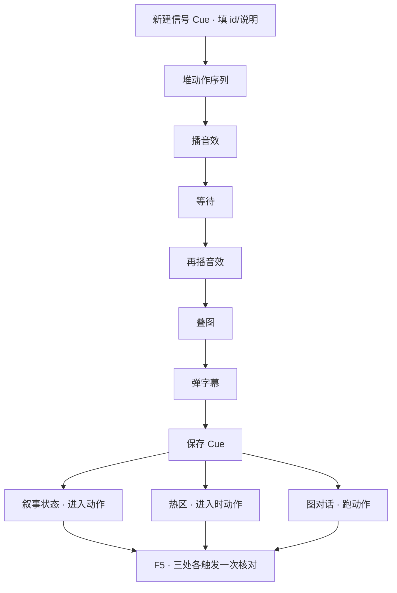

# 做一个可复用信号

城隍庙的钟声，不该只在一个地方响一次——庙前热区走进去要响、进庙状态触发时要响、关二狗聊起庙里的事对白里可能也要响。同一段"钟声 + 雾气 + 一句字幕"的表现，与其在三个地方各自重新排一遍，不如封成一个**信号 Cue**，随处一句"播放这个信号"就行。这一页带你从零封一条可复用的 Cue，并在好几个地方触发它。

---

## 这是什么（30 秒看懂）

信号 Cue 就是一个"表现快捷键"：把"播音效 → 停一下 → 再播一声 → 弹个字幕"这一串步骤存成一个具名包，取个好记的名字。以后任何地方——叙事状态进入时、热区触发时、图对话执行动作里——只要说一句"播放这个信号"，这一整串表现就会照着原样跑一遍，不用每次都重新排列步骤。

它跟叙事状态机发的**逻辑信号**不是一回事：叙事状态机的信号推动的是"故事该往哪走"这种全局判断；信号 Cue 打包的是玩家眼睛耳朵能感知到的**表现**——灯闪、音效、叠图、震屏。两者常常配合：叙事状态机进某个状态，进入动作里第一条就是播一个信号 Cue。

打个比方，信号 Cue 就像雾津戏班里那句"打钟三响"的固定提示——不管是开场、换幕还是收尾，只要班主一喊这句口诀，敲钟的、打鼓的、喊嗓子的都知道自己该干什么、什么时候干。你不用每次都重新跟每个人交代一遍步骤，喊一句口诀，整套配合自动跑起来。信号 Cue 在编辑器里就是这句"口诀"：封一次，随处喊。

## 读完你能做到什么

- 新建一条信号 Cue，堆一串表现动作
- 在叙事状态、热区、图对话三个不同地方各触发一次同一条 Cue
- 只改一处就能同步更新所有触发点的效果
- 弄清楚 Cue 跟过场的分工，什么时候该用哪个

---

## 手把手逐步操作

### 第 1 步：打开信号 Cue 面板，新建一条

```bash
./dev.sh editor
```

进入主编辑器后走 **叙事编排 → 信号 Cue**（导航里也可能显示为"信号"）。点新建，填一个**id**，比如"城隍庙钟鸣"——这个名字以后在别的地方引用时就靠它。

### 第 2 步：写说明

填**description**，一句话备注，比如"城隍庙晨钟，远播三响，配雾气与字幕"。这纯粹是给自己看的，不影响运行结果，但半年后回来翻记录会感激当初写了它。

id 起名建议带上"地点/场景 + 效果"的组合，比如"城隍庙钟鸣""码头夜风""渡口水声"，团队里几十条 Cue 攒下来之后，光看名字就能大致猜到是哪儿的哪种表现，不用挨个点开才知道内容，找起来快很多。

### 第 3 步：堆一串表现动作

用通用的动作编辑器把表现一步步堆起来：

1. **播音效**——选一声钟响（音效要提前去[音频面板](../editors/panels/audio)登记好，这里才能选到）
2. **等待**一小段时间，留出钟声的余韵
3. **再播一声**音效，做出"远播"的层次感
4. **叠一层图**——雾气或金光的叠加效果（同样要先在[叠图面板](../editors/panels/overlay)登记好）
5. **弹一句字幕**——"钟声悠悠，飘过雾津的瓦檐"

动作顺序按体感微调，一般"先响后画"比较贴近真实的反馈节奏——先听见声音，画面效果紧跟着出来，具体顺序多在预览里听几遍、看几遍再定。

### 第 4 步：保存

保存这条 Cue。信号 Cue 结构很简单，就 id、description、一串动作这三样，没有别的隐藏字段，保存不容易出岔子。

### 第 5 步：第一处触发——叙事状态进入时

打开[叙事状态机](../editors/panels/narrative)，找"进城隍庙"这个状态（没有就先照[搭一段叙事状态机](./narrative-state)建一个），在它的**进入动作**里加一条"播放信号 Cue"，选"城隍庙钟鸣"。

### 第 6 步：第二处触发——热区/区域

去场景面板找庙前的一片区域（或按[画一片区域触发剧情](./trigger-zone)新建一个），在它的**进入时动作**里同样加"播放信号 Cue"，选同一个"城隍庙钟鸣"。

### 第 7 步：第三处触发——图对话跑动作

打开[图对话](../editors/panels/dialogue-graph)，找关二狗提到城隍庙的一句对白，在它后面接一个**跑动作**节点，同样加"播放信号 Cue"，选"城隍庙钟鸣"。

### 第 8 步：验证，体会复用的好处

1. 保存工程
2. F5 运行预览，分别用三种方式触发：进入"进城隍庙"状态一次、走进庙前区域一次、跟关二狗聊到庙里话题一次——三次听到的、看到的应该是**完全一样**的钟声 + 雾气 + 字幕
3. 回信号 Cue 面板，随便调一个细节（比如把等待时间调长一点，或换一句字幕），保存后回预览重新触发这三处，三处的效果会**同步一起变**，不用挨个改三遍

这一步顺手记一个老手习惯：不少表现是**成对**出现的——进一个地方响一次钟，退出来的时候也该有个收尾（比如雾气渐渐散掉、字幕淡出）。与其把"进"和"出"两套表现揉进同一条 Cue 里靠参数区分，不如干脆封两条对称的 Cue，一条管进、一条管出，各自触发点各管各的，思路更清楚，以后调其中一边也不会牵连另一边。

---

## 流程示意



---

## 雾津完整实例

**信号 Cue**："城隍庙钟鸣"——低沉钟声两响、叠一层薄雾叠图、一句字幕"钟声悠悠，飘过雾津的瓦檐"，在进庙状态、庙前热区、关二狗对白三处各触发一次。

1. 信号 Cue 面板新建一条，id 填"城隍庙钟鸣"，description 写"城隍庙晨钟，远播三响，配雾气与字幕"。
2. 动作序列：播音效"庙钟_1"→ 等待 1.2 秒 → 播音效"庙钟_2"→ 叠图"薄雾叠层"→ 弹字幕"钟声悠悠，飘过雾津的瓦檐"。
3. 保存 Cue。
4. 叙事状态机里"进城隍庙"状态的进入动作，第一条加"播放信号 Cue"选"城隍庙钟鸣"。
5. 场景里庙前热区的进入时动作，同样加"播放信号 Cue"选"城隍庙钟鸣"。
6. 图对话里关二狗那句"这庙里的钟，一到时辰准响"后面接跑动作节点，加"播放信号 Cue"选"城隍庙钟鸣"。
7. F5：先从叙事图手动触发进庙状态，听到钟声看到雾气；再重新进游戏直接走进庙前热区，效果一样；再跟关二狗聊到这句台词，效果还是一样。
8. 回 Cue 面板把等待时间从 1.2 秒改成 2 秒，保存后三处重新触发，都变成了新的节奏——不用挨个改三处触发点。

---

## 常见卡点

**触发后完全没有表现？**
先检查引用处填的 id 跟信号 Cue 登记表里的 id 是不是完全一致，拼错一个字都会导致静默没反应；也可能这条 Cue 已经被删掉了，回信号 Cue 面板确认它还在。

**有震屏或字幕，但就是没声音？**
音效 id 没有在[音频面板](../editors/panels/audio)登记，或者当初选错了音效。回音频表核对一遍。

**叠图一闪就消失了，来不及看清？**
动作序列里可能缺了一个等待步骤，或者叠图本身设置的持续时间太短。加一个等待动作，或者延长叠图的持续时间。

**两处同时触发同一条 Cue，效果叠在一起显得很吵？**
比如叙事状态进入时和玩家刚好也走进热区，两边同时各播了一次。要么合并触发点只留一个，要么给其中一处加一个条件（比如判断状态是不是刚进入过），避免同一时刻重复播放。

**这段表现该做成 Cue，还是该做成过场？**
几秒钟内能演完的一组短反馈（钟声、闪屏、震动、一句字幕）适合做 Cue；需要镜头运镜、好几句对白、时间线比较长的演出，应该走[过场](./cutscene)，硬塞进 Cue 会让维护变得很痛苦。这条钟鸣 Cue 之所以合适，是因为它就几秒钟、步骤固定，换成"一整段带运镜的进庙演出"就不该再用 Cue 了。

**删掉一条 Cue 之后，游戏在某处报错或没了表现？**
删除前没有全局搜索一下这个 id 还被哪些地方引用着。删 Cue 之前，先把叙事状态、热区、图对话里所有用到这个 id 的地方都改掉或清空，再删。

**同一条 Cue 在不同地方触发，听起来的音量或位置感觉不太一样？**
音效本身的响度、是否随距离衰减，是[音频面板](../editors/panels/audio)那边登记音效时设定的属性，跟信号 Cue 本身无关。Cue 只负责"在什么时候、按什么顺序播放哪个音效"，具体这个音效听起来怎样，回音频面板核对对应音效条目的设定。

---

## 相关

- [信号 Cue 面板](../editors/panels/cue-signal)
- [叙事状态机面板](../editors/panels/narrative)
- [搭一段叙事状态机](./narrative-state)
- [音频面板](../editors/panels/audio)
- [叠图面板](../editors/panels/overlay)
- [排一场过场](./cutscene)
- [怎么编排动作](../editors/concepts/actions)
- [按目标查：我想做…](./goal-index)
