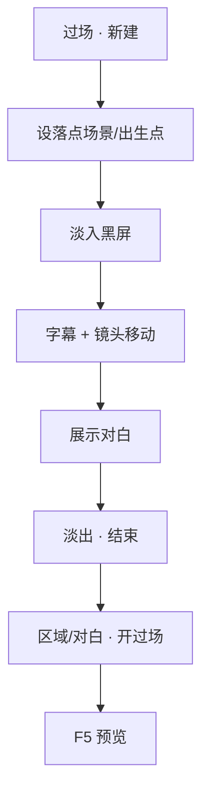

# 排一场过场

有些戏不适合玩家走着触发——黑屏、镜头推拉、电影感字幕、自动念白。这叫**过场**：按时间线一步步播，不用玩家按 E。雾津里进义庄、城隍庙叫魂，很多靠过场撑气氛。

---

## 读完你能做到什么

- 在主编辑器过场面板新建一条过场
- 用时间线步骤拼出：淡入 → 字幕 → 镜头移动 → 淡出
- 设过场结束落在哪个场景、哪个出生点
- 在场景区域或对白里「开过场」，预览里看完整演出

---

## 怎么开工具

主编辑器 → **叙事编排 → 过场**

```bash
./dev.sh editor
```

过场常被 **区域进入动作**、**热区调查**、**对白图里的跑动作** 调用。动作见 [怎么编排动作](../editors/concepts/actions)。

---

## 逐步操作

### 第 1 步：新建过场

1. 过场列表选 **新增**（或选已有条目改）
2. 填 **标识** 与备注名，如「城隍庙_影壁_初见」
3. 设 **目标场景** / **目标出生点** / **落点坐标** —— 播完后玩家站在哪
4. **恢复状态**（若有）：播完是否还原进过场前的镜头与位置——按剧情需要选

### 第 2 步：加时间线步骤

大纲列表从上到下即播放顺序。常见步骤类型（界面里是中文名）：

| 步骤 | 干什么 |
|---|---|
| **淡入黑屏 / 淡出黑屏** | 屏幕黑下去、亮起来 |
| **闪白** | 一瞬白光，惊吓或转场 |
| **等待时间** | 停若干秒 |
| **等待点击** | 玩家点一下才继续 |
| **标题字** | 大字幕，如章节名 |
| **展示对白** | 过场内自动念一句（说话人 + 台词） |
| **展示图片 / 隐藏图片** | 插一张插图 |
| **电影黑边 / 隐藏黑边** | 宽银幕感 |
| **字幕** | 底部或电影带字幕，可配音效情绪 |
| **镜头移动** | 平移到某坐标，可地图点选 |
| **镜头缩放** | 推近拉远 |
| **显示 / 隐藏角色** | 过场里谁露面 |
| **跑动作** | 某一步里执行给物品、设旗标等 |

点 **添加步骤**，从列表选类型，右侧填参数。

### 第 3 步：并行轨（可选）

需要「镜头在动的同时字幕在走」→ 添加 **并行** 步骤，里面再嵌多条子轨。大纲里可折叠、**拖拽排序**。

### 第 4 步：保存

**Ctrl+S**。过场步骤若用了编辑器不认识的额外字段，保存时可能被抹掉——只填检查器里有的项。

### 第 5 步：挂到游戏里

过场本身不会自动播，要有人调用：

1. **场景 · 区域 · 进入时** → 动作「开过场」，选刚做的过场  
   （见 [画一片区域触发剧情](./trigger-zone)）
2. 或 **对白图 · 跑动作** → 「开过场」
3. 或 **全局配置 · 初始过场**（开局播片）

### 第 6 步：预览

**F5** 触发过场，从头看到尾：镜头、字幕、落点场景是否正确。

---

## 流程示意



---

## 雾津小例子

**任务**：关二狗第一次被李天狗拽进义庄，短过场：黑屏 → 义庄标题 → 一句旁白 → 落在义庄门口。

1. 新建过场「义庄_初进」
2. 目标场景：义庄；出生点：门口 default
3. 步骤顺序：
   - 淡入黑屏（1 秒）
   - 标题字：「义庄」
   - 字幕：「停尸的床板，比码头还冷。」
   - 等待点击
   - 淡出
4. 雾津街头某 **转场热区** 或 **区域** 的进入动作里「开过场」选这条
5. **F5** 走过去触发

---

## 相关手册

- [过场面板](../editors/panels/cutscene)
- [场景面板](../editors/panels/scene) —— 热区也可绑过场列表
- [怎么编排动作](../editors/concepts/actions)
- [画一片区域触发剧情](./trigger-zone)
