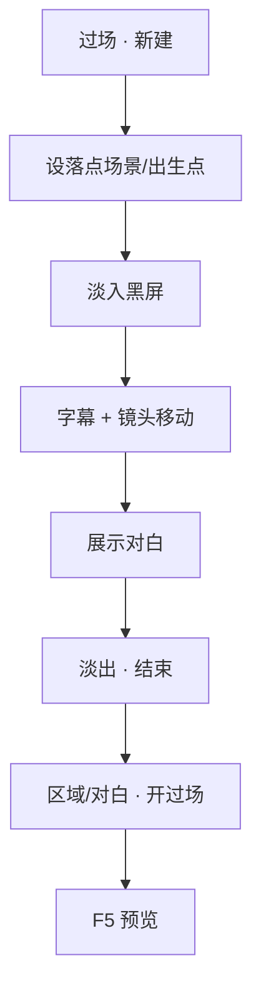

# 排一场过场

有些戏不适合玩家走着触发——黑屏、镜头推拉、电影感字幕、自动念白。这叫**过场**：按时间线一步步播，不用玩家按 E。雾津里进义庄、城隍庙叫魂，很多靠过场撑气氛。

---

## 这是什么（30 秒看懂）

对白图和区域触发的剧情，玩家多少还能自己控制节奏——点不点、走不走。**过场**不一样：它是一段**收走玩家控制权**、按你排好的时间线自动往下演的演出。黑屏几秒、镜头缓缓推向匾额、字幕一行行浮现、旁白自顾自念完——这些都不用玩家做任何事（除非某一步特意等他点一下）。你可以把过场想成折子戏里那种「幕间过渡」：灯暗下来，锣鼓点起，等灯再亮，场景已经换了。

过场本身排好了不会自己播——它要被别的地方**调用**：一片区域的进入动作、一个热区的调查动作、一张对白图里的跑动作节点、甚至任务接取或完成的那一刻，都可以在动作列表里选「开过场」，指定播哪一条。

## 读完你能做到什么

- 在主编辑器过场面板新建一条过场
- 用时间线步骤拼出：淡入 → 字幕 → 镜头移动 → 淡出
- 设过场结束落在哪个场景、哪个出生点
- 在场景区域或对白里「开过场」，预览里看完整演出

---

## 怎么开工具

主编辑器 → **叙事编排 → 过场**

```bash
./dev.sh editor
```

过场常被 **区域进入动作**、**热区调查**、**对白图里的跑动作** 调用。动作见 [怎么编排动作](../editors/concepts/actions)。

---

## 手把手逐步操作

### 第 1 步：新建过场

1. 过场列表选 **新增**（或选已有条目改）
2. 填 **标识** 与备注名，如「城隍庙_影壁_初见」
3. 设 **目标场景** / **目标出生点** / **落点坐标** —— 播完后玩家站在哪
4. **恢复状态**（若有）：播完是否还原进过场前的镜头与位置——按剧情需要选

### 第 2 步：加时间线步骤

大纲列表从上到下即播放顺序。常见步骤类型（界面里是中文名），大致分成两类：

**玩家看得见的呈现类步骤**：

| 步骤 | 干什么 |
|---|---|
| **淡入黑屏 / 淡出黑屏** | 屏幕黑下去、亮起来 |
| **闪白** | 一瞬白光，惊吓或转场 |
| **等待时间** | 停若干秒 |
| **等待点击** | 玩家点一下才继续 |
| **标题字** | 大字幕，如章节名 |
| **展示对白** | 过场内自动念一句（说话人 + 台词） |
| **展示图片 / 隐藏图片** | 插一张插图 |
| **电影黑边 / 隐藏黑边** | 宽银幕感 |
| **字幕** | 底部或电影带字幕，可配音效情绪 |
| **镜头移动** | 平移到某坐标，可地图点选 |
| **镜头缩放** | 推近拉远 |
| **显示 / 隐藏角色** | 过场里谁露面 |

**不直接被玩家看见、干实事的逻辑类步骤**：

| 步骤 | 干什么 |
|---|---|
| **跑动作** | 某一步里执行给物品、设旗标、切场景等——只能从一份允许列表里选，不在列表里的类型不能用 |

点 **添加步骤**，从列表选类型，右侧填参数。

### 第 3 步：并行轨（可选）

需要「镜头在动的同时字幕在走」→ 添加 **并行** 步骤，里面再嵌多条子轨。大纲里可折叠、**拖拽排序**。

### 第 4 步：保存

**Ctrl+S**。步骤的每一项都通过检查器里的表单填，复杂字段（如缓推缓移运镜）有专属折叠区，保存时都会保留。

### 第 5 步：挂到游戏里

过场本身不会自动播，要有人调用：

1. **场景 · 区域 · 进入时** → 动作「开过场」，选刚做的过场
   （见 [画一片区域触发剧情](./trigger-zone)）
2. 或 **对白图 · 跑动作** → 「开过场」
3. 或 **全局配置 · 初始过场**（开局播片）

### 第 6 步：预览

**F5** 触发过场，从头看到尾：镜头、字幕、落点场景是否正确。

---

## 流程示意



---

## 雾津完整实例

**任务**：关二狗第一次被李天狗拽进义庄，短过场：黑屏 → 义庄标题 → 一句旁白 → 等玩家点一下 → 淡出 → 落在义庄门口；同时镜头要在字幕出现的同时缓缓推近停尸床板。

1. 新建过场「义庄_初进」
2. 目标场景：义庄；出生点：门口 default
3. 步骤顺序：
   - 淡入黑屏（1 秒）
   - 标题字：「义庄」
   - **并行**：一轨字幕「停尸的床板，比码头还冷。」，另一轨镜头移动推向床板方向
   - 等待点击
   - 淡出
4. 雾津街头某 **转场热区** 或 **区域** 的进入动作里「开过场」选这条
5. **F5** 走过去触发，确认镜头推近和字幕是同时发生的，不是先后错开

---

## 常见卡点

**在场景里调用了「开过场」，但什么都没发生？**
先确认动作里选的过场 id 就是你刚才编辑的这一条——常见错误是当时新建了一份类似的过场做测试，动作却还指向旧的那份。其次检查外层有没有挂条件，条件不满足时同样不会播。

**过场播到「等待点击」那一步卡住不动，也没提示玩家该点哪？**
「等待点击」本身不会自动生成提示文字，需要你在这步之前用字幕或对白提前告诉玩家「点一下继续」，否则玩家可能以为是卡死了。

**过场播完，玩家却掉进黑屏或者卡进墙里？**
检查目标场景、出生点、落点坐标是不是三者没有对齐——比如目标场景填对了，但出生点的 key 拼错或者压根不存在，玩家会落到一个意料之外的地方。

**保存后发现某一步的参数少了一项？**
呈现步骤是数据无损的：像插图的缓推缓移运镜、字幕表情这类复杂字段都有专属编辑区，保存时会保留；先确认是不是在别的没展开的折叠区里漏填了，而不是被清掉了。

**加了一步跑动作，保存直接失败或者预览播不出来？**
过场里的跑动作只能用一份**允许列表**里的动作类型，不在这份名单里的类型编辑器会直接拒绝保存。遇到这种情况，检查你想用的动作是不是过场专属支持的类型，若不支持，考虑把这段逻辑挪到对白图或区域动作里去做，过场只负责纯演出。

---

## 进阶变体

- **并行轨做多层同步演出**：镜头推近的同时字幕浮现、BGM 渐强，这些「同时发生」的效果都靠**并行**步骤里嵌套多条子轨实现，而不是指望编辑器自动帮你对齐时间——子轨之间的节奏需要你自己用等待时间去微调。
- **镜头移动直接点地图选点**：镜头移动步骤支持在小地图上直接点选目标位置，比手填 x/y 坐标直观得多，尤其是想让镜头精确对准某个热区或雕像时。
- **电影黑边渲染仪式感**：想让某段过场显得更「电影」而不是游戏内常规演出，加一对电影黑边步骤，配合字幕用电影带样式，比经典对话框更有场面感——常用在重大剧情转折或首次进入重要场景时。
- **恢复状态决定演出算不算"打断"**：如果过场只是路过式的短暂演出（比如一句心理活动配镜头推近），通常希望播完恢复玩家原本的镜头与位置；如果过场明确要把玩家带到新地方（比如被拽进义庄），则不恢复，直接以目标场景/出生点为准——这个字段按场景语境选，别两种情况都用同一个默认值。
- **过场里也能给物品、设旗标**：不是所有逻辑都要挪到区域或对话里，过场自己的时间线里插入允许列表内的动作步骤，就能在演出过程中同步记旗标或给物品——比如镜头定格在某件遗物上的同时，悄悄把「已见过遗物」的旗标设为真。
- **多个调用入口共用同一场过场**：同一条过场完全可以被区域、热区、任务完成动作分别调用——比如「进义庄」这场过场，既可以是转场热区触发，也可以是某任务完成后的强制演出，不用为每个入口各做一份。

---

## 相关手册

- [过场面板](../editors/panels/cutscene)
- [场景面板](../editors/panels/scene) —— 热区也可绑过场列表
- [怎么编排动作](../editors/concepts/actions)
- [画一片区域触发剧情](./trigger-zone)
- [做一条任务线](./quest) —— 任务接取/完成时也常播过场
