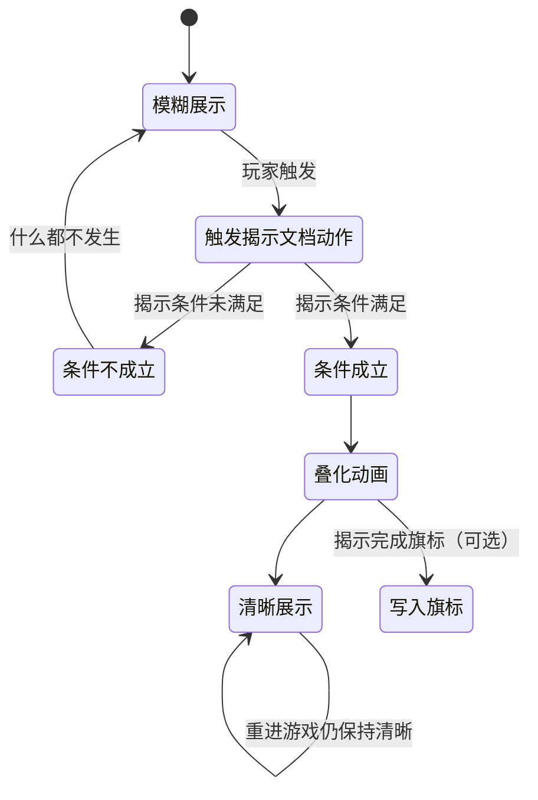

# 做一次文档揭示

庙祝案头那封被水浸糊的信、见闻录里一张洇着墨迹的旧照——有些文书不能让玩家一眼看清，得先攒够线索或推进到某一步剧情，字迹才「洇」出清楚来。这种「模糊 → 清晰」的效果在编辑器里叫**文档揭示**。这一页从零配一条揭示，接上触发它的动作，再用运行预览把「条件没满足」和「条件满足」两种画面都看一遍。

---

## 这是什么（30 秒看懂）

想象雾津庙祝手里那封被水浸糊的信——玩家要先集齐线索，或者剧情推进到某一步，信上的字迹才会「洇」出清楚来。文档揭示管的就是这一整套效果：一张模糊图、一张清晰图、一个决定「什么时候切换」的条件、一段叠化用多久的时长，以及切换完要不要顺手记一笔「已经看过了」。这套东西打包成一条条目，交给一条专门的动作去触发。

它和另一个看起来相似的面板——**叠图**——不是同一套东西：叠图管的是「呈现叠图」「叠化叠图」这几个动作的图片来源，文档揭示的模糊图和清晰图各自独立选文件，跟叠图登记表完全无关。这个区别第一次接触容易搞混，进阶部分会讲清楚。

读完这页你能：

- 独立配好一条文档揭示：选好模糊图/清晰图、定好触发条件、调好叠化时长与位置。
- 接对触发它的动作，让这条揭示真正能被玩家碰到。
- 用运行预览验证「条件未满足仍是模糊图」和「条件满足后叠化成清晰图」这两种结局。

---

## 入门：手把手做第一次

### 怎么开工具

主编辑器 → **资源 → 文档揭示**：

```bash
./dev.sh editor
```

### 先认几个词

| 词 | 大白话 |
|---|---|
| **模糊图 / 清晰图** | 揭示前后各自独立的两张图，不是同一张图做特效 |
| **揭示条件** | 决定"什么时候真的会揭示"的判断，最常用的是旗标或剧本阶段 |
| **过渡时序** | 叠化用多久、触发后延迟多久才开始叠化 |
| **揭示完成旗标** | 揭示成功后自动写为真的一个旗标，供别处判断"看过没有" |
| **揭示文档动作** | 真正触发这条揭示的动作，得挂在图对话/过场等能加动作的地方 |

### 第 1 步：新建一条揭示

1. 文档揭示列表点 **添加**。
2. **id** 建议和对应的[档案](../editors/panels/archive)文档同名，方便联想；也可以点「生成唯一 id」让编辑器自动分配。

### 第 2 步：选图

1. **模糊图**点浏览选一张"看不清"的图。
2. **清晰图**点浏览选一张"看清楚"的图，建议和模糊图同尺寸同构图，叠化才不会显得"跳"。
3. 如果懒得单独画一版模糊图，选好清晰图后可以用**涂抹生成**按钮，手绘水墨涂抹烘焙出一张同尺寸的模糊图。

### 第 3 步：定揭示条件

先用最直观的一种模式练手：

1. **揭示条件**选 **Flag 条件**。
2. 从旗标登记表里选一个已注册的旗标（没有就先去[旗标面板](../editors/panels/flags)注册，或参考[加一个旗标](./add-flag)）。
3. **比较方式**选 `==`；填要求达到的值，比如 `true`。

（如果你要的是剧情线推进到某个阶段才揭示，选 **Scenario 阶段** 模式，第 5 步的雾津实例会用到。）

### 第 4 步：定过渡时序与位置

1. **叠化时长**填 2000（2 秒）。
2. **起播延迟**留 0（立即开始）。
3. **水平/垂直位置百分比**先用默认 50/50（正中）。
4. **宽度百分比**填 40（占四成屏宽），高度会按图自身比例自动算。

### 第 5 步：填揭示完成旗标（可选）

想让别处的条件、对话分支知道"这条已经揭示过"，就填一个揭示完成旗标，比如 `letter_miaozhu_read`；不需要跨系统联动就留空。

### 第 6 步：保存

点 **Apply** 保存。

### 第 7 步：接上触发它的动作

文档揭示登记好不会自己触发，必须去[图对话](../editors/panels/dialogue-graph)的动作序列或[过场](../editors/panels/cutscene)里加一条**揭示文档**动作，「这条揭示对应的文档」选刚建好的这条 id。

### 第 8 步：验证

1. **F5** 起运行预览。
2. 用一个还没满足揭示条件的存档触发这条揭示文档动作——应该仍然是模糊图，什么都不会发生。
3. 让存档满足揭示条件后，再触发一次——应该看到叠化动画，最终停在清晰图。
4. 如果填了揭示完成旗标，确认这个旗标确实被写成了真值。
5. 退出重进游戏，再看一次这条揭示——应该直接是清晰图，不会重播叠化。

### 流程示意



---

## 雾津完整实例：庙祝的秘函

从零走一遍，做出"庙祝案头一封秘函，跟他聊够了才能看清"的效果：

1. 打开[旗标面板](../editors/panels/flags)，确认（或参照[加一个旗标](./add-flag)新建）一个旗标 `met_guan_ergou_trust`（对庙祝的信任程度到位），值类型布尔。
2. 打开文档揭示面板，新增一条，id 填 `letter_miaozhu`（和后面要联动的档案文档同名）。
3. **模糊图**选一张水渍信纸的图；**清晰图**选一张墨迹工整的扫描件；如果手头只有清晰图，用"涂抹生成"烘焙一张模糊图。
4. **揭示条件**选 **Flag 条件**：key 选 `met_guan_ergou_trust`，比较方式 `==`，值 `true`。
5. **叠化时长**填 2000，**起播延迟**留 0；**位置**用默认 50/50，**宽度百分比**填 40。
6. **揭示完成旗标**填 `letter_miaozhu_read`。
7. 点 **Apply** 保存。
8. 打开[图对话](../editors/panels/dialogue-graph)，找到玩家去检查这封信的那个热区或对话节点，添加一条**揭示文档**动作，「这条揭示对应的文档」选 `letter_miaozhu`。
9. 找到庙祝对话里推进信任度的那个节点，确认那里已经有一条**设旗标** `met_guan_ergou_trust` 为真的动作（如果还没有，照[加一个旗标](./add-flag)里的做法补一条）。
10. **Ctrl+S**，**F5** 起运行预览：用一个还没跟庙祝建立信任的存档去检查这封信——应该仍是模糊的水渍信纸；跟庙祝把对话聊到位、旗标变真之后，再去检查同一封信——这次应该看到叠化动画，最终停在清晰的扫描件；确认 `letter_miaozhu_read` 也被写成了真值。

---

## 进阶：每一项都讲透

### 基本信息

- **id**：这条揭示的标识，剧情侧靠它触发——"揭示文档"动作里"这条揭示对应的文档"下拉选它。可以和[档案](../editors/panels/archive)里一条文档同名，让"看揭示"和"翻档案"联动起来；没想好名字就点"生成唯一 id"。
- **模糊图**：揭示前显示的"看不清"图，直接选文件路径，不走叠图登记表的短 id。
- **清晰图**：揭示后显示的"看清"图，叠化结束后就一直保留这张，同样是直接选文件。建议和模糊图同尺寸同构图，叠化才自然；如果懒得单独画模糊图，用"涂抹生成"按钮对清晰图手绘涂抹烘焙一张即可。

### 揭示条件（五种模式逐条讲）

这是整个面板的核心，决定"什么时候真的会揭示"：

1. **Scenario 阶段**（最常用）：选一条剧情线（scenario），选它的某个阶段（phase），选要求达到的状态（一般用"已完成 done"），还可以选填一个具体的 outcome（要求这个阶段是某个特定结局值才揭示，不需要就留空）。
2. **Flag 条件**：从旗标登记表里选一个已注册的旗标，选比较方式（`==` 最常用，也支持 `!= > < >= <=`），填要求达到的值。本页示例用的就是这一种，最直观。
3. **任务状态**：选一个[任务](./quest)，选要求它到达的状态（如"已完成"或"进行中"）。
4. **JSON（高级：条件表达式）**：直接写一段条件表达式，给需要复杂且/或/非组合、又想手写的老手用。
5. **表达式树（all/any/not…）**：可视化拼且/或/非，效果等价于第 4 种，但用界面拖拽而不是手写，语义和通用的[条件](../editors/concepts/conditions)控件一致。

日常内容用前三种基本够用，第 4/5 种留给确实需要组合逻辑（比如"A 完成 且（B 或 C）"）的场合。

### 过渡时序（animation）

- **叠化时长**：叠化用多久（毫秒），2000 就是 2 秒，眼看着从模糊渐变到清晰。
- **起播延迟**：触发后先等多久再开始叠化（毫秒），0 就是立即开始，留一点延迟可以让玩家先意识到"发生了什么"再看画面变化。

### 位置与可选字段

- **揭示完成旗标（可选）**：揭示成功后自动写为真的一个旗标。想让别处的条件、对话分支知道"这条已经看过了"，就给它填一个；不需要跨系统联动就留空。
- **水平/垂直位置百分比**：清晰图（以及模糊图）中心贴在屏幕的水平/垂直百分比位置，50/50 是正中。
- **宽度百分比**：图的显示宽度占屏幕宽度的百分比，高度按图自身比例自动算，不用你手动配比。
- **高级：图层句柄（一般留空）**：这不是叠图登记表的引用，只是给这层揭示动画本身起的一个内部"把手"名字，留空时系统会自动生成一个。只有极少数需要用其它动作专门去寻址/关闭这一层的高级场景才需要手填，绝大多数情况完全不用碰这个字段。

### 怎么让它真正触发——揭示文档动作

文档揭示登记好之后不会自己触发，必须在[图对话](../editors/panels/dialogue-graph)的动作序列、[过场](../editors/panels/cutscene)，或其它能挂动作的地方加一条**揭示文档**动作，「这条揭示对应的文档」选这条登记的 id：

- 玩家触发这个动作时，系统才会去检查这条的揭示条件是否成立。
- **成立**：播放模糊到清晰的叠化动画、写入揭示完成旗标（若填了）、并把"已揭示"状态记进存档——下次重新进入游戏依然保持清晰，不会重播叠化。
- **不成立**：什么都不发生，玩家看到的仍然是模糊图。这意味着你完全可以把这条"揭示文档"动作挂在一个反复可点的检查类热区上——玩家没达成条件时点了也没关系，条件一旦满足再点一次就会真正揭示。

### 和"叠化叠图"动作的关系与迁移建议

早期做法是直接在过场/图对话里手写[叠图](../editors/panels/overlay)面板下的**叠化叠图**动作，给它填两张图路径来做"模糊变清晰"的效果。项目现在建议：这类"告示揭示真相"式的效果优先用**文档揭示 + 揭示文档动作**来做——条件判断、完成旗标、存档持久化都是专门支持好的，不用你在动作参数里手写来拼凑；只有确实不需要"记住是否揭示过"的一次性叠化效果，才继续用叠化叠图动作。

### 和其他面板/工具怎么配合

- **[档案](../editors/panels/archive)**：长篇文字内容放档案，文档揭示更适合"图证式"的渐进揭示，两者互补，id 同名能让"看揭示"和"翻档案"体验连贯。
- **[规矩](./rule)**：某条规矩验证到位后才能看清一份文书，是常见的搭配——揭示条件这时可以设计成对应规矩层解锁后写入的一个旗标。
- **[旗标](../editors/panels/flags)**：揭示条件选 Flag 条件时用到的旗标，得先在旗标面板注册好；揭示完成旗标同理，也需要先注册才会出现在下拉里。

### 批量做法与效率窍门

- 一批"先糊后清"的信件/告示，先把清晰图画好，用"涂抹生成"批量刷出对应模糊图，省一版单独素材。
- id 与对应档案文档同名，玩家"揭示了信件"和"翻档案能查到同一条"体验上更连贯。
- 调 x/y/宽度百分比时可以对着编辑器自带的"揭示过渡预览"边调边看，不用来回进游戏试。

---

## 危险区与边界

- 模糊图/清晰图比例不一致会导致清晰图被拉伸变形，两图同尺寸同构图效果最好。
- 最容易漏掉的一步是：面板里登记好了一条，却忘了在图对话/过场里挂"揭示文档"动作——这样玩家永远碰不到触发点，画面会永远停在模糊图，看起来像是"这功能没做"。
- 揭示完成旗标不是必填，但不填的话别处系统没法知道"这条到底揭示过没有"，只能靠揭示条件本身重复判断。
- 图层句柄不要填图片路径，它是内部把手名字，不是"贴哪张图"的字段，图永远填模糊图/清晰图两个专门的位置。
- 长篇文字内容仍然放[档案](../editors/panels/archive)，本面板更适合"图证式"的渐进揭示，别把大段文案塞进这里凑数。
- 更多编辑器整体可编辑边界见[危险区](../editors/concepts/danger-zone)。

---

## 常见问题

| 现象 | 原因 | 怎么办 |
|---|---|---|
| 永远只看到模糊图 | 没有任何地方挂"揭示文档"动作，或挂了但揭示条件一直未满足 | 检查图对话/过场是否加了揭示文档动作；用满足条件的存档测试 |
| 揭示完成后进度没被记住 | 没填揭示完成旗标 | 补上这个字段并 Apply |
| 清晰图被拉变形 | 宽度百分比与素材原始比例不符 | 调整宽度百分比或换成同比例的图 |
| 图层句柄填了图片名但没用 | 这个字段不是图片引用，是内部把手 | 图片改填模糊图/清晰图对应的字段 |
| 和叠图面板的图混着改 | 两套图片各自独立，互不联动 | 图片改动分别去对应面板改 |
| 重进游戏又看到叠化动画重播一遍 | 揭示状态会持久化，不会重播；如果重播了，通常是这条 id 被误删后又重建过 | 核对 id 是否被改名/重建，必要时恢复原 id |

---

## 相关

- [文档揭示面板](../editors/panels/doc-reveal)
- [叠图面板](../editors/panels/overlay)
- [档案面板](../editors/panels/archive)
- [规矩面板](./rule)
- [加一个旗标](./add-flag)
- [怎么编排动作](../editors/concepts/actions)
- [怎么设条件](../editors/concepts/conditions)
- [按目标查：我想做…](./goal-index)
