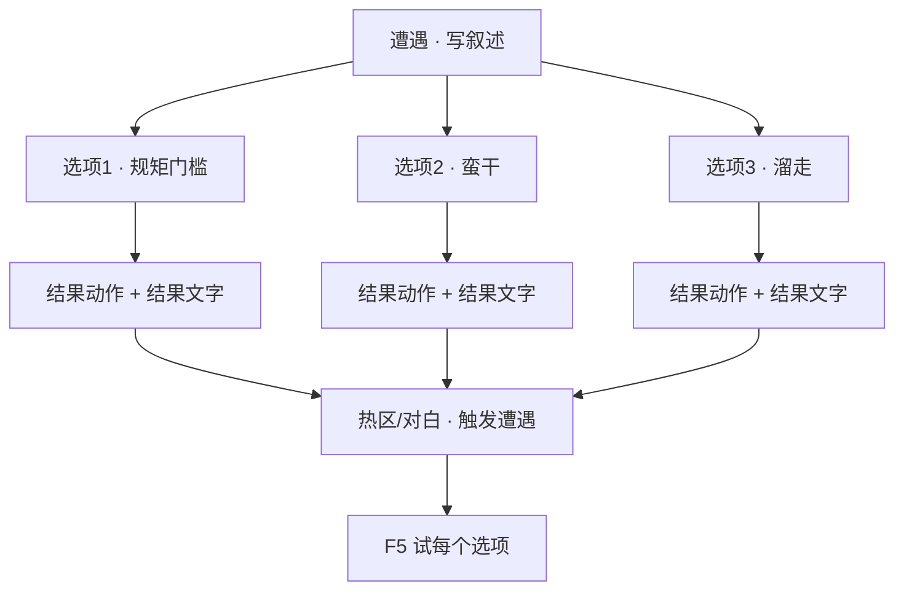

# 做一个遭遇

雾津不只有聊天——象理术、规矩判定、险境抉择，常做成**遭遇**：一屏事件描述，下面几个选项，有的要懂规矩、有的要耗物品，选完跑**结果动作**并显示**结果文字**。城隍庙前驱邪、义庄里镇煞，都适合遭遇。这一页带你从零建一条遭遇，挂到场景里，逐个选项试出该有的效果。

---

## 这是什么（30 秒看懂）

把**遭遇**想成庙祝案头一张「事件签」：签上先写一段情景（叙述），签下贴着几条纸条（选项），每条纸条背面写着「要懂哪条规矩」「要搭哪样供品（物品）」「抽中后发生什么、给你念哪句批语（结果动作与结果文字）」。玩家走到城隍庙影壁前，随手抽一张签，按自己懂不懂规矩、兜里有没有东西，能抽到的纸条不一样，抽完的结果也不一样。

遭遇和**图对话**的差别在于：图对话是一路对话线（可能有分支），遭遇是**一屏并列的选项**，更像「考验」而非「聊天」——不需要逐句念白，直接给判断结果。城隍庙前的对峙、纸人巷的抉择，用遭遇比用图对话更利落。

读完这页你能：

- 在遭遇面板新建一条遭遇，写好叙述与多个选项（普通 / 需规矩 / 需消耗物品等类型）。
- 给每个选项配门槛（规矩层、条件、消耗物品）与结果（结果动作、结果文字）。
- 把遭遇挂到场景热区或对白动作上，用运行预览逐个选项试。
- 认出遭遇特有的坑：规矩 id 写错、消耗未配够、只写反馈文字却没让世界真的变化。

---

## 入门：手把手做第一次


*遭遇面板：左侧遭遇列表，右侧写叙述文本与各选项及其后果。*

### 怎么开工具

主编辑器 → **叙事编排 → 遭遇**：

```bash
./dev.sh editor
```

遭遇常由 **遭遇型热区** 或 **对白图 · 跑动作 · 开始遭遇** 触发——这两条路本页第 4 步都会讲到。

### 先认几个词

| 词 | 大白话 |
|---|---|
| **遭遇** | 一次性或少数几次的「事件卡」，走近才弹出来 |
| **选项** | 玩家点的按钮，每条独立判定、独立结果 |
| **规矩层** | 象 / 理 / 术——玩家规矩本里这条规矩摸到第几层，遭遇选项按层设门槛 |
| **结果动作** | 选这项后发生什么——改旗标、给物品、进另一个遭遇、扣血都算 |
| **结果文字** | 选完展示给玩家的反馈台词 |

规矩本体在 [规矩面板](../editors/panels/rule) 里编；遭遇只**引用**规矩 id 和层，不重复定义规矩内容。

### 第 1 步：新建遭遇

1. 遭遇列表点 **新增**，填 **标识（id）**——以后场景热区、动作里都靠这个 id 找到它，取个一看就懂的名字，比如 `temple_shadow`。
2. 填 **叙述**（富文本）：玩家第一眼看到的事件描述。
   例：「庙口纸钱打着旋，像有人拽你的裤脚。」
   富文本里可以插人名、物品名等引用标签，写法见 [怎么写带引用的文本](../editors/concepts/rich-text)。

### 第 2 步：添加选项

选项列表 **新增** 若干条，每条检查器里有：

| 项 | 说明 |
|---|---|
| **选项文字** | 按钮上写的，如「按李天狗教的念咒」 |
| **选项类型** | 普通 / 需规矩 / 需消耗物品等，以界面下拉为准 |
| **所需规矩** | 下拉选一条规矩；不选就是无门槛 |
| **规矩层** | 若选了所需规矩，再选门槛层：象 / 理 / 术 |
| **消耗物品** | 选这项要扣什么、扣几个（若有） |
| **选项条件** | 额外门槛，如旗标、任务状态——和规矩门槛可以同时存在 |
| **结果动作** | 选中后执行的动作列表 |
| **结果文字** | 选完的反馈台词 |

用检查器上的 **上移 / 下移** 排按钮显示顺序。

### 第 3 步：设计不同结果

典型三条路（后面雾津例子会照这个搭）：

1. **懂规矩的选项** —— 所需规矩「破煞咒」、规矩层至少 **理** → 结果动作：设旗标成功、给轻微奖励
2. **蛮干选项** —— 无门槛，人人可点 → 结果动作：压力上升、设旗标失败
3. **溜走选项** —— 只改一个「已避开」旗标，跳过战斗或险境

结果动作具体能选哪些类型，见 [怎么编排动作](../editors/concepts/actions)。

### 第 4 步：挂到场景

**方式 A · 遭遇型热区**

1. 打开 [场景面板](../editors/panels/scene) → 新增 **热区**，类型选 **遭遇**
2. 热区的**指定遭遇**下拉选刚建的条目
3. 玩家走近按 E（或项目里对应的交互键）打开遭遇 UI

**方式 B · 对白或区域动作**

在图对话、过场或区域进入动作里选 **跑动作 → 开始遭遇**，选遭遇标识——这样对话聊到某句话，或玩家踩进某片区域，都能直接弹出遭遇，不用非得靠热区。

### 第 5 步：保存与验证

1. **Ctrl+S** 保存
2. **F5** 起运行预览
3. 每个选项点一遍：门槛不满足的应显示灰态或禁点提示；门槛满足选中的，结果文字与旗标变化要符合预期

### 流程示意



---

## 雾津完整实例：城隍庙 · 影壁煞气

从头走一遍，照抄就能出效果：

1. 遭遇列表新增，id 填 `temple_shadow`。
2. 叙述：「影壁后冷风贴后颈，像有人吹气。」
3. 添加选项一：「念破煞咒」——选项类型选需规矩；所需规矩选「破煞咒」；规矩层选 **理**；结果动作设旗标 `temple_shadow_cleared` 为成功；结果文字「符光一闪，风停了。」
4. 添加选项二：「硬闯过去」——无门槛；结果动作设旗标 `temple_shadow_angered`；结果文字「脚踝一凉，像被什么东西缠住。」
5. 添加选项三：「退后两步」——无门槛；结果动作只设旗标 `temple_shadow_avoided`；结果文字随意写一句「你退到了安全的地方」。
6. 用上移/下移把「退后两步」放最后一条。
7. 打开城隍庙场景，在影壁位置新增热区，类型选**遭遇**，指定遭遇选 `temple_shadow`。
8. 回到 [立一条规矩](./rule) 确认「破煞咒」这条规矩确实存在，且测试存档里 **理** 层已经解锁（没解锁就先按那页教的方法临时解锁）。
9. **Ctrl+S**，**F5**，走近影壁触发遭遇，三种选法各试一次：理层没解锁时「念破煞咒」应该是灰的或点了没反应；解锁后应该能点，点完旗标和文字都要对得上。

---

## 进阶：每一项都讲透

### 选项字段逐条讲透

- **选项文字**：就是按钮上的字，尽量让玩家一眼看出「这条路要付出什么」——比如带上「（需规矩）」「（消耗符纸）」这类暗示，别让玩家瞎点才发现要花钱。
- **选项类型**：决定这条选项走哪套判定逻辑（普通 / 规矩门槛 / 物品消耗等），选错类型可能导致门槛字段填了也不生效，具体以你项目界面列出的类型为准。
- **所需规矩 + 规矩层**：两个字段是一对——只填规矩不选层，或层选错，都会让选项「看起来配置了却永远不满足」。层的含义详见 [立一条规矩](./rule)：象最浅、理居中、术最深。
- **消耗物品**：选这项要扣的物品与数量。物品本身要先在 [物品面板](../editors/panels/item) 登记好，遭遇这里只引用 id——写错 id 或者玩家背包里数量不够，选项要么点不了要么点了扣不掉，一定要预览里实点一次验证。
- **选项条件**：规矩、物品之外的额外门槛，比如「只有设了某旗标才显示这条选项」「只有某任务处于进行中才能选」。条件的完整写法见 [怎么设条件](../editors/concepts/conditions)。
- **结果动作**：这是选项真正「改变世界」的地方——给奖励、扣血、切场景、进另一个遭遇、推动任务旗标，都在这里编排。**只写结果文字、不写结果动作是最常见的坑**：玩家看到字变了但游戏状态其实没变，任务卡关时第一个该查的就是这个。
- **结果文字**：反馈台词，成功失败的语气要拉开差距，让玩家一眼分辨自己选对了没有。

### 三条路的设计套路

遭遇最常见的设计模式，就是本页示例里的「懂规矩 / 蛮干 / 溜走」三分法：

| 路线 | 适合场景 | 通常配置 |
|---|---|---|
| 懂规矩 | 玩家提前学了对应规矩，给正向反馈 | 所需规矩 + 层门槛，结果给小奖励或推进剧情 |
| 蛮干 | 没学规矩也能选，但要承担代价 | 无门槛，结果动作扣血、加压力值或触发险境 |
| 溜走 | 给玩家一条不冒险但也没收获的路 | 无门槛，仅改旗标，跳过战斗/长按等风险环节 |

按这个思路铺选项，遭遇天然会有「有准备的玩家更轻松、没准备的玩家有代价但不会卡死」的手感。

### 和其他面板/工具怎么配合

- **规矩面板**：遭遇选项的门槛来源，先立好规矩三层文本，遭遇这里才有得选，见 [立一条规矩](./rule)。
- **物品面板**：消耗物品的登记处，物品 id、堆叠上限都在那边定义。
- **任务面板**：遭遇结果动作常用来推进任务——比如结果动作里设的旗标，正好是某条任务的完成条件。
- **图对话/过场**：遭遇可以从对话或过场里用「开始遭遇」动作触发，也可以在遭遇结果动作里反过来「进另一个遭遇」或「跑对话」，做成多阶段事件链。
- **临场长按/信号**：蛮干路线的代价，除了扣血、加压力值，也常见接到临场长按（一段紧张的按键蓄力）或触发一次险境信号。

### 批量做法与老手技巧

- **生成唯一 id**：新建选项时用工具自带的生成按钮拿唯一 id，别自己手打——手打容易和别处撞车导致引用错乱。
- **结果动作链式设计**：一个遭遇的结果动作可以直接「开始遭遇」进入下一个遭遇，做出「先抽一签、再抽一签」的连锁事件，比如城隍庙先遇到影壁煞气，选错了直接进入第二个更凶险的遭遇。
- **热区显示条件**：热区本身可以加条件，只有某旗标成立时才显示这个遭遇型热区——常用来做「同一个位置，剧情前期没有遭遇、后期才出现」的效果，别把所有遭遇都做成一开局就能触发。
- **规矩层+物品双重门槛**：进阶设计可以同时给一个选项配规矩层和消耗物品，做出「你得又懂规矩、又带够东西」的高门槛选项，通常用来对应「最优解」路线。

---

## 危险区与边界

- 遭遇本身的数据结构不复杂，日常编辑风险不大，但**删除遭遇前**一定要确认场景热区、任务、对话里没有别处还在引用这个遭遇 id——删掉后引用处会找不到目标。
- 改动**所需规矩**或**规矩层**要小心：这是纯文本/下拉引用，编辑器不会帮你检查规矩 id 是否真实存在，写错只会表现为「选项永远点不亮」，不会报错提示。
- 遭遇不属于主编辑器的重建区高危项，但如果同一个遭遇同时被多处引用（多个热区、多条对话都指向它），改动结果动作时要留意是不是会影响到你没想到的那条触发路径。
- 更系统的「哪里改了会丢、哪里编辑器根本够不着」，参考 [危险区](../editors/concepts/danger-zone) 与 [可编辑面参考](../reference/danger-zone)。

---

## 常见问题

| 现象 | 原因 | 怎么办 |
|---|---|---|
| 选项永远是灰的 | 所需规矩 id 或规矩层配错 | 回规矩面板核对 id 拼写与三层是否都填了 |
| 点了选项没扣物品 | 消耗物品的 id 或数量配置有误 | 核对物品面板里的 id，预览里实点一次看背包变化 |
| 反馈文字变了，但游戏状态没变 | 只写了结果文字、没配结果动作 | 补上对应的旗标/给予/切场景等结果动作 |
| 场景热区走近没弹遭遇 | 热区类型没选对、或指定遭遇 id 写错 | 回场景面板检查热区类型与遭遇引用 |
| 硬闯选项选完什么都没发生 | 结果动作链是空的 | 补上扣血、加压力或触发下一遭遇等动作 |
| 三条选项想要不同优先级展示 | 顺序只由列表里的位置决定 | 用检查器的上移/下移调整显示顺序 |

---

## 相关

- [遭遇面板](../editors/panels/encounter)
- [规矩面板](../editors/panels/rule)
- [场景面板 · 热区](../editors/panels/scene)
- [怎么编排动作](../editors/concepts/actions)
- [怎么设条件](../editors/concepts/conditions)
- [立一条规矩](./rule) —— 遭遇的规矩门槛从这里立起
- [做一条任务线](./quest) —— 遭遇结果常改旗标驱动任务
