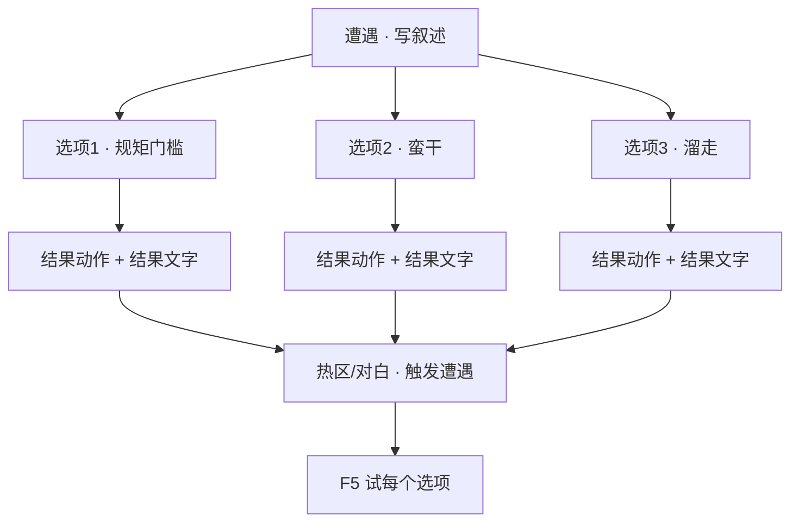

# 做一个遭遇

雾津不只有聊天——象理术、规矩判定、险境抉择，常做成**遭遇**：一屏事件描述，下面几个选项，有的要懂规矩、有的要耗物品，选完跑**结果动作**并显示**结果文字**。城隍庙前驱邪、义庄里镇煞，都适合遭遇。

---

## 读完你能做到什么

- 在遭遇面板新建一条遭遇
- 写事件叙述与多个选项（普通 / 规矩 / 消耗物品等类型）
- 给选项设门槛与结果
- 在场景热区或对白里拉起遭遇，预览里逐选项试

---

## 怎么开工具

主编辑器 → **叙事编排 → 遭遇**

```bash
./dev.sh editor
```

遭遇常由 **遭遇型热区** 或 **对白图 · 跑动作 · 开始遭遇** 触发。

---

## 遭遇里几个词

| 词 | 大白话 |
|---|---|
| **遭遇** | 一次性或少数几次的「事件卡」 |
| **选项** | 玩家点的按钮，每条独立判定 |
| **规矩层** | 象 / 理 / 术——玩家规矩本里掌握到第几层才解锁 |
| **结果动作** | 选这项后发生什么（伤害、旗标、给物品） |
| **结果文字** | 选完展示给玩家的反馈 |

规矩本体在 [规矩面板](../editors/panels/rule) 里编；遭遇只**引用**规矩。

---

## 逐步操作

### 第 1 步：新建遭遇

1. 遭遇列表 **新增**，填 **标识**
2. **叙述**（富文本）：玩家第一眼看到的事件描述  
   例：「庙口纸钱打着旋，像有人拽你的裤脚。」

### 第 2 步：添加选项

选项列表 **新增** 若干条，每条检查器里有：

| 项 | 说明 |
|---|---|
| **选项文字** | 按钮上写的，如「按李天狗教的念咒」 |
| **选项类型** | 普通 / 需规矩 / 需物品等（以界面为准） |
| **所需规矩** | 下拉选规矩；可选 **象 / 理 / 术** 层数门槛 |
| **消耗物品** | 选这项要扣什么（若有） |
| **选项条件** | 额外门槛（旗标、任务状态） |
| **结果动作** | 选中后执行的动作列表 |
| **结果文字** | 反馈对白 |

用 **上移 / 下移** 排按钮顺序。

### 第 3 步：设计不同结果

典型三条路：

1. **懂规矩的选项** —— 需规矩「破煞咒」至少 **理** 层 → 结果：设旗标成功、轻微奖励
2. **蛮干选项** —— 无门槛 → 结果：压力上升、设旗标失败
3. **溜走选项** —— 结果：只改旗标，战斗/风险跳过

结果动作类型见 [怎么编排动作](../editors/concepts/actions)。

### 第 4 步：挂到场景

**方式 A · 遭遇热区**

1. **场景** → 新增 **热区**，类型选 **遭遇**
2. 指定 **遭遇** 下拉选刚建的条目
3. 玩家走近按 E 打开遭遇 UI

**方式 B · 对白或区域动作**

- **跑动作 → 开始遭遇**，选遭遇标识

### 第 5 步：保存与验证

1. **Ctrl+S**
2. **F5** 预览
3. 每个选项点一遍：门槛不对的应不可选或给禁点提示；选对的结果文字与旗标变化符合预期

---

## 流程示意



---

## 雾津小例子

**遭遇**：「城隍庙 · 影壁煞气」

1. 叙述：「影壁后冷风贴后颈，像有人吹气。」
2. 选项：
   - 「念破煞咒（需规矩 · 破煞咒 · 理）」→ 成功，设 `temple_shadow_cleared`，结果文字：「符光一闪，风停了。」
   - 「硬闯过去」→ 设 `temple_shadow_angered`，结果文字：「脚踝一凉，像被什么东西缠住。」
   - 「退后两步」→ 仅设 `temple_shadow_avoided`
3. 城隍庙影壁 **遭遇热区** 绑定此遭遇
4. 先在 [立一条规矩](./rule) 里确保「破煞咒」存在且测试存档里 **理** 层已解锁
5. **F5** 三种选法各试一次

---

## 相关手册

- [遭遇面板](../editors/panels/encounter)
- [规矩面板](../editors/panels/rule)
- [场景面板 · 热区](../editors/panels/scene)
- [怎么设条件](../editors/concepts/conditions)
- [做一条任务线](./quest) —— 遭遇结果常改旗标驱动任务
