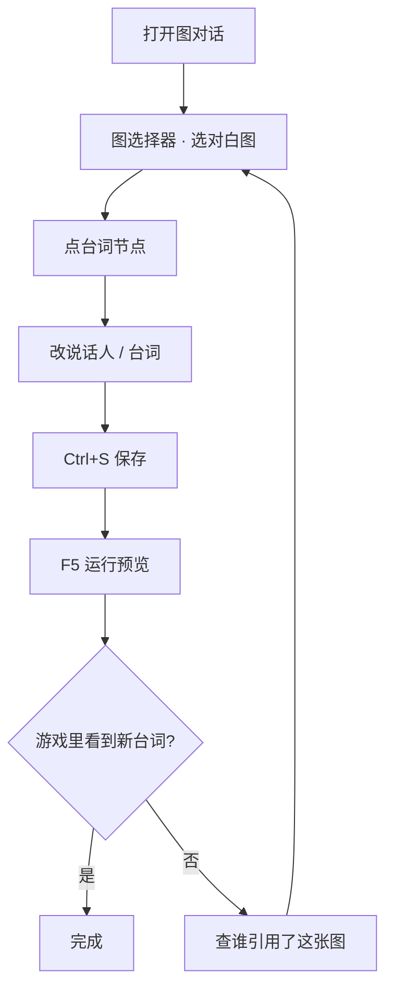

# 改你的第一句对白

对白是雾津里最常改的东西。这一页只讲一件事：找到一句台词、改掉它、在游戏里亲眼看到。

---

## 这是什么（30 秒看懂）

雾津里所有人说的话——李天狗的冷嘲热讽、关二狗的碎碎念、庙祝的场面话——都不是散落在场景里的孤立文字，而是串在一张张**对白图**上的**台词节点**。你可以把对白图想成折子戏的**唱本**：一页页翻下去，谁在第几句说什么、说完往下翻到哪一页，都写得明明白白。改一句台词，就是翻到唱本的某一页，划掉旧词，写上新词。

一张对白图可以被很多地方**引用**：某个 NPC 站在那儿等你搭话、某个热区让你点了看说明、某场过场里自动念白——它们都只是「翻开这本唱本，从第几页开始念」，唱本本身只有一份。这也是为什么改台词有时候「感觉没生效」：你八成是改了另一本唱本，或者改对了唱本但游戏翻开的是另一页。

## 读完你能做到什么

- 在主编辑器里打开图对话，找到目标对白图
- 认出**台词节点**并修改说话人与台词
- 保存后在游戏里触发这段对话，确认改动生效

---

## 怎么开工具

**推荐**：主编辑器 → 左侧 **叙事编排 → 图对话**

**独立窗口**（画布更大时）：

```bash
./dev.sh dialogue-graph
```

也可从 Web 控制台点「图对话编辑器」按钮。详见 [图对话编辑器](../editors/narrative-domain/dialogue-graph-editor)。

若还没打开主编辑器：

```bash
./dev.sh editor
```

---

## 手把手逐步操作


*图对话面板：左侧按叙事归属列出所有对白图，中间是节点画布。*

### 第 1 步：选对白图

1. 打开图对话面板
2. 顶部**图选择器**下拉，浏览已有对白图的名字
3. 选中一张——不确定时，先挑关二狗或李天狗相关的图练手

> **对白图**：一整段对话的「路线图」，由许多节点连起来。一张图可以被 NPC、热区或过场引用。

### 第 2 步：找到台词节点

画布上的方块就是节点。你主要认这几种：

| 节点（大白话） | 干什么 |
|---|---|
| **台词节点** | 某人说一句话（或连续几句） |
| **选项节点** | 给玩家几个选项，选不同路 |
| **分支节点** | 按条件走不同下一跳 |
| **跑动作** | 播过场、给物品、切场景等 |
| **结束** | 对话结束 |

点一个**台词节点**，右侧检查器会显示：

- **说话人**：可以是玩家、指定 NPC、场景里当前那个 NPC（谁跟你说话就算谁）、或一个固定字面名字（比如旁白、一个不在角色登记里的路人）
- **台词**：富文本框，可插名字、物品等引用
- **多拍台词**（可选）：同一个人连续说好几句，不用拆成好几个节点，往「多拍」列表里追加一条就是下一句

### 第 3 步：改台词

1. 在「台词」框里直接改字
2. 若要插玩家名或物品名，用检查器里的「插入引用」按钮，别手打奇怪格式
3. **Ctrl+S** 保存

富文本用法见 [怎么写带引用的文本](../editors/main-editor/shared-rich-text)。

### 第 4 步：确认连边没断

台词节点下方有「下一跳」——指向下一个节点。改完字若对话播到一半卡住，回来检查这条线是否还连着**结束**或下一个**台词节点**。

### 第 5 步：进游戏验证

1. 主编辑器按 **F5** 运行预览
2. 走到会触发这段对话的位置（NPC 旁边、调查点、过场里——取决于谁引用了这张对白图）
3. 对白框里应出现你刚改的字

若看不到：先确认保存了，再确认游戏里触发的是**同一张对白图**。排查思路见下方「常见卡点」，或 [出问题怎么办](./troubleshooting)。

---

## 流程示意



---

## 雾津完整实例

**任务**：把李天狗初见关二狗时一句冷淡的招呼，改得更像游方道士的口吻，并确认它在两个地方都能触发——场景里直接搭话、以及某条热区调查触发的同一句开场白。

1. 图选择器里找李天狗相关的对白图，比如 `li_tiangou_first_meet`
2. 第一个**台词节点**里，说话人选「李天狗」或对应场景 NPC 选项
3. 台词改成：「道士穷归穷，眼睛倒是亮。你找谁？」
4. 检查这个节点是不是**多拍**的——如果李天狗原本连说了两句，第二句也顺手改一改语气，别一句道士腔一句普通话
5. **Ctrl+S** 保存
6. **F5** 进雾津街头，走近李天狗按互动键——对白框里应该是新台词
7. 再去找场景里那个「土地庙」调查热区，点一下——如果它也引用了同一张图、同一个入口，应该看到同样的新台词；如果台词还是旧的，说明这个热区其实挂的是另一张图或另一个入口，需要单独去改

茶馆的雾还没散，台词已经换成你的版本了。

---

## 常见卡点

**改了保存了，游戏里还是旧台词？**
八成是游戏里触发的**不是同一张对白图**，或者不是同一个**入口节点**。同一句招呼语，可能被两张图分别写过一份（比如「第一次见面」和「已经认识」两条线各自独立），你只改了其中一张。回去看看触发这段对话的 NPC 或热区，检查它绑的图 id 和入口是不是你刚改的那个。

**对话播到一半突然结束或卡住？**
多半是「下一跳」没接上——你改台词时手滑清空了连线，或者上一次编辑时节点被重建、断了线。回到画布，从这个节点的出口重新拖一条线到下一个节点，或在检查器「下一跳」里重新选一次。

**插入引用后，游戏里显示的是奇怪的方括号文字？**
说明手打的引用格式不对，或者引用的对象（玩家名、物品名）在系统里根本不存在。用检查器的「插入引用」按钮生成，不要凭记忆手打。

**同一张图，独立图对话工具里改的和主编辑器里看到的不一样？**
两边编的是同一份图，只是入口不同的窗口。养成习惯：改完在**其中一边**保存后，切到另一边前先重新打开一次图，避免看到编辑前的旧画布缓存。

**保存后，节点里我多填的一个字段消失了？**
先确认这是不是引用的东西被删了或改了 id——这是最常见的原因。台词节点的检查器覆盖了说话人、台词、多拍列表、头像等全部活字段，保存后都会保留；详见 [危险区](../editors/concepts/danger-zone)。

---

## 进阶变体

- **说话人不是"人"**：说话人除了玩家和登记好的 NPC，还能选「场景里当前这个 NPC」——同一张图挂在不同 NPC 身上时，说话人自动跟着换，不用为每个 NPC 各写一张图；也能选一个纯字面名字，用来写画外音或不需要角色登记的临时角色。
- **一句话拆成几拍**：想让一段独白有停顿感（先说一句，停一下，再说下一句），不用拆成两个台词节点接来接去，直接在同一个台词节点的「多拍」列表里往后追加，画面上会按顺序一拍拍念出来。
- **对白结束前顺手做点别的**：台词说完想给玩家一件东西、翻开一页新的档案条目、或者悄悄记一个旗标——接一个**跑动作**节点，把这些放进去，参见 [怎么编排动作](../editors/concepts/actions)。
- **同一句台词在多处复用**：不建议为每个引用处复制一份台词图。宁可维护一张公共的「问候」图，被多个 NPC 或热区共同指向同一个入口；改一次，处处生效，也避免你今天改了这处、忘了改另一处。
- **批量找台词**：图选择器一般支持按名字搜索。给对白图起一个能一眼看出「谁的、什么场合」的名字（比如 `li_tiangou_first_meet`），比一堆 `dialogue_001` 好找得多，也方便以后回来改。
- **多语言/多版本台词**（若项目有此需求）：留意台词框旁是否有语言切换或版本标记；只改了默认语言，其它语言版本不会跟着变。

---

## 相关手册

- [图对话面板](../editors/panels/dialogue-graph) —— 面板级完整说明
- [怎么编排动作](../editors/concepts/actions) —— 对白里「跑动作」节点会用到
- [怎么设条件](../editors/concepts/conditions) —— 分支、选项门槛
- [写一段带选择的对白](./branching-dialogue) —— 下一步：加选项分支
- [术语表 · 对白图](../reference/glossary) —— 第一次见「对白图」可点此
