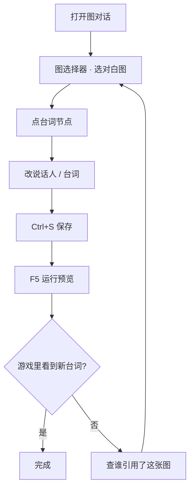

# 改你的第一句对白

对白是雾津里最常改的东西。这一页只讲一件事：找到一句台词、改掉它、在游戏里亲眼看到。

---

## 读完你能做到什么

- 在主编辑器里打开图对话，找到目标对白图
- 认出**台词节点**并修改说话人与台词
- 保存后在游戏里触发这段对话，确认改动生效

---

## 怎么开工具

**推荐**：主编辑器 → 左侧 **叙事编排 → 图对话**

**独立窗口**（画布更大时）：

```bash
./dev.sh dialogue-graph
```

也可从 Web 控制台点「图对话编辑器」按钮。详见 [图对话编辑器](../editors/narrative-domain/dialogue-graph-editor)。

若还没打开主编辑器：

```bash
./dev.sh editor
```

---

## 逐步操作

### 第 1 步：选对白图

1. 打开图对话面板
2. 顶部**图选择器**下拉，浏览已有对白图的名字
3. 选中一张——不确定时，先挑关二狗或李天狗相关的图练手

> **对白图**：一整段对话的「路线图」，由许多节点连起来。一张图可以被 NPC、热区或过场引用。

### 第 2 步：找到台词节点

画布上的方块就是节点。你主要认这几种：

| 节点（大白话） | 干什么 |
|---|---|
| **台词节点** | 某人说一句话（或连续几句） |
| **选项节点** | 给玩家几个选项，选不同路 |
| **分支节点** | 按条件走不同下一跳 |
| **跑动作** | 播过场、给物品、切场景等 |
| **结束** | 对话结束 |

点一个**台词节点**，右侧检查器会显示：

- **说话人**：玩家、某个 NPC、场景里的 NPC、或固定名字
- **台词**：富文本框，可插名字、物品等引用

### 第 3 步：改台词

1. 在「台词」框里直接改字
2. 若要插玩家名或物品名，用检查器里的「插入引用」按钮，别手打奇怪格式
3. **Ctrl+S** 保存

富文本用法见 [怎么写带引用的文本](../editors/main-editor/shared-rich-text)。

### 第 4 步：确认连边没断

台词节点下方有「下一跳」——指向下一个节点。改完字若对话播到一半卡住，回来检查这条线是否还连着**结束**或下一个**台词节点**。

### 第 5 步：进游戏验证

1. 主编辑器按 **F5** 运行预览
2. 走到会触发这段对话的位置（NPC 旁边、调查点、过场里——取决于谁引用了这张对白图）
3. 对白框里应出现你刚改的字

若看不到：先确认保存了，再确认游戏里触发的是**同一张对白图**。排查思路见 [出问题怎么办](./troubleshooting)（待写）。

---

## 流程示意



---

## 雾津小例子

**任务**：把李天狗初见关二狗时一句冷淡的招呼，改得更像游方道士的口吻。

1. 图选择器里找李天狗相关的对白图
2. 第一个**台词节点**里，说话人选「李天狗」或对应 NPC
3. 台词改成：「道士穷归穷，眼睛倒是亮。你找谁？」
4. **F5** 进雾津街头或触发该对话的场景，跟李天狗搭话

茶馆的雾还没散，台词已经换成你的版本了。

---

## 相关手册

- [图对话面板](../editors/panels/dialogue-graph) —— 面板级完整说明
- [怎么编排动作](../editors/concepts/actions) —— 对白里「跑动作」节点会用到
- [怎么设条件](../editors/concepts/conditions) —— 分支、选项门槛
- [术语表 · 对白图](../reference/glossary) —— 第一次见「对白图」可点此
