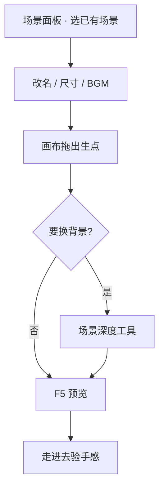

# 摆一个新场景

雾津由许多**场景**拼成——码头、义庄、雾津街头、城隍庙……每一幕都是一张可走的地图。这一页教你打开场景面板，把**已有场景**摆好、设出生点，再让玩家走进去。

:::info[关于「新建场景」]
场景面板**没有「新建场景」按钮**。新场景通常由项目组在资源管线里添加；你在编辑器里做的是**选中已有场景并编辑**。若要让玩家一启动就进某场景，到 [全局配置](../editors/panels/config) 里设「初始场景」。
:::

---

## 这是什么（30 秒看懂）

如果把雾津想成一出连台大戏，**场景**就是每一幕的**布景**——码头有码头的水汽和缆绳，城隍庙有城隍庙的香火与阴影。场景面板管的是「这一幕舞台」的整体设置：这块地有多大、走多快、进场时放什么曲子、给整幕定个什么色调，以及舞台上摆的道具（**热区**）、感应机关（**区域**）、跑龙套的（**NPC**）、演员从哪个侧幕条上场（**出生点**）。

这一页只带你搭「舞台本身」——尺寸、氛围、出生点。舞台上的道具和角色，分别在 [放一个会说话的 NPC](./place-npc) 和 [画一片区域触发剧情](./trigger-zone) 里细讲。

## 读完你能做到什么

- 在主编辑器场景面板里选中并打开一个场景
- 调整场景名、世界尺寸、背景音乐等顶层设置
- 在画布上摆好**出生点**，用运行预览走进去
- 知道背景图要在哪类工具里换（主编辑器改不了背景层）

---

## 怎么开工具

主编辑器 → 左侧 **物理世界 → 场景**

```bash
./dev.sh editor
```

场景画布里还能拖**热区**、**NPC**、**区域**——本页先聚焦场景本身；放 NPC 见 [放一个会说话的 NPC](./place-npc)。

---

## 手把手逐步操作


*场景面板：左侧场景列表，中间画布摆放热区与 NPC，右侧属性栏。图中是雾津「桥下」场景。*

### 第 1 步：选中要改的场景

1. 打开场景面板
2. 顶部或侧栏有**场景列表**（下拉或列表，视版本布局而定）——点选「雾津街头」「义庄」等已有条目
3. 画布加载该场景的俯视图与实体

没有「新建」？正常。若要玩家开局进某场景：打开 **全局配置** 面板，把「初始场景」设成目标场景名，保存后 **F5** 预览。

### 第 2 步：改场景顶层信息

右侧检查器里常见项：

| 设置 | 干什么 |
|---|---|
| **场景名** | 显示用名字，也供其它面板引用 |
| **世界宽 / 高** | 可走范围；可锁宽高比 |
| **世界缩放** | 整体尺寸手感 |
| **背景音乐** | 进场景自动播的 BGM |
| **滤镜** | 色调氛围（需先在滤镜工具里做好） |
| **镜头缩放 / 像素比** | 画面远近与像素密度 |
| **行走 / 奔跑速度** | 玩家在本场景的移动速度 |
| **进场景时跑动作** | 一进来就执行的动作（可选） |

改完 **Ctrl+S** 保存。

### 第 3 步：摆出生点

**出生点**是玩家进入场景时站的位置。

1. 画布左侧或列表面板找到「出生点」
2. 选中默认出生点（通常不可删），在画布上**拖到**合适位置——比如雾津街头茶馆门口
3. 需要多个入口时，可**新增**出生点并起名，供转场热区指定「落到哪个点」

:::warning[出生点别乱删]
默认出生点删不掉；其它出生点删了，引用它的转场可能把玩家丢到奇怪的地方。
:::

### 第 4 步：背景与深度（知道去哪改）

主编辑器**改不了背景图列表**——背景在**场景深度工具**里维护、导出。若画面缺层或遮挡不对，去 [场景深度工具](../editors/render-domain/scene-depth-editor) 处理，再回到场景面板验证出生点与实体位置。

### 第 5 步：进游戏走一圈

1. **F5** 运行预览
2. 若刚改了全局「初始场景」，应直接落在你设的场景；否则从地图或转场热区走进去
3. 确认：BGM 对了、出生点对了、边界不会把玩家卡死

---

## 流程示意



---

## 雾津完整实例

**任务**：让玩家读档后落在「雾津街头」，出生点就在李天狗常蹲的庙口附近，进场就飘一句氛围旁白，BGM 换成街头环境音。

1. 场景列表选「雾津街头」
2. 默认出生点拖到庙口石阶前
3. 世界宽高确认能覆盖整条街，锁住宽高比避免以后被拉变形
4. BGM 下拉选街头环境音那条（需先在 [音频面板](../editors/panels/audio) 登记好）
5. 「进场景时跑动作」加一条**播脚本对白**，说话人选玩家，台词写「雾比昨天更浓了。」
6. 全局配置里「初始场景」设为雾津街头（若要做开局测试）
7. **Ctrl+S**，**F5** —— 关二狗应站在庙口，江雾在脚边，一进场就飘出那句独白

---

## 常见卡点

**F5 之后玩家没有落在我设的场景？**
检查你改的是**全局配置**里的「初始场景」，不是场景面板本身——场景面板只负责这张图长什么样，「开局进哪张图」是全局配置管的。另外确认存档不是从别处读的旧进度——已有存档不会因为改了初始场景就自动跳转。

**出生点拖了、保存了，玩家却落在别的位置？**
可能是转场热区指定的「目标出生点」不是这个点的 key。出生点可以有好几个，转场热区要**精确指定**落到哪一个；如果热区还指着默认点或者别的旧点，改了当前点也没用。

**背景怎么改都没反应？**
主编辑器场景面板本来就**改不了背景图列表**——这是编辑器的盲区，要去场景深度工具里处理，改完导出后再回场景面板确认实体位置没被背景遮住。

**BGM 选了但没听到声音？**
先确认音频条目本身在 [音频面板](../editors/panels/audio) 里登记正确、文件路径没问题；场景这边只是「选哪一条」，音频文件本体要在那边配好。

**「进场景时跑动作」写了好几条，玩家进来卡住不动？**
检查是不是有一条动作在等待玩家点击或输入却没有对应的界面提示——这类动作更适合放进过场而不是场景级动作。场景级动作适合短平快的东西（放个旗标、播段简短旁白），复杂的演出建议排一场 [过场](./cutscene) 再从这里调用。

---

## 进阶变体

- **多个出生点分工**：给每个方向的转场各配一个专属出生点（`from_dock`、`from_temple`），玩家从码头进街头和从庙里进街头，落点自然不同，比所有转场都挤同一个出生点更真实。
- **世界缩放 vs 镜头缩放**：世界缩放改的是「这张图本身多大」，镜头缩放改的是「玩家看到的画面推得多近」——两者常被搞混。想让玩家看得更近而不想改动地图尺寸，只调镜头缩放即可。
- **像素比与手感**：镜头的像素与世界单位换算，直接决定「贴图看起来精不精细、走起来跳不跳」。改完这个数值一定要进游戏走一段实际感受，光看编辑器画布判断不出手感。
- **滤镜先做后选**：场景面板的「滤镜」只是个下拉选择器，具体的色调参数要先在 [滤镜面板](../editors/panels/filters) 里调好、存成一条，这里才有得选。想让雾津街头偏冷、城隍庙偏暗，去滤镜面板先做出这两条再回来选。
- **进场动作接条件**：如果只想让「已经跟李天狗打过招呼」的玩家进场时多一句旁白，别把所有情况都堆进同一条「进场景时」动作——给这条动作外层挂上 [条件](../editors/concepts/conditions)，或者干脆改用一片进入时才触发的**区域**，逻辑更清楚也更好维护。
- **行走 / 奔跑速度按场景微调**：有的场景想让玩家走得慢一点渲染氛围（比如义庄），有的想让长距离场景（比如码头）跑得快一点省时间——这两个数值是逐场景设置的，不必全局一个速度用到底。

---

## 相关手册

- [场景面板](../editors/panels/scene) —— 热区、区域、NPC 完整说明
- [全局配置](../editors/panels/config) —— 初始场景、窗口大小等
- [地图面板](../editors/panels/map) —— 大地图上的场景图标与解锁
- [怎么编排动作](../editors/concepts/actions) —— 「进场景时跑动作」
- [放一个会说话的 NPC](./place-npc) —— 下一步：往这张舞台上放一个能开口的人
- [术语表 · 场景 / 出生点](../reference/glossary)
