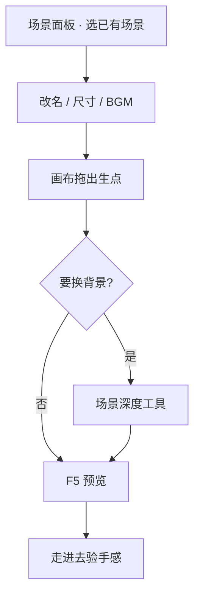

# 摆一个新场景

雾津由许多**场景**拼成——码头、义庄、雾津街头、城隍庙……每一幕都是一张可走的地图。这一页教你打开场景面板，把**已有场景**摆好、设出生点，再让玩家走进去。

:::info[关于「新建场景」]
场景面板**没有「新建场景」按钮**。新场景通常由项目组在资源管线里添加；你在编辑器里做的是**选中已有场景并编辑**。若要让玩家一启动就进某场景，到 [全局配置](../editors/panels/config) 里设「初始场景」。
:::

---

## 读完你能做到什么

- 在主编辑器场景面板里选中并打开一个场景
- 调整场景名、世界尺寸、背景音乐等顶层设置
- 在画布上摆好**出生点**，用运行预览走进去
- 知道背景图要在哪类工具里换（主编辑器改不了背景层）

---

## 怎么开工具

主编辑器 → 左侧 **物理世界 → 场景**

```bash
./dev.sh editor
```

场景画布里还能拖**热区**、**NPC**、**区域**——本页先聚焦场景本身；放 NPC 见 [放一个会说话的 NPC](./place-npc)。

---

## 逐步操作

### 第 1 步：选中要改的场景

1. 打开场景面板
2. 顶部或侧栏有**场景列表**（下拉或列表，视版本布局而定）——点选「雾津街头」「义庄」等已有条目
3. 画布加载该场景的俯视图与实体

没有「新建」？正常。若要玩家开局进某场景：打开 **全局配置** 面板，把「初始场景」设成目标场景名，保存后 **F5** 预览。

### 第 2 步：改场景顶层信息

右侧检查器里常见项：

| 设置 | 干什么 |
|---|---|
| **场景名** | 显示用名字，也供其它面板引用 |
| **世界宽 / 高** | 可走范围；可锁宽高比 |
| **世界缩放** | 整体尺寸手感 |
| **背景音乐** | 进场景自动播的 BGM |
| **滤镜** | 色调氛围（需先在滤镜工具里做好） |
| **镜头缩放 / 像素比** | 画面远近与像素密度 |
| **行走 / 奔跑速度** | 玩家在本场景的移动速度 |
| **进场景时跑动作** | 一进来就执行的动作（可选） |

改完 **Ctrl+S** 保存。

### 第 3 步：摆出生点

**出生点**是玩家进入场景时站的位置。

1. 画布左侧或列表面板找到「出生点」
2. 选中默认出生点（通常不可删），在画布上**拖到**合适位置——比如雾津街头茶馆门口
3. 需要多个入口时，可**新增**出生点并起名，供转场热区指定「落到哪个点」

:::warning[出生点别乱删]
默认出生点删不掉；其它出生点删了，引用它的转场可能把玩家丢到奇怪的地方。
:::

### 第 4 步：背景与深度（知道去哪改）

主编辑器**改不了背景图列表**——背景在**场景深度工具**里维护、导出。若画面缺层或遮挡不对，去 [场景深度工具](../editors/render-domain/scene-depth-editor) 处理，再回到场景面板验证出生点与实体位置。

### 第 5 步：进游戏走一圈

1. **F5** 运行预览
2. 若刚改了全局「初始场景」，应直接落在你设的场景；否则从地图或转场热区走进去
3. 确认：BGM 对了、出生点对了、边界不会把玩家卡死

---

## 流程示意



---

## 雾津小例子

**任务**：让玩家读档后落在「雾津街头」，出生点就在李天狗常蹲的庙口附近。

1. 场景列表选「雾津街头」
2. 默认出生点拖到庙口石阶前
3. 全局配置里「初始场景」设为雾津街头（若要做开局测试）
4. BGM 选街头 ambient 那条
5. **F5** —— 关二狗应站在庙口，江雾在脚边

---

## 相关手册

- [场景面板](../editors/panels/scene) —— 热区、区域、NPC 完整说明
- [全局配置](../editors/panels/config) —— 初始场景、窗口大小等
- [地图面板](../editors/panels/map) —— 大地图上的场景图标与解锁
- [怎么编排动作](../editors/concepts/actions) —— 「进场景时跑动作」
- [术语表 · 场景 / 出生点](../reference/glossary)
