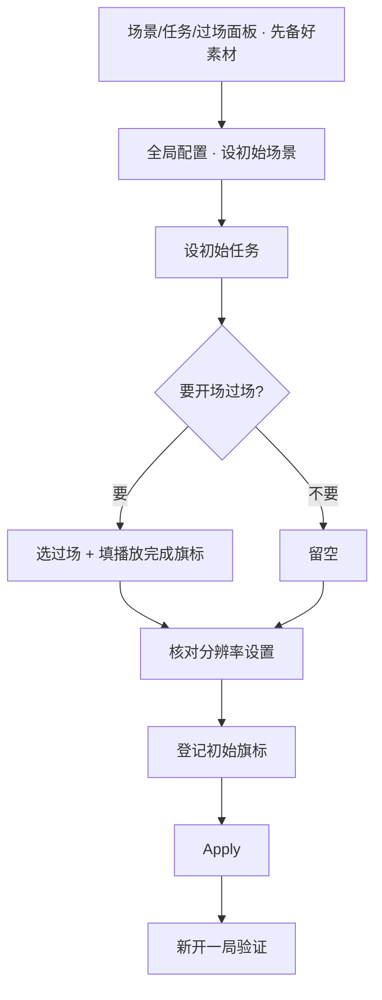

# 改初始场景/开场设置

新档一开局玩家该落在哪、手上先接到哪个任务、要不要先看一段开场演出、世界一开始就该是什么状态——这些「开局设定」全部集中在**全局配置**面板一处管。这一页带你从头改一遍，把关二狗的新故事从院子清晨正式开场。

---

## 这是什么（30 秒看懂）

把全局配置想成这出戏开幕前的**总纲**：戏从哪个场子开锣（初始场景）、台下先递给谁一个什么活儿（初始任务）、开场要不要先演一段引子（开场过场）、开幕时世界已经是什么状态（初始旗标）。这里改一次，影响的是**以后所有新开的档**，不是某一份具体存档——动手前最好和同组人知会一声，别让别人手上正在测的开局莫名其妙变了样。

## 读完你能做到什么

- 把新档的初始场景改成你想要的那张
- 给新档配一个初始任务，让任务日志一开局就有内容
- 加一段开场过场，并确保它只会强制播一次、不会反复重播
- 登记几条新档一开局就该生效的初始旗标
- 新开一局验证以上全部生效

---

## 怎么开工具

主编辑器 → **资源 → 全局配置**

```bash
./dev.sh editor
```

---

## 手把手逐步操作

### 第 1 步：确认目标场景、任务、过场都已经存在

全局配置面板里几乎所有选项都是选**已有内容**的下拉：初始场景要先在[场景面板](../editors/panels/scene)建好并摆好出生点，初始任务要先在[任务面板](../editors/panels/quest)建好，开场过场（如果要用）要先在[过场面板](../editors/panels/cutscene)做好。这一步不涉及全局配置本身，是先去别的面板把材料备齐。

### 第 2 步：设初始场景

打开全局配置，「初始场景」下拉选目标场景，比如院子清晨。顺手去场景面板确认这张场景的出生点摆在合理位置——这一步很容易漏，漏了的后果是玩家新开局直接卡进墙里或掉出地图。

### 第 3 步：设初始任务

「初始任务」下拉选主线第一步任务。留空的话新档任务日志会是空的，不一定算错，但如果设计上希望玩家一开局手上就有活干，记得填上。

### 第 4 步：配开场过场（可选）

如果想要新档一开局先播一段引子：

1. 「开场过场」下拉选做好的那段过场
2. 紧接着一定要填「开场播放完成旗标」——填一个还没被用过的旗标 key。这一步漏了的后果是，玩家每次重新开一局新档，都会被迫重新看一遍这段开场，即使他已经看过很多遍
3. 如果不需要开场演出，这两项都留空，新档会直接进场景

### 第 5 步：核对分辨率设置（如果需要改）

展开 Display 折叠栏，Viewport 和 Window Size 各自有一个启用勾选框——不勾选就不写入配置，运行时走引擎自己的默认值。需要改就先勾启用，再填宽高数值，改之前最好核对一下美术给的 UI 设计稿尺寸，避免对话框、场景边缘跟着跑偏。这两组概念不一样：一个是画面本身按多大尺寸渲染，一个是窗口容器本身占多大——想清楚要改的是哪一个再动手。

### 第 6 步：登记初始旗标

「新存档初始旗标」是一张 key/value 表，点加一行，逐条登记新档一开局就该有的旗标状态。填的 key 必须是已经在[旗标面板](../editors/panels/flags)注册过的，不是随手现造一个名字就能用。这些值只在新存档创建的那一刻写入一次，不是每次进游戏都重置。

### 第 7 步：保存并新开一局验证

1. Apply 保存——记住这会影响所有以后新建的档
2. 一定要**新开一局**去验证，不要拿旧档去看效果——旧档已经走过这些逻辑，不会重新触发
3. 检查：第一屏是不是落在你设的场景、任务日志第一条对不对、开场过场播完之后再新开一局是不是不会再强制重播、初始旗标状态是否符合预期

---

## 流程示意



---

## 雾津完整实例

**任务**：给关二狗的新故事配一套完整开局——从院子清晨开场，先播一段短引子，落地就有主线第一步任务，还要预置一条教程旗标，免得老玩家每次都被教程打断。

1. 场景面板确认「院子清晨」已经建好，出生点摆在关二狗平常睡觉的竹床边
2. 任务面板确认「湿了的鞋」这条主线第一步任务已经建好
3. 全局配置：初始场景选院子清晨，初始任务选湿了的鞋
4. 开场过场选一段做好的短引子（镜头从院墙外的雾推进到院子），开场播放完成旗标填一个之前没用过的键
5. Display 折叠栏勾启用 Viewport 和 Window Size，都填成美术 UI 稿对应的尺寸
6. 初始旗标表加一行，把某个教程提示类的旗标预先设成已完成，免得老玩家每次都被教程挡住
7. Apply，新开一局：应该先看到开场那段雾散院子的引子，播完直接落在竹床边，任务日志已经有「湿了的鞋」这一条；再新开一局（模拟玩家重开新档），这次不应该再被强制重播那段引子

---

## 常见卡点

**新档一开局就卡进墙里或掉出地图？**
检查目标场景的出生点位置——这是全局配置改完之后最容易漏掉的核对项，出生点是场景那边的事，全局配置只负责「进哪张场景」。

**每次新开档都被迫重新看一遍开场？**
「开场播放完成旗标」没填，或者填的 key 和实际判断用的不一致。回去补上或核对，确保这个键在旗标面板已经注册过。

**任务日志一开始是空的？**
「初始任务」留空了或选错了任务，回全局配置里重新选一遍主线第一步。

**主角的脸/动画在这里怎么都改不了？**
这本来就不归全局配置管，去[玩家化身面板](../editors/panels/avatar)改，全局配置这一页够不着这块内容。

**窗口大小和 UI 稿对不上？**
检查是不是把 Viewport 和 Window Size 搞混了——一个管画面渲染精细度，一个管窗口容器大小，两者各自独立，分别核对。

**初始旗标保存后报警告？**
填的 key 还没有在旗标面板注册过，先去那边注册这个键，再回来填进初始旗标表。

**明明改了全局配置，进游戏却什么都没变？**
大概率是拿旧存档在测——旧档不会重新触发这些开局逻辑，必须新开一局才能看到效果。

---

## 进阶变体

- **给不同测试目的配不同开局**：正式发布用的初始场景/任务是一套，团队内部想直接从某个中后期章节测起又是另一套——常见做法是平时开发时先临时把初始场景改成要测的那一段，测完再改回院子清晨，别把临时测试用的开局值忘在配置里直接带上线。
- **兜底场景是最后一道防线，别偷懒指向和初始场景一样的地方**：兜底场景是给运行时异常跳转兜底用的，选一个哪怕出了意外也绝对安全、不会再引发连锁问题的场景（比如一张空旷的老街），如果和初始场景选成同一张，一旦这张场景本身有问题，新档和异常兜底会一起出故障，没有退路。
- **开场过场别塞太满**：开场过场是玩家每一局新档唯一躲不掉的部分，做得越长、玩家复玩或给别人演示时越容易失去耐心。比起一段完整的大演出，一段简短的氛围引子（几秒钟的镜头运镜加一句旁白）更适合放在这里，真正的剧情演出留给后续可跳过的过场去做。
- **初始旗标别和任务系统重复记账**：有些进度信息任务系统自己就能判断（比如某个任务是否完成），如果同一件事又在初始旗标里另开一条重复记录，两边容易慢慢不同步。初始旗标更适合放那些任务系统本身管不到的「世界初始状态」，比如某个环境开关、某个教程是否默认跳过。
- **分辨率两项启用框，不确定就都先不勾**：不确定 Viewport 和 Window Size 该填什么数值时，宁可先都不勾启用，让运行时走引擎自己的默认值，也不要随手填一个猜测的数字勾上——错误的固定尺寸比什么都不填更容易把画面挤变形。

---

## 相关

- [全局配置面板](../editors/panels/config) —— 每一项字段的完整说明
- [场景面板](../editors/panels/scene) —— 初始场景的出生点在哪核对
- [任务面板](../editors/panels/quest) —— 初始任务的候选来源
- [过场面板](../editors/panels/cutscene) —— 开场过场的候选来源
- [旗标面板](../editors/panels/flags) —— 开场播放完成旗标、初始旗标键的注册处
- [用运行预览验证改动](./preview-verify) —— 新开一局怎么验证
- [按目标查：我想做…](./goal-index)
