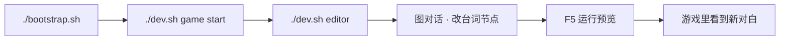
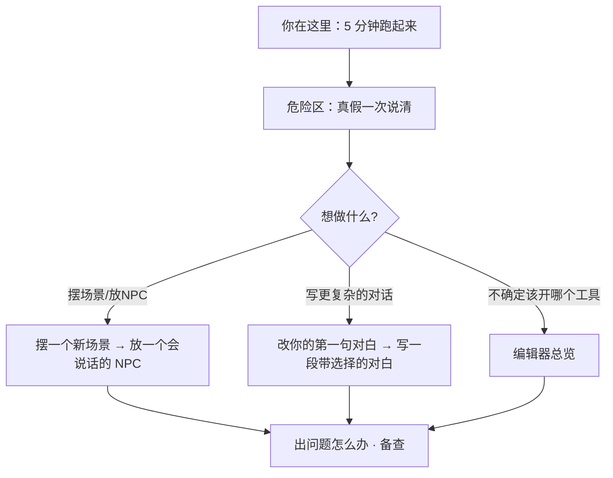

import PageBanner from '@site/src/components/PageBanner';

<PageBanner
  img="/img/banner-tutorials.jpg"
  title="上手 · 教程"
  subtitle="从零起步：在雾津点亮第一盏灯，跑通「改对白 → 进游戏看效果」。" />

# 5 分钟跑起来

油灯刚点上，书案还空着。这一页带你把**游戏**和**主编辑器**都跑起来，亲手改一句雾津里的对白，再进游戏确认改动生效。全程照做即可。

---

## 读完你能做到什么

- 在游戏仓库里初始化环境、启动游戏
- 打开主编辑器，找到图对话面板
- 改一句台词，用运行预览在游戏里看到效果
- 知道下一步该读哪几页教程

---

## 前置：你需要什么

- **Node.js 20 或以上**
- **Python 3.11 或以上**（环境脚本会建独立虚拟环境，不污染系统）
- 已克隆 **GameDraft 游戏仓库**（下文以 `~/AIWork/GameDraft/` 为例）

:::tip[文档站与游戏项目]
本文档站是独立项目，**不含游戏本体**。所有 `./dev.sh` 命令都要在**游戏仓库根目录**下运行，不是在文档站里。
:::

---

## 第 1 步：初始化环境（只做一次）

在**游戏仓库根目录**执行：

```bash
cd ~/AIWork/GameDraft
./bootstrap.sh
```

首次运行会建独立 Python 环境并安装资源管理工具。若大文件资源还没拉下来，继续：

```bash
./dev.sh pull
```

:::danger[没跑 bootstrap 会怎样]
后面任何 `./dev.sh` 都可能提示「Python 运行环境缺失」。见到这个提示，回来先跑 `./bootstrap.sh`。
:::

---

## 第 2 步：启动游戏

```bash
./dev.sh game start
```

浏览器打开终端里提示的本地地址（通常是 `http://localhost:5173`），雾津的界面就会亮起来。你改内容后，页面会自动刷新。

停止游戏：`./dev.sh game stop`。

---

## 第 3 步：打开主编辑器

```bash
./dev.sh editor
```

左侧是**导航树**——按物理世界、叙事编排、规则与经济等分组，列出三十来块面板；右侧是当前面板的编辑区。

另一个入口是 **Web 控制台**：

```bash
./dev.sh console
```

它像一块仪表盘：列着全部工具按钮，还能一键起游戏、跑校验。不知道开哪扇门时，从这里找。详见 [Web 控制台](../editors/web-console)。

:::tip[动手改之前]
保存很稳，你填的会存住。要注意的只有两件事：几个编辑器压根没入口的字段（换专项工具改），和几个点了会有后果的操作（比如切换区域类型）。花两分钟看一眼 [危险区速查](../editors/concepts/danger-zone)。
:::

---

## 第 4 步：改一句对白（端到端闭环）

### 4.1 打开图对话

1. 主编辑器左侧 → **叙事编排 → 图对话**
2. 顶部**图选择器**里挑一张对白图——雾津里关二狗在茶馆的桥段就存在这样的图里
3. 画布上出现一串节点：最常见的是**台词节点**（有人说话）和**结束节点**

> **台词节点**：谁在说、说什么。**结束节点**：这段对话到此为止。

### 4.2 改文字

1. 在画布上点一个**台词节点**
2. 右侧检查器里改「台词」框里的文字
3. 按 **Ctrl+S** 保存当前面板，或 **Ctrl+Shift+S** 保存全部

:::tip[节点保存不丢字段]
已知类型的节点（台词、选项等），检查器里的表单会完整覆盖它的每一项活字段，保存后全部保留；编辑器遇到不认识的节点类型，则整块原样带过，同样不丢。优先用检查器里提供的选项填。
:::

### 4.3 在游戏里看效果

按 **F5**：主编辑器会先保存，再内嵌启动游戏预览。

- **Ctrl+F5**：独立窗口预览
- **Shift+F5**：停止预览

若第 2 步已用 `./dev.sh game start` 起了游戏，也可以直接切到浏览器窗口看——改动会自动刷进去。

---

## 流程示意



---

## 雾津小例子

你想改关二狗在满堂茶客里踮脚听评书那句——「全雾津头一份！」改成更损一点的夸法：

1. 图对话里找到关二狗相关的对白图
2. 点对应**台词节点**，把台词改成你要的版本
3. **F5** 进游戏，走到触发这段对话的位置，确认新台词蹦出来

改对了，油灯下的书案就算铺开张了。

---

## 跑起来之后，先看哪几页

游戏和编辑器都跑起来了，台词也改成功了——先别急着直接冲进 30 块面板里乱点。按下面这个顺序走，能少走弯路：



1. **先读一遍 [危险区速查](../editors/concepts/danger-zone)**——两分钟的事，弄清楚哪几个字段编辑器改不到、哪几个操作点了会有后果。这是本页第 3 步末尾提到过的，此刻正式读一遍不亏。
2. **接着按你想做的事挑教程**：
   - 想摆场景、放会走动的角色 → [摆一个新场景](./first-scene)、[放一个会说话的 NPC](./place-npc)
   - 想深入对话本身 → [改你的第一句对白](./first-line)（更细的找法）、[写一段带选择的对白](./branching-dialogue)
   - 完全不确定手头这件事该用哪个工具 → 先扫一眼 [编辑器总览](../editors/overview)，找到对应的门再进去
3. **把 [出问题怎么办](./troubleshooting) 收藏起来**——不是现在就要读完，而是等你真的卡住（起不来、改了没生效、东西不见了）时，第一时间回来查，比自己瞎猜快得多。
4. 后续教程（区域触发、过场、任务、遭遇、规矩、小游戏……）不必按顺序啃完，**做到哪个功能就去读哪一页**，用到时学最快。

---

## 日常命令速查

| 命令 | 作用 |
|---|---|
| `./dev.sh game start` | 起游戏 |
| `./dev.sh game stop` | 停游戏 |
| `./dev.sh editor` | 主编辑器 |
| `./dev.sh console` | Web 控制台 |
| `./dev.sh pull` | 拉取资源 |
| `./dev.sh validate-data` | 校验游戏数据 |

---

## 接下来读什么

想直接按"我要做的事"找教程（做任务、做物件、做位面……），去 **[按目标查：我想做…](./goal-index)**。

| 教程 | 你会学到 |
|---|---|
| [改你的第一句对白](./first-line) | 更细地找、改、验一句台词 |
| [摆一个新场景](./first-scene) | 选场景、摆背景、设出生点 |
| [用运行预览验证改动](../editors/main-editor/run-preview) | 边改边看的完整用法 |
| [编辑器总览](../editors/overview) | 二十多件工具的心智地图 |
| [术语表](../reference/glossary) | 场景、热区、旗标……大白话解释 |
