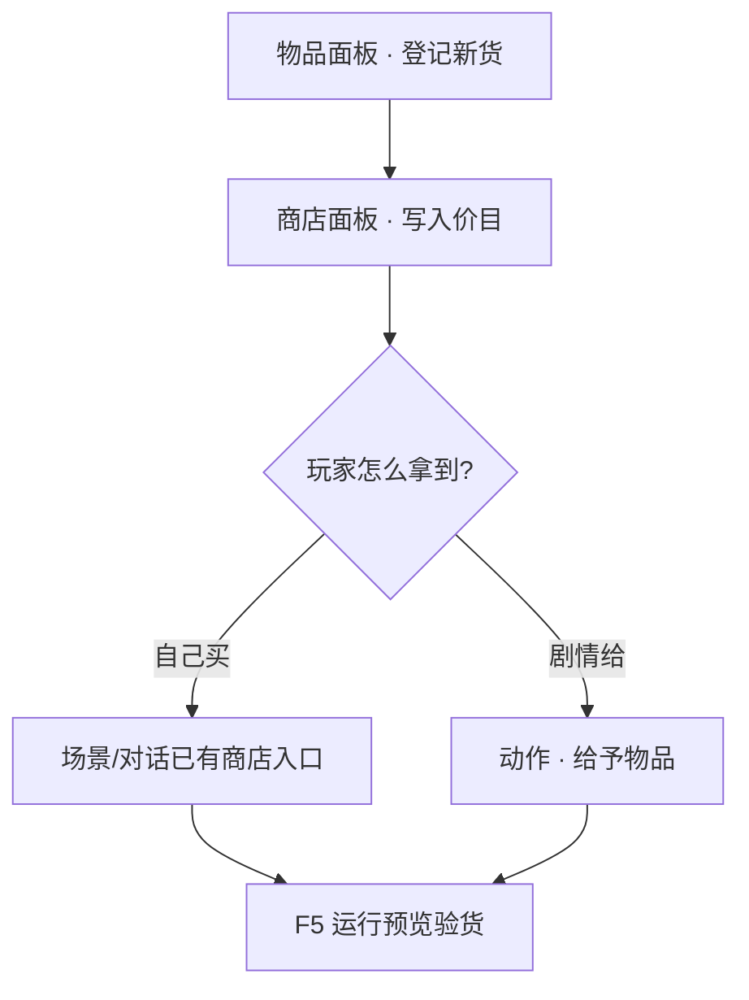

# 加物品、开商店

雾津街上要卖香烛、要发任务道具，都得先**登记物品**，再**挂进商店**。这一页带你走通：新建一件货 → 写清名字与用途 → 放进铺子价目表 → 在游戏里买一次验货。

---

## 这是什么（30 秒看懂）

把这件事想成开一家真实的香烛铺:你得先有一本**货品登记册**（物品面板）——写清楚这东西叫什么、算哪一类、能囤几个、大概值多少钱；再有一张**挂在柜台上的价目表**（商店面板）——写清楚这家铺子卖它、卖多少钱。登记册管「这东西是什么」，价目表管「哪家铺子卖它、几文钱」，两本账分开记，一件货可以同时出现在好几家铺子的价目表上，价钱还能不一样。

物品和商店是雾津经济系统的两块基石：物品面板决定了背包里显示什么、能不能叠加、用完什么反应；商店面板决定了玩家从哪个摊位、花多少钱能买到它。

读完这页你能：

- 在主编辑器里新建一件**物品**（名字、类型、叠加上限等）。
- 把物品挂进一家**商店**的价目表。
- 用**动作**让玩家买到手，或在剧情里直接发放。
- 用运行预览确认背包里看得见、买得到、用得上。

---

## 入门：手把手做第一次

### 你要先懂的两个词

| 词 | 大白话 |
|---|---|
| [物品](../reference/glossary) | 玩家能拿在手里、背包里数着的东西——香烛、符纸、任务线索都算 |
| [商店](../reference/glossary) | 一张价目表：哪家铺子卖什么、多少钱 |

### 第 1 步：打开主编辑器

```bash
./dev.sh editor
```

左侧导航树 → **规则与经济**。

### 第 2 步：登记新物品

1. 点 **物品** 面板。
2. 列表里点「新建」，给这件货起一个**内部编号（id）**——以后别处引用用，玩家看不见。
3. 填检查器里的常用项：

| 要填的 | 说明 |
|---|---|
| 显示名 | 背包、商店里玩家看到的名字，如「城隍庙平安香」 |
| 类型 | 消耗品、任务道具、装备等——决定能不能用、怎么用 |
| 描述 | 背包里默认显示的一句话说明 |
| 叠加上限 | 背包里最多堆几个 |
| 收购价（可选） | 玩家卖给铺子时的参考价，注意这只是**参考**，商店实际售价另填 |

4. **Ctrl+S** 保存。

:::tip[动态描述能逐条删除]
物品面板里「随状态变化的描述」——加一条、删一条都行，每条都有删除按钮。写错了直接删掉重写就好，不用靠新增一条去覆盖。第三节会细讲。
:::

### 操作示意

<svg viewBox="0 0 720 400" xmlns="http://www.w3.org/2000/svg" role="img" aria-label="物品面板操作示意" style={{width:'100%', height:'auto'}}>
  <rect width="720" height="400" fill="#1a1510" rx="8"/>
  <rect x="16" y="16" width="180" height="368" fill="#231c14" stroke="#3a2f20" rx="6"/>
  <text x="106" y="44" textAnchor="middle" fill="#e0a44e" fontSize="13" fontFamily="serif">规则与经济</text>
  <text x="32" y="72" fill="#8a7a5c" fontSize="11">物品 ◀ 选中</text>
  <text x="32" y="92" fill="#c9bda1" fontSize="11">商店</text>
  <rect x="210" y="16" width="220" height="368" fill="#1f1810" stroke="#3a2f20" rx="6"/>
  <text x="320" y="44" textAnchor="middle" fill="#c9bda1" fontSize="12">物品列表</text>
  <rect x="226" y="60" width="188" height="28" fill="#2a2218" stroke="#e0a44e" rx="4"/>
  <text x="320" y="78" textAnchor="middle" fill="#f0e7d2" fontSize="11">城隍庙平安香</text>
  <rect x="446" y="16" width="258" height="368" fill="#1f1810" stroke="#3a2f20" rx="6"/>
  <text x="575" y="44" textAnchor="middle" fill="#c9bda1" fontSize="12">检查器</text>
  <text x="462" y="72" fill="#8a7a5c" fontSize="10">显示名</text>
  <rect x="462" y="78" width="226" height="24" fill="#2a2218" rx="3"/>
  <text x="470" y="94" fill="#f0e7d2" fontSize="10">城隍庙平安香</text>
  <text x="462" y="124" fill="#8a7a5c" fontSize="10">类型 · 叠加上限 · 收购价</text>
  <rect x="462" y="200" width="226" height="40" fill="none" stroke="#e0a44e" strokeWidth="2" strokeDasharray="6 4" rx="4"/>
  <text x="575" y="225" textAnchor="middle" fill="#e0a44e" fontSize="11">保存 Ctrl+S</text>
</svg>

### 第 3 步：挂进商店

1. 左侧 → **商店** 面板。
2. 选一家已有铺子，或新建——雾津里城隍庙前的香烛铺就可以对应一家店；填**显示名**，比如「城隍庙香烛铺」。
3. 在「商品表」里**添加条目**：
   - 选刚登记的物品
   - 填**售价**（玩家买一份花几文，这个价格独立于物品的收购价，保存时会**总是显式写出数字**，不会自动继承物品默认价）
4. 保存。

玩家能不能走进这家店，取决于**场景**里有没有对应的商店热区或对话动作——价目表只解决「卖什么、多少钱」。详见 [商店面板](../editors/panels/shop) 与 [物品面板](../editors/panels/item)。

### 第 4 步：让玩家拿到手

常见两条路：

| 方式 | 什么时候用 |
|---|---|
| 玩家自己买 | 场景或对话里已有「打开商店」的入口，价目表对上即可 |
| 剧情直接给 | 在图对话、过场、任务完成动作里选「给予物品」 |

> **[动作](../editors/concepts/actions)**：游戏里「发生什么」的编排——给物品、扣钱、切场景都算动作。

### 第 5 步：运行预览验货

按 **F5** 起运行预览，走到能买东西或触发给物品的地方：

1. 背包里能看到新物品、名字对。
2. 若走商店：扣钱、数量增加是否正确。
3. 若是消耗品：用完行为符合预期。

没生效？先看 [用运行预览验证改动](./preview-verify)，再查 [出问题怎么办](./troubleshooting)。

### 流程示意



---

## 雾津完整实例：引路纸钱上架

你想在**城隍庙**香烛铺多卖一捆「引路纸钱」——玩家拜完神顺路买，后面任务也要用：

1. **物品**面板新建「引路纸钱」，id 填 `item_lujing_paper`，类型选任务道具，描述写「拜祭时烧的引路钱纸，进阴地也用得上。」，叠加上限设 5。
2. **商店**面板打开城隍庙香烛铺，商品表新增一行选「引路纸钱」，售价标 8 文——这个价和物品的收购价无关，独立填写。
3. 确认城隍庙场景里进铺子的入口还在（没有就回 [场景面板](../editors/panels/scene) 补热区）。
4. 若某任务要用到这张纸钱，去任务面板把「持有引路纸钱」设为完成条件之一。
5. **F5** 进游戏，走进香烛铺，买一包，看背包里有没有、钱扣没扣；再去触发那条任务，确认能正常完成。

价目写进册子，铺子才算真的开张。

---

## 进阶：每一项都讲透

### 物品字段逐条讲透

- **id**：全局唯一，商店、拾取热区、任务条件、富文本里的物品引用标签都靠它对上号。**改 id 等于新建加迁移**——一旦大量引用后不要轻易改名，改了要全局搜一遍替换。
- **显示名**：背包、商店 UI 里玩家看到的名字，与 id 无关，可以随时改而不影响引用。
- **类型**：消耗品、任务道具、装备等，决定这件物品能不能使用、使用后什么反应，具体分类和行为以项目配置为准。
- **描述**：默认展示的一句话说明，建议写短；需要根据情况变化的长内容放进「动态描述」而不是硬塞进这里。
- **叠加上限**：背包堆叠数量的上限，任务类物品通常设 1（不需要囤积），消耗品可以设更大的数字。
- **收购价**：只是策划参考值，不是商店实际售价；商店里的售价要单独在商店面板的价目表里填，两者互不干扰。
- **动态描述列表**：每条 = 一个触发条件 + 对应文本，用来做「鉴定前/鉴定后」「白天看/夜里看」这类描述随情境变化的效果。**这个列表能新增也能删除单条**，每条都带删除按钮，写错了直接删掉重写。多条命中时具体展示哪条以游戏内判定逻辑为准，务必逐条在预览里实测。

### 商店字段逐条讲透

- **商店 id / 显示名**：id 供内部引用，显示名是玩家在商店 UI 里看到的铺子名字，比如「渡口货郎」「纸扎铺」。
- **商品表（物品 + 售价）**：可以自由增删行；每行选定一个已登记的物品 id，填一个独立于物品收购价的售价。保存时价格**总会被显式写出**，不存在「留空继承默认价」这回事。
- 商店面板结构简单，日常调价、上下架都可以放心改。

### 让玩家拿到物品的完整方式清单

除了「自己去商店买」和「剧情动作直接给予」，还有几种常见的发放来源，设计遭遇、任务、小游戏时可以留意：

- **遭遇结果动作**：遭遇某个选项选中后，用给予物品作为奖励或代价（见 [做一个遭遇](./encounter)）。
- **热区拾取**：场景里的拾取型热区，走近直接捡到物品，不需要经过商店或对话。
- **小游戏产出**：水域小游戏「捞」到东西、扎纸小游戏做出成品，都能配置成给予对应物品。
- **档案首次阅读**：见闻录、人物簿的条目首次打开时，也能顺带发放一个物品（常配合规矩碎片一起用）。

### 和其他面板怎么配合

- **场景面板**：商店的入口（热区或对话动作）、拾取型热区都在这里配置。
- **任务面板**：「持有某物品」常作为任务完成条件；任务奖励也常直接给予物品。
- **图对话/过场**：对话里「打开商店」「给予物品」都是常见动作，货郎的台词接动作即可。
- **富文本**：物品名字可以用 `[物品:…]` 标签插进任意富文本描述里，保证名字全局一致，见 [怎么写带引用的文本](../editors/concepts/rich-text)。

### 批量做法与效率窍门

- **先建物品、再建商店**：商店的商品表下拉只能选已登记的物品，顺序反过来会来回切面板，效率更低。
- **同一物品挂多家店**：一件物品可以同时出现在好几家商店的价目表里，价格互相独立，适合做「同一件货不同地方不同价」的经济设计（比如熟人价、偏远地区加价）。
- **货币类物品单独标记**：如果项目用物品本身模拟货币（用一个货币标记之类的字段），要在物品面板里明确标出，避免和普通物混淆导致 UI 显示异常。
- **批量核价小技巧**：给同一批新物品定价时，先把收购价和商店售价都记在策划文档表格里对齐好，再逐条填进两个面板，比边想边填更不容易漏项或算错。

---

## 危险区与边界

- **物品的动态描述列表能新增也能删除单条**——每条都有删除按钮，写错了直接删掉重写，不用靠新增覆盖，见上文进阶部分。
- **改物品 id** 会让所有引用它的商店、拾取热区、任务条件、富文本标签全部失效，等同于做一次迁移，操作前先全局搜索确认引用范围。
- **删除物品或商店前**，要确认没有场景热区、任务条件、对话动作还在引用它——删除后引用处会指向不存在的目标。
- 更系统的「真正要当心什么、哪里编辑器根本够不着」参考 [危险区](../editors/concepts/danger-zone)。

---

## 常见问题

| 现象 | 原因 | 怎么办 |
|---|---|---|
| 商店打开是空的 | 商品表没有行，或选的物品 id 无效 | 补行并从下拉里重新选择已登记物品 |
| 背包里的价格和策划表不一致 | 商店售价独立于物品收购价 | 以商店面板价目表为准，两处对齐记录 |
| 买了东西没进背包 | 物品 id 和给予/购买逻辑引用的 id 不一致 | 统一 id，预览里实点购买或触发一次 |
| 对话里点了没能打开商店 | 未绑商店 id 或 id 写错 | 检查对话结果动作里的商店引用 |
| 任务要求「持有某物」却一直不满足 | 任务条件里的物品 id 和实际发放的物品 id 不一致 | 统一两处 id，预览走一次完整流程验证 |

---

## 接下来读什么

| 页面 | 内容 |
|---|---|
| [物品面板](../editors/panels/item) | 物品字段与当心事项 |
| [商店面板](../editors/panels/shop) | 价目表怎么维护 |
| [怎么编排动作](../editors/concepts/actions) | 给予物品、打开商店等 |
| [做一个遭遇](./encounter) | 消耗物品作为选项门槛 |
| [危险区](../editors/concepts/danger-zone) | 危险区速查 |
