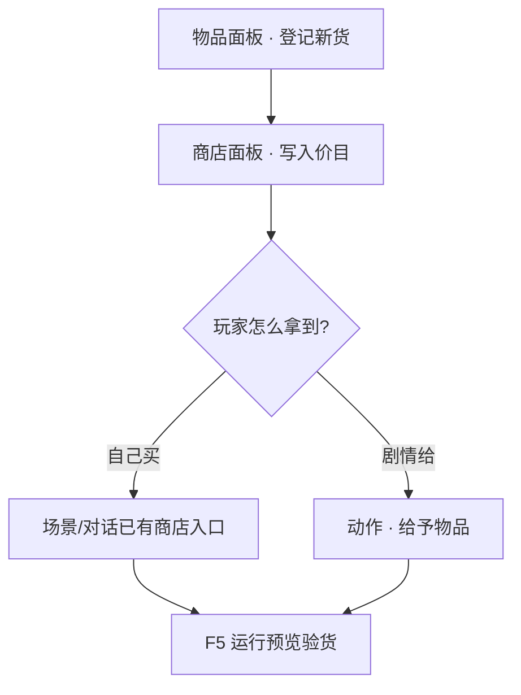

# 加物品、开商店

雾津街上要卖香烛、要发任务道具，都得先**登记物品**，再**挂进商店**。这一页带你走通：新建一件货 → 写清名字与用途 → 放进铺子价目表 → 在游戏里买一次验货。

---

## 读完你能做到什么

- 在主编辑器里新建一件**物品**（名字、类型、叠加上限等）
- 把物品挂进一家**商店**的价格表
- 用**动作**让玩家买到手、或剧情里直接发放
- 用运行预览确认背包里看得见、用得上

---

## 你要先懂的两个词

| 词 | 大白话 |
|---|---|
| [物品](../reference/glossary) | 玩家能拿在手里、背包里数着的东西——香烛、符纸、任务线索都算 |
| [商店](../reference/glossary) | 一张价目表：哪家铺子卖什么、多少钱 |

物品和商店各有一块面板，分工清楚：**物品**管「这东西是什么」，**商店**管「哪家铺子卖它、几文钱」。

---

## 第 1 步：打开主编辑器

```bash
./dev.sh editor
```

左侧导航树 → **规则与经济**。

---

## 第 2 步：登记新物品

1. 点 **物品** 面板
2. 列表里点「新建」，给这件货起一个**内部编号**（以后别处引用用，玩家看不见）
3. 填检查器里的常用项：

| 要填的 | 说明 |
|---|---|
| 显示名 | 背包、商店里玩家看到的名字，如「城隍庙平安香」 |
| 类型 | 消耗品、任务道具、装备等——决定能不能用、怎么用 |
| 叠加上限 | 背包里最多堆几个 |
| 收购价（可选） | 玩家卖给铺子时的参考价 |

4. **Ctrl+S** 保存

:::warning[动态描述只能加、不能删单条]
物品面板里「随状态变化的描述」——加一条可以，删某一条不行。改描述用「改最后一条」或整体规划，别指望逐条擦掉。
:::

### 操作示意

<svg viewBox="0 0 720 400" xmlns="http://www.w3.org/2000/svg" role="img" aria-label="物品面板操作示意" style={{width:'100%', height:'auto'}}>
  <rect width="720" height="400" fill="#1a1510" rx="8"/>
  <rect x="16" y="16" width="180" height="368" fill="#231c14" stroke="#3a2f20" rx="6"/>
  <text x="106" y="44" textAnchor="middle" fill="#e0a44e" fontSize="13" fontFamily="serif">规则与经济</text>
  <text x="32" y="72" fill="#8a7a5c" fontSize="11">物品 ◀ 选中</text>
  <text x="32" y="92" fill="#c9bda1" fontSize="11">商店</text>
  <rect x="210" y="16" width="220" height="368" fill="#1f1810" stroke="#3a2f20" rx="6"/>
  <text x="320" y="44" textAnchor="middle" fill="#c9bda1" fontSize="12">物品列表</text>
  <rect x="226" y="60" width="188" height="28" fill="#2a2218" stroke="#e0a44e" rx="4"/>
  <text x="320" y="78" textAnchor="middle" fill="#f0e7d2" fontSize="11">城隍庙平安香</text>
  <rect x="446" y="16" width="258" height="368" fill="#1f1810" stroke="#3a2f20" rx="6"/>
  <text x="575" y="44" textAnchor="middle" fill="#c9bda1" fontSize="12">检查器</text>
  <text x="462" y="72" fill="#8a7a5c" fontSize="10">显示名</text>
  <rect x="462" y="78" width="226" height="24" fill="#2a2218" rx="3"/>
  <text x="470" y="94" fill="#f0e7d2" fontSize="10">城隍庙平安香</text>
  <text x="462" y="124" fill="#8a7a5c" fontSize="10">类型 · 叠加上限 · 收购价</text>
  <rect x="462" y="200" width="226" height="40" fill="none" stroke="#e0a44e" strokeWidth="2" strokeDasharray="6 4" rx="4"/>
  <text x="575" y="225" textAnchor="middle" fill="#e0a44e" fontSize="11">保存 Ctrl+S</text>
</svg>

---

## 第 3 步：挂进商店

1. 左侧 → **商店** 面板
2. 选一家已有铺子，或新建——雾津里城隍庙前的香烛铺就可以对应一家店
3. 在「售卖列表」里**添加条目**：
   - 选刚登记的物品
   - 填**售价**（玩家买一份花几文）
4. 保存

玩家能不能走进这家店，取决于**场景**里有没有对应的商店热区或对话动作——价目表只解决「卖什么、多少钱」。详见 [商店面板](../editors/panels/shop) 与 [物品面板](../editors/panels/item)。

---

## 第 4 步：让玩家拿到手

常见两条路：

| 方式 | 什么时候用 |
|---|---|
| 玩家自己买 | 场景或对话里已有「打开商店」的入口，价目表对上即可 |
| 剧情直接给 | 在图对话、过场、任务完成动作里选「给予物品」 |

> **[动作](../editors/concepts/actions)**：游戏里「发生什么」的编排——给物品、扣钱、切场景都算动作。

---

## 第 5 步：运行预览验货

按 **F5** 起运行预览，走到能买东西或触发给物品的地方：

1. 背包里能看到新物品、名字对
2. 若走商店：扣钱、数量增加
3. 若是消耗品：用完行为符合预期

没生效？先看 [用运行预览验证改动](./preview-verify)，再查 [出问题怎么办](./troubleshooting)。

---

## 流程示意



---

## 雾津小例子

你想在**城隍庙**香烛铺多卖一捆「引路纸钱」——玩家拜完神顺路买，后面任务也要用：

1. **物品**面板新建「引路纸钱」，类型选任务道具，叠加上限 5
2. **商店**面板打开城隍庙香烛铺，售价标 8 文
3. 确认城隍庙场景里进铺子的入口还在（没有就回 [场景面板](../editors/panels/scene) 补热区）
4. **F5** 进游戏，买一包，看背包里有没有、钱扣没扣

价目写进册子，铺子才算真的开张。

---

## 接下来读什么

| 页面 | 内容 |
|---|---|
| [物品面板](../editors/panels/item) | 物品字段与当心事项 |
| [商店面板](../editors/panels/shop) | 价目表怎么维护 |
| [怎么编排动作](../editors/concepts/actions) | 给予物品、打开商店等 |
| [危险区](../editors/concepts/danger-zone) | 哪里保存会丢内容 |
