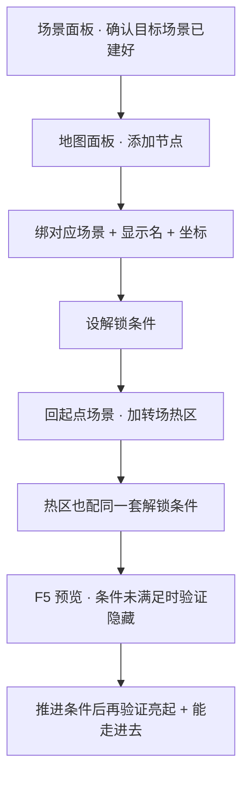

# 加一个地图节点

世界地图上，码头、老街、城隍庙都是玩家一眼就能点的点。新场景做出来了，玩家却在地图上看不到入口——多半是地图上还没给它加点。这一页教你在地图面板新增一个节点，绑到已有场景，配一个解锁条件，再回场景里接一条真正能走进去的转场，让「地图上能点」和「游戏里能走到」对上号。

:::info[地图面板不能新建场景]
地图节点只能指向**已经存在**的场景。地图面板本身没有「新建场景」的入口——场景要先在[场景面板](../editors/panels/scene)里建好、摆好出生点，再回地图面板挂节点。
:::

---

## 这是什么（30 秒看懂）

把世界地图想成雾津这本折子戏的**目录页**：码头、老街、城隍庙……每一行目录条目背后，都是真正的一幕布景（场景）。地图节点就是目录页上新添的一行——写着地名、画在纸上哪个位置、什么时候才准玩家翻到这一页。

新增地图节点，只是「在目录上添一行」。玩家真正能不能翻过去、走进这张新场景，靠的是**场景里的转场热区**——这是两件独立的事，得一起做才算完整：地图上亮了但场景里没接转场，玩家点得到点却走不进去；场景里接了转场但地图上没点，玩家只能瞎摸路走进去，压根不知道这地方存在。

## 读完你能做到什么

- 在世界地图画布上新增一个节点，绑定到一张已有场景
- 给节点起显示名、拖到合适的坐标
- 设一个解锁条件，让节点在满足条件之前保持隐藏或灰掉
- 回到起点场景，加一条转场热区，让玩家真的能从地图走进这张新场景
- 运行预览验证：没解锁时看不到/点不到，解锁后能点进去且落点正确

---

## 怎么开工具

主编辑器 → **物理世界 → 地图**（新增节点、设解锁条件）
主编辑器 → **物理世界 → 场景**（接转场热区）

```bash
./dev.sh editor
```

两块面板会来回切换：地图管「入口的样子」，场景管「走不走得进去」。

---

## 手把手逐步操作


*地图面板：左侧节点列表，右侧是手绘水墨大地图，蓝点是可跳转的节点。*

### 第 1 步：确认目标场景已经存在

去场景面板确认你要挂的那张场景已经建好，出生点也摆在合理位置。这一步不在地图面板里做，但漏了后面全白搭——地图节点绑不了一张不存在的场景。

### 第 2 步：新增地图节点

1. 打开地图面板，画布上会看到已有的几个点（老街、渡口……）
2. 点**添加**，画布上出现一个新节点
3. 右侧检视器「对应场景」下拉里，选你要挂的目标场景 id

### 第 3 步：起显示名、摆位置

1. **显示名**填玩家在地图上看到的短名，比如「货栈仓库」
2. 在画布上把新节点**拖到**贴近目标场景在雾津地理上该在的位置——参照老街、渡口这些已有点的相对方位来定，别凭空乱放
3. 想更精细可以直接在检视器里填坐标数值；这个坐标只管「在地图这张图上画在哪」，跟场景内部的世界坐标是两回事，互不影响

### 第 4 步：设解锁条件

1. 检视器「解锁条件」区域，加一个[条件](../editors/concepts/conditions)——常见的是「某任务已完成/进行中」或「某旗标为真」
2. 留空表示这个点从一开始就可见可点；填了才会有「没到时候玩家看不到/点不到」的效果
3. 条件能用的判断种类很多，任务状态、旗标、剧本阶段都能拿来当门槛，挑最贴合设计意图的那种

### 第 5 步：回场景里接一条真正能走进去的转场

地图节点只是「入口的样子」。玩家点地图之后是不是真的能落到这张场景里、又或者是从另一张场景里走近某个地方触发转场，靠的都是**场景面板里的转场热区**，不是地图节点自己在管。

1. 打开玩家应该从哪张场景走向新场景的那张起点场景（比如从老街走向仓库，起点就是老街）
2. 在合适的位置新增一个热区，类型选**转场**
3. 目标场景选新节点对应的那张场景，目标出生点选好玩家该落在哪个点
4. 如果这条路也需要门槛，同样给这个热区加条件——最好和地图节点的解锁条件保持一致，避免「地图上看着已经解锁，走到场景里那扇门却还是推不开」这种脱节

### 第 6 步：保存与验证

1. 地图面板和场景面板改完各自 **Ctrl+S / Apply**
2. **F5** 运行预览：先在没满足解锁条件时打开地图，确认新节点按设计隐藏或灰着，同时去起点场景那条路走一遍，确认转场也同样进不去
3. 推进任务或设旗标满足条件后再打开地图，确认新节点亮了、能点；再走到起点场景那条路，确认转场也通了
4. 点地图节点或走转场进去，确认落地场景正确、出生点没让玩家卡进墙里

---

## 流程示意



---

## 雾津完整实例

**任务**：城隍庙这条任务线做完之后，世界地图上要新亮出一个「货栈仓库」的点，玩家可以从地图直接点进去，也可以从老街巷尾走路进去。

1. 场景面板确认「雾津仓库」已经建好，出生点摆在卷帘门内侧
2. 地图面板新增节点，对应场景选仓库，显示名填「货栈仓库」
3. 拖到老街西侧、靠近渡口的位置，和美术给的地图底图对齐
4. 解锁条件加一条：任务「城隍庙」已完成
5. 回老街场景，在巷子尽头加一条转场热区，类型选转场，目标场景选仓库，目标出生点选仓库那个卷帘门出生点，同样加上「城隍庙任务已完成」这条条件
6. **Ctrl+S / Apply**，**F5** 预览：城隍庙任务没做完时，老街巷尾走过去没反应，地图上也看不到货栈仓库这个点；等城隍庙任务做完，巷尾能走进去了，地图上货栈仓库也亮了，点进去也能直接切场景，落点正好在卷帘门内侧

---

## 常见卡点

**地图上点亮了，但走到场景里那扇门还是过不去？**
地图节点的解锁条件和场景转场热区的条件是**两套独立配置**，两边都要设，不能只设一边就以为完事了。回场景面板检查转场热区的条件是不是漏配了，或者填的条件和地图节点那边不一致。

**新节点在画布上找不到？**
大概率是坐标没改，跟别的点叠在一起了。放大画布或者去检视器里核对坐标数值，把新节点拖开一点。

**点了地图节点，游戏黑屏或卡在原地不动？**
去目标场景检查有没有摆出生点，或者转场热区的目标出生点有没有选对——选了目标场景但没选具体出生点，落点就没有着落。

**解锁条件设了，节点却一直亮着？**
检查条件本身是不是真的填对了——键名有没有写错、和旗标或任务实际用的名字是不是一致。条件不满足时不会报错提示，只会安静地什么都不管用。

**删了地图节点，场景是不是也没了？**
不会。删地图节点只是把这个入口从世界地图上拿掉，场景本身和场景里的内容都还在——只是玩家没了从地图直接跳过去的路。如果场景转场热区还留着，玩家照样能靠走路进去，只是地图上看不到这个地方了。

---

## 相关

- [地图面板](../editors/panels/map) —— 节点、坐标、解锁条件完整说明
- [场景面板](../editors/panels/scene) —— 转场热区怎么配
- [任务面板](../editors/panels/quest) · [旗标面板](../editors/panels/flags) —— 解锁条件常用的判断来源
- [怎么设条件](../editors/concepts/conditions)
- [按目标查：我想做…](./goal-index)
