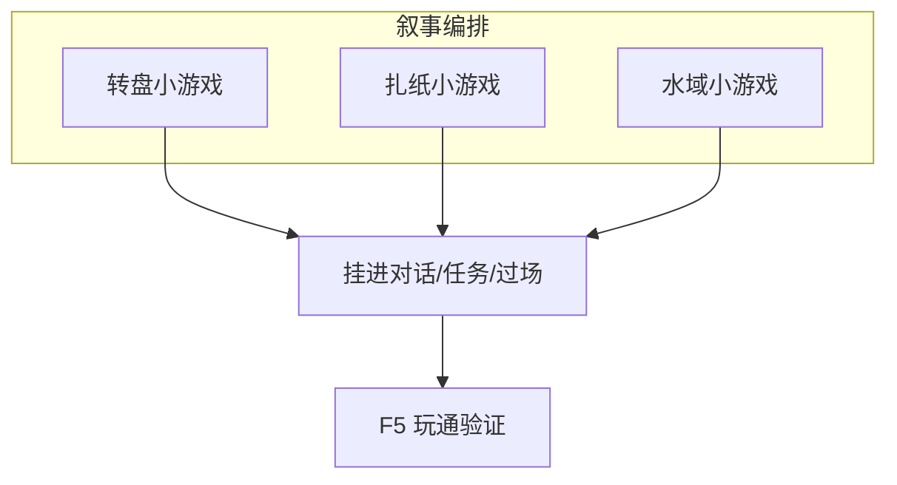

# 做一个小游戏关卡

雾津不只有走路说话——糖画转盘、扎纸手艺、江边水域，各有一段玩家亲手操作的戏。这一页是**配一关**的概览：三类小游戏各走哪扇门、最少要填什么、怎么挂进剧情。细字段和画布操作，分别去对应面板文档。

---

## 读完你能做到什么

- 分清**糖画转盘**、**扎纸**、**水域**各自管什么
- 知道每类「一关」最少要登记哪些内容
- 把一关挂进任务、对话或过场里触发
- 运行预览里玩通一遍

---

## 三类小游戏一览

| 小游戏 | 玩家在手柄里干啥 | 主编排面板 |
|---|---|---|
| 糖画转盘 | 转指针、停扇区，讨彩头、判吉凶 | [转盘小游戏](../editors/panels/sugar-wheel) |
| 扎纸 | 按订单选部件、拼纸人纸马 | [扎纸小游戏](../editors/panels/paper-craft) |
| 水域 | 江边钓鱼、捞物、限时操作 | [水域小游戏](../editors/panels/water-minigame) |

> **[小游戏](../reference/glossary)**：独立玩法片段，有自己的规则与界面，由剧情动作或热区拉起来。

---

## 通用流程（三类都一样）

1. `./dev.sh editor` 打开主编辑器
2. 左侧 **叙事编排** → 选对应小游戏面板
3. **新建一关**（实例），起内部编号、写玩家看到的标题
4. 在面板里配**规则与内容**（下文分类型说）
5. 在图对话、任务、过场或场景热区里，用**动作**「开始某某小游戏」并指向这关
6. **F5** 触发，自己玩通；失败、胜利分支是否接好

:::warning[删关不擦旧档]
登记表里删掉某一关，磁盘上可能还留着旧数据文件。长期维护时注意别引用已删编号，必要时让负责工程的人清理残留。
:::

---

## 糖画转盘：配一关

适合城隍庙前、庙会摊档——指针停在哪扇区决定台词或发奖。

**最少要配：**

| 块 | 你要定什么 |
|---|---|
| 扇区 | 盘上几块、每块文案或权重 |
| 指针与物理 | 转多久、停下来的手感 |
| 外观 | 底盘、指针图、氛围装饰 |
| 收尾 | 停稳后执行哪些动作（给物品、播对白、记旗标） |

**雾津例子：** 糖画王摊位「讨彩头」——三扇区：吉、平、凶；停在吉给平安符，凶则触发关二狗贫嘴台词。

细调扇区与指针校准 → [转盘小游戏面板](../editors/panels/sugar-wheel)。

---

## 扎纸：配一关

适合义庄、纸扎铺——按订单拼出纸人、纸马、灯笼架。

**最少要配：**

| 块 | 你要定什么 |
|---|---|
| 订单 | 这一关要交什么成品 |
| 部件与槽位 | 哪些零件、画布里摆哪里 |
| 纸色与样式 | 红白纸、金边等选项 |
| 判定 | 拼对放行、拼错提示或扣时 |

**雾津例子：** 李天狗让关二狗扎一盏**引魂灯**——订单写清部件列表，槽位对上图纸，完成后动作接任务进度。

画布摆槽位 → [扎纸小游戏面板](../editors/panels/paper-craft)。

---

## 水域：配一关

适合码头、江边——抛线、收线、限时捞指定物。

**最少要配：**

| 块 | 你要定什么 |
|---|---|
| 实体 | 水里有什么可捞、各自动还是静物 |
| 规则 | 时间、次数、成功条件 |
| 反馈 | 捞到、脱钩、空竿各播什么 |
| 收尾 | 达标后动作链 |

**雾津例子：** 码头夜捞**沉箱钥匙**——实体里登记钥匙影，限时三十秒，捞到触发切场景或给物品。

实例与实体画布 → [水域小游戏面板](../editors/panels/water-minigame)。

---

## 挂进剧情

小游戏不会自己弹——要在别处**点名**：

| 入口 | 常见做法 |
|---|---|
| 图对话 | 节点里动作「开始小游戏」，选类型与关卡 id |
| 任务 | 步骤完成条件或奖励动作里开一局 |
| 过场 | 演出步骤中插入小游戏（较少，多用于强引导） |
| 场景热区 | 走近摊位热区 → 动作开转盘或扎纸 |

动作编排见 [怎么编排动作](../editors/concepts/actions)。玩家侧玩法说明见 [玩家手册 · 小游戏](../player/minigames)。

---

## 进阶：三类小游戏的深水区

概览表只列了「最少要配」。真做起来，这几处是老手才会留心的地方：

### 转盘：手感与防白嫖

- **物理停针**参数（摩擦、初速等约十来项）决定指针最终停在哪格的分布——改完不能只凭感觉，**甩十把看实际落点**，和策划表对一遍概率是否符合预期。改角度、改扇区边界后，**所有扇区都要重新校准**，漏一个就会出现「明明落在龙格，判定却算成空」。
- **开转前置**（充电前的条件与动作）是防止玩家白嫖的关卡——通常配一条「扣钱」动作和一条「没钱就禁用开转」的条件。漏了这步等于免费抽奖。
- **气氛组**可以让同一个转盘在白天、夜晚切出不同灯光氛围，适合摆摊时段跟随雾津昼夜走。
- 分格里的「专家 JSON」一类高级字段一旦格式不对，**整段保存都会失败**——手改前先复制一份备用。

### 扎纸：标签体系与分层评价

- 槽位的**接受标签**（accepts）和部件的**自身标签**（tags）必须**命名一致**，这是最容易踩的坑——标签打错一个字，部件永远拖不进槽位。
- 合格分、警告分、失败分**三档都要给动作反馈**，只做「成功/失败」两档会让玩家「差一点点」时毫无察觉——警告档适合配一句摊主/庙祝的嘀咕台词，既提醒又不卡关。
- 收尾问题是最后一步的加分/分支点，比如「是否点睛」，可以借它埋一个和 [规矩](../editors/panels/rule) 相关的隐藏后果。
- 换了订单背景图之后，**画布上的槽位要重新摆**——坐标是跟着背景图走的，不会自动跟随。

### 水域：默认值与教学关设计

- 实体的**显示大小**和**命中半径**留空就是走品类默认，不必每个都手填——只有确实要做「特别小、特别难捞」的实体才手动缩小。
- **拉力档位**（pull）决定手感难度——**第一个教学关**建议用最低档，让玩家一钩就中，建立信任感，后面的隐藏道具关再调难。
- **每个实体的成功和失败都该有反馈**，哪怕失败只是一声水花——完全没反馈的钩空会让玩家怀疑是不是卡了。
- 实体别堆太多在同一片可捞范围（bounds）里，数量一多既影响性能也影响玩家分辨「这个能捞、那个不能」。

---

## 危险区与边界

- **索引 id 与实例内部 id 必须完全一致**——三类小游戏都是这个规矩，不一致的后果是「打不开」或「开错关」，游戏里可能直接报错或播错内容。
- **删关不清理磁盘旧文件**：登记表里删掉一行，磁盘上的实例数据文件通常还留着——这是工作流层面的坑，不是面板按钮能一键处理的。长期维护要靠工程侧走版本管理清理，别自己瞎删文件。
- 转盘、扎纸的部分高级字段走「专家 JSON」或裸输入框，格式不对会导致**整段保存失败**，动手前先复制一份原内容备用。
- 更完整的「哪里改了会丢、哪里编辑器根本够不到」说明，见 [危险区](../editors/concepts/danger-zone)。

---

## 操作示意

<svg viewBox="0 0 680 320" xmlns="http://www.w3.org/2000/svg" role="img" aria-label="小游戏配置示意" style={{width:'100%', height:'auto'}}>
  <rect width="680" height="320" fill="#1a1510" rx="8"/>
  <rect x="24" y="24" width="200" height="272" fill="#231c14" stroke="#3a2f20" rx="6"/>
  <text x="124" y="52" textAnchor="middle" fill="#e0a44e" fontSize="12" fontFamily="serif">叙事编排</text>
  <text x="40" y="80" fill="#c9bda1" fontSize="11">转盘小游戏</text>
  <text x="40" y="100" fill="#c9bda1" fontSize="11">扎纸小游戏</text>
  <text x="40" y="120" fill="#c9bda1" fontSize="11">水域小游戏</text>
  <rect x="248" y="24" width="408" height="272" fill="#1f1810" stroke="#3a2f20" rx="6"/>
  <text x="452" y="56" textAnchor="middle" fill="#c9bda1" fontSize="12">当前关卡 · 规则 · 画布</text>
  <path d="M452 200 L452 260" stroke="#8a7a5c" stroke-width="2" marker-end="url(#mg-arr)"/>
  <defs><marker id="mg-arr" markerWidth="8" markerHeight="8" refX="6" refY="3" orient="auto"><path d="M0,0 L6,3 L0,6 Z" fill="#8a7a5c"/></marker></defs>
  <text x="452" y="290" textAnchor="middle" fill="#e0a44e" fontSize="11">对话/任务/热区 · 动作触发</text>
</svg>

---

## 雾津串联例子

庙会一条线串三个小游戏（可拆开做）：

1. **转盘**关「讨彩头」→ 得吉兆旗标
2. **扎纸**关「引魂灯」→ 任务道具
3. **水域**关「捞河灯」→ 夜场收尾

各在主编辑器建关 → 任务面板串步骤 → **F5** 从庙会入口玩到底，看旗标与物品是否衔接。

---

## 常见问题

| 现象 | 原因 | 怎么办 |
|---|---|---|
| 开不了关，或开成了别的关 | 索引 id 与实例内部 id 不一致 | 对齐两处 id，三类小游戏都是这条规矩 |
| 转盘停在奖格却没给东西 | 该扇区没配 actions，或配错了 id | 回扇区检查动作是否指对物品/旗标 |
| 转盘没扣钱也能一直转 | 缺开转前置条件与扣费动作 | 补上「持有铜钱才能开转」的条件 |
| 扎纸部件怎么都拖不进槽位 | 槽位 accepts 与部件 tags 名字对不上 | 统一标签命名，逐字核对 |
| 换了扎纸背景图后槽位全错位 | 坐标是跟着背景图走的，换图不会自动跟随 | 画布里把槽位重新摆一遍 |
| 水域点了水面没反应 | 交互点 id 和场景里的水域交互点没对齐 | 和场景策划核对交互点 id |
| 水域实体总是钩不到 | 命中半径太小，或实体不在 bounds 范围内 | 画布里调大半径、把实体挪进框内 |
| 保存时整段报错 | 专家 JSON/裸输入字段格式不合法 | 改前复制备份，按格式小心改 |
| 删了一关，磁盘还占着旧文件 | 删除只清登记表，不清实例文件 | 属正常现象，长期清理走工程版本管理 |

---

## 接下来读什么

| 页面 | 内容 |
|---|---|
| [转盘小游戏面板](../editors/panels/sugar-wheel) | 糖画转盘全字段 |
| [扎纸小游戏面板](../editors/panels/paper-craft) | 扎纸订单与槽位 |
| [水域小游戏面板](../editors/panels/water-minigame) | 水域实体与规则 |
| [用运行预览验证改动](./preview-verify) | 边改边玩 |
