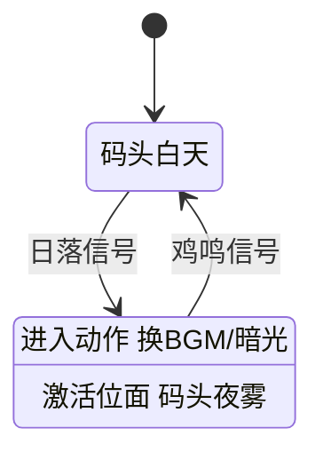

# 搭一段叙事状态机

雾津的码头白天一个样、夜里又是另一个样——同一个地方，同一个 NPC，说的话不一样，规则也可能不一样。这种"整个世界此刻处于哪个阶段"的活，不该塞进某一段对话或某个任务里自己攒逻辑，而是交给**叙事状态机**统一管。这一页带你从零搭一套最简单的状态机：几个状态、状态间的迁移，再让图对话读这套状态联动分支。

---

## 这是什么（30 秒看懂）

把整条故事线想成一张地铁图：每一个站是一个**状态**（"码头·白天""码头·夜晚"……），站与站之间的铁轨是**迁移**，什么时候发车由**信号**决定。玩家在任意时刻只会停在一个站——这个站决定了"现在世界是什么规则"（配合[位面](../editors/panels/plane)）、"进这一站要顺手做什么"（换 BGM、改旗标、播一小段表现）。

叙事状态机不管某句台词具体怎么说，也不管某个任务给不给奖励——它管的是"故事此刻走到哪一步"这件**全局唯一**的事。别的地方（图对话、任务）可以**读**这个状态来分支，但状态本身该在这里改，不建议在别处各自悄悄攒一套"现在是不是白天"的判断逻辑，不然早晚会对不上。

## 读完你能做到什么

- 新建两三个状态，标出哪个是初始状态
- 拉迁移，配信号触发、加条件
- 给状态设进入动作、设激活位面
- 在图对话里读当前叙事状态做分支
- 在调试模式里手动发信号，验证迁移对不对，不用从头玩一遍

---

## 手把手逐步操作

### 第 1 步：打开叙事状态机面板

```bash
./dev.sh editor
```

进入主编辑器后走 **叙事编排 → 叙事状态机**。选要编的**构图**——一个作品可以有一张主图，也可以拆出子图，先从主图开始。

画布左上角有**编辑 / 连线 / 调试**三种模式：编辑模式拖状态改属性，连线模式专门拉线建迁移（不容易误拖坏画布），调试模式只用来看关系和跑运行时快照，不会改任何数据，放心切进去看。

### 第 2 步：新建状态

切到**编辑**模式，画布空白处新建一个状态，命名"码头·白天"，写一句描述给自己看。侧栏勾上**是否初始**，让故事默认从这里开始。

再新建一个状态"码头·夜晚"。

### 第 3 步：给状态配进入动作、激活位面

选中"码头·夜晚"，侧栏填**进入动作**：换成夜曲 BGM、加一层暗光滤镜表现（可以打包成一个[信号 Cue](./cue-signal) 复用）。再填**激活位面**——下拉选一个已经在[位面面板](../editors/panels/plane)登记过的位面，比如"码头夜雾"；下拉是空的说明还没登记，先去位面面板补一个再回来选。

如果这个状态进入这件事本身要让别处也能监听到（比如任务面板想知道"玩家是不是已经进了夜晚"），勾上**进入时广播**——系统会自动派生一个只读信号供别处监听，不用你手写。

### 第 4 步：拉迁移

切到**连线**模式，从"码头·白天"拖一条线到"码头·夜晚"，生成一条迁移。选中这条迁移，侧栏填：

- **触发类型**：选"作者信号"，自己起一个信号 id，比如"日落信号"
- **条件**（可选）：留空表示信号一到就走这条边
- **优先级**：只有一个状态同时有好几条可能满足的迁移时才需要排

再拉一条反向迁移，"码头·夜晚" → "码头·白天"，触发信号"鸡鸣信号"。

迁移的**从/到**在侧栏结构化表单里是只读的——拉错线了，回连线模式重新拖，别在侧栏硬填。

### 第 5 步：保存（注意两步保存）

这块画布是嵌在主编辑器里的一块独立页面，按保存快捷键只会把改动记到内存草稿，**不会立刻落盘**。真正写盘要回到主编辑器点一次**全部保存**——这是新手最容易漏的一步，画完state别急着关软件，先回主编辑器保存一次。

### 第 6 步：安排信号真正被发出来

状态机画好了，但没人发信号它也不会自己跳。去找一个合适的触发点——比如一个热区、一段过场结束、或某个时间点——在那里的**跑动作**里加一条"发信号"动作，信号选"日落信号"。信号名一定要跟这里登记的完全对上，拼错了图会安安静静地不跳，也不会报错提醒你。

### 第 7 步：图对话里读状态做分支

打开[图对话](../editors/panels/dialogue-graph)，找关二狗在码头的对白，台词节点后面接一个**主人态**（或上下文态）节点，读当前叙事状态是"码头·白天"还是"码头·夜晚"，分别接不同的回应台词——白天一套精神话，夜晚一套压低声音的话。

### 第 8 步：验证

不用从头玩一遍，切到**调试**模式：

1. **拉取运行时快照**，看当前故事实际停在哪个状态
2. **手动发一个信号**（比如"日落信号"），看这张图会不会按预期跳到"码头·夜晚"
3. 图对话也跟着走一遍，确认关二狗的台词真的换了一套

验证通过后，再从正式路径走一遍（真的等触发点被玩家碰到），确认真实体验没问题——调试模式的手动发信号只是给你验证逻辑用的快捷方式，不能代替走一遍正式流程。

---

## 流程示意




---

## 雾津完整实例

**目标**：码头白天/夜晚两个状态来回切换，夜晚换氛围、换位面，图对话里关二狗的台词跟着状态变。

1. 叙事状态机面板，选主图，新建状态"码头·白天"（标初始）、"码头·夜晚"。
2. "码头·夜晚"进入动作：加一条动作播放信号 Cue（提前在[信号 Cue 面板](../editors/panels/cue-signal)封好一条换氛围的 Cue，比如夜风声 + 暗一层滤镜）；激活位面选"码头夜雾"（提前在位面面板登记好）。
3. 拉迁移：白天 → 夜晚，触发信号"日落信号"；夜晚 → 白天，触发信号"鸡鸣信号"。
4. 回主编辑器点**全部保存**（两步保存，别漏这步）。
5. 找一个码头附近的热区，进入时的跑动作里加"发信号"→"日落信号"；找另一处（比如时间到了某个点的过场），发"鸡鸣信号"。
6. 图对话里关二狗的台词后接**主人态**节点：读当前叙事状态，"码头·白天"接一句"哟，寻狗的，大白天的可别偷懒"，"码头·夜晚"接一句压低声音的"这个点还在外头晃悠，不怕撞见什么？"。
7. 调试模式手动发一次"日落信号"，确认状态跳到"码头·夜晚"、快照也显示对了；再去码头找关二狗聊天，确认真的说的是夜晚那套词。
8. 正式路径走一遍：白天进码头触发区域进入"日落信号"→ 等到对应过场发"鸡鸣信号"，两边台词都对得上。

---

## 常见卡点

**发了信号，状态却没跳？**
先去信号目录核对拼写——发信号处填的信号 id 要跟迁移登记的名字完全一致，一个字都不能差。另外要注意，只在**条件**里读某个信号不算"监听"，必须是迁移的**触发方式**选中它才算，读条件那种写法永远等不到信号真正推动图往前走。

**按了保存，重启后状态和迁移都不见了？**
这块画布的保存只是暂存到内存草稿，真正落盘要回主编辑器点一次**全部保存**。以后养成"画完立刻回主编辑器保存一次"的习惯。

**进了夜晚状态，场景表现却还是白天那套？**
检查这个状态的**激活位面**有没有真的选对；再检查进入动作里配的表现（换 BGM、滤镜、信号 Cue）是不是真的加上了，漏配一项都可能导致"状态跳了、玩家却没感觉"。

**位面下拉是空的，选不到想要的位面？**
目标位面还没在[位面面板](../editors/panels/plane)登记，先去补登记再回来选，下拉才会出现。

**同一个状态引出好几条迁移，走的却不是我想要的那条？**
检查这几条迁移的**优先级**排序——同时满足的情况下，靠优先级决定先判定哪条边，把更想要优先命中的那条往前排。

**图对话的分支怎么改都跳不到我想要的那一支？**
先确认主人态/上下文态节点读的的确是当前这张构图的状态，而不是别的子图；再用调试模式的运行时快照对照一下当前实际停在哪个状态，往往是状态判断本身没问题，是节点连线接错了目标。

---

## 相关

- [叙事状态机面板](../editors/panels/narrative)
- [叙事状态机（图编辑器）](../editors/narrative-domain/narrative-editor-web)
- [位面面板](../editors/panels/plane)
- [信号 Cue 面板](../editors/panels/cue-signal)
- [做一个可复用信号](./cue-signal)
- [图对话面板](../editors/panels/dialogue-graph)
- [怎么编排动作](../editors/concepts/actions)
- [怎么设条件](../editors/concepts/conditions)
- [按目标查：我想做…](./goal-index)
