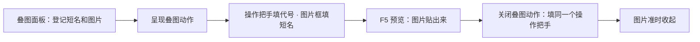

# 加一张叠图

你想让画面上突然贴出一张符咒、一缕雾气、一张剪影——这就是**叠图**。这一页带你把一张图登记成一个好记的短名，再用两个动作把它显示出来、演完收掉。

---

## 这是什么（30 秒看懂）

把叠图想成庙祝抽屉里编好号的符纸：做法事时喊一声"三号符"，徒弟就把对应那张递上来，不用每次现画现找。**叠图面板**就是这本"短名对应哪张图"的登记册，它本身不会让任何图出现在屏幕上——真正贴出来靠别处的动作去喊这本册子里的短名。

读完这页你能：

- 把一张带透明背景的图片登记成一个短名。
- 用**呈现叠图**动作把它贴到屏幕指定位置。
- 用**关闭叠图**动作把它收起来，不让它一直挂在画面上。
- 分清呈现叠图参数里"操作把手"和"图片"这两个框各管什么，不会填错地方。

---

## 手把手逐步操作

### 第 1 步：登记短名和图片

打开主编辑器，进**资源 → 叠图**：

1. 点添加，新增一行。
2. 起一个短名，字母数字下划线即可，比如 `overlay_charm_burn`。
3. 点旁边的选图按钮，挑一张带透明通道的图片（比如一张符咒燃烧的剪影）。
4. 保存这本登记册。

### 第 2 步：用"呈现叠图"把它贴出来

去信号 Cue、过场或图对话的动作编排里，加一条**呈现叠图**动作。这条动作有两个框，容易搞混，务必分清：

- **操作把手**：这是一个你自己起的代号，将来"关闭叠图"要靠它对上，指的是"关哪一层"，**不是图片本身**。
- **图片**：这里才是真正决定贴什么图的地方——直接填第 1 步登记的短名即可，不用再去点浏览选文件。

再填一下**屏幕位置**（图贴在屏幕百分之几的地方）和**宽度百分比**（图占屏幕多宽，高度按原图比例自动算，不用你换算）。

### 第 3 步：用"关闭叠图"把它收起来

在同一串动作序列里（或稍后另一个触发点），再加一条**关闭叠图**动作，操作把手填成和第 2 步**完全一样**的字符串——运行时靠这串字符串对上，才知道该收的是哪一层。想让图停留几秒再消失，两条动作之间插一个等待步骤即可。

### 第 4 步：运行预览验证

**F5** 触发这条 Cue 或过场，确认：图片是否准时出现、位置和大小合不合构图、过一会儿是否准时消失、不会卡在画面上不走。

---

## 流程示意

---

## 雾津完整实例：城隍庙夜祭符咒一闪

美术给了一张"符咒燃起"的透明剪影图，你要让它在城隍庙夜祭过场里念咒瞬间闪一下，念完自动收掉：

1. 先把这张图入库（参照[导入一张素材](./import-art)），再打开叠图面板登记短名 `overlay_charm_burn`。
2. 在城隍庙夜祭过场里，庙祝念咒台词说完那一刻，加一条**呈现叠图**动作：操作把手填 `charm_layer`，图片填 `overlay_charm_burn`，位置居中偏上，宽度设成屏幕的一半左右。
3. 紧接着加一个等待动作，两三秒。
4. 再加一条**关闭叠图**动作，操作把手同样填 `charm_layer`，让符咒燃尽的画面消失，回到夜祭正常光景。
5. **F5** 从头触发这段过场，确认符咒图准时贴出来、位置压得住构图，也准时收掉，没有卡在画面上不走。

符咒一闪而过，玩家才觉得这是一记法术，不是画面出了故障。

---

## 进阶：每一项都讲透

### 操作把手和图片框别混淆

呈现叠图和关闭叠图共用的是**同一个操作把手字符串**——它只是"开关的把手"，同一个把手出现在呈现和关闭两条动作里，运行时才认得是同一层。真正决定贴哪张图的，永远是呈现叠图那条动作里的**图片框**。

### 想做"模糊变清晰"，别用叠化叠图硬凑

叠图面板里还有一个**叠化叠图**动作，能让一张图慢慢变成另一张图，听起来像是做"信件从模糊到清晰"这类效果的现成工具。但项目里已经有专门的**文档揭示**面板在管这类效果，自带条件判断和存档记录，做告示、信件这类"看清楚才算数"的效果，优先用它，别在动作里手写两张图路径来对付。

### 这三个地方"贴图"但各管各的，不共用登记表

- 过场自己"闪一张图"的步骤，有自己独立的选图框，直接选文件，不查叠图登记表——哪怕你在登记表里起了同名的短名，过场那边也得自己重新选一次文件。
- 文档揭示的模糊图和清晰图，同样是各自独立选文件，不查这本登记表。
- 只有**呈现叠图 / 叠化叠图 / 关闭叠图**这三个动作的图片框，认叠图登记表的短名。

记混了最直接的后果就是"改了登记表但那边画面没反应"——先确认你改的地方到底认不认这本表。

### 和滤镜的分工

叠图改的是"贴了一张什么图上去"，[滤镜](../editors/panels/filters)改的是"整屏画面的色调"，两者是完全不同的两条线，可以同时用但各管各的：想让义庄夜访更冷，去调滤镜；想让画面上多贴一张符咒或剪影，来这里登记叠图。别把本该用滤镜解决的整体色调问题，硬想着靠贴一张半透明色块的叠图去凑，效果通常不如直接调滤镜参数来得干净。

### 什么时候值得登记，什么时候不必

- 同一张图会在好几个过场、Cue 里反复用到（比如"雾"这张图好几段演出都要闪一下）→ 值得登记短名，以后想统一换风格，改一处路径大家都跟着变。
- 只在一个地方用一次的图 → 直接在那条动作的图片框里浏览选文件即可，不用特地跑来登记。

### 效率与画面安全

- 全屏图要留出 UI 安全边，别把对话框、任务栏挡死。
- 大图记得先走压缩管线再登记，不然演出时会先卡一下才显示出来。
- 带透明通道（alpha）的图优先，避免白底硬边穿帮。

### 同时挂好几层叠图

一段演出里想同时贴出好几样东西——比如符咒燃起的同时再叠一层雾气——只要每一层用**不一样的操作把手**，几条呈现叠图动作就能同时挂着互不冲突。收的时候也要对应用各自的操作把手分别关掉，别图省事把所有层都塞进同一个操作把手里，那样关一层会把其它层也一起带没了。

### 命名从一开始就想好前缀

项目里叠图短名多了之后，下拉列表会越滚越长。养成加场景或用途前缀的习惯（比如城隍庙相关的都带"庙"字头，鬼打墙相关的都带"墙"字头），下拉选的时候一眼能认出这张图是给哪场戏用的，比一堆看不出用途的短名混在一起好找得多。

---

## 危险区与边界

- 叠图登记表本身很轻，只是短名对路径的字典，保存不会影响你没碰过的行。
- 删除一个短名前，编辑器不会替你去查有哪些呈现叠图/叠化叠图动作还在用这个字符串——你得自己去过场、信号 Cue、图对话里逐条确认，删漏了会让某段演出突然报错或者黑一块。
- 呈现和关闭如果操作把手没对上（哪怕多打错一个字符），关闭动作就等于关了一个不存在的东西，图会一直留在画面上不走。
- 更多编辑器整体的可编辑边界，见[危险区](../editors/concepts/danger-zone)。

---

## 常见问题

| 现象 | 原因 | 怎么办 |
|---|---|---|
| 触发了呈现叠图，画面上什么都没有 | 图片框填的不是登记表里的短名，或短名拼错 | 核对拼写，或改成浏览直接选文件 |
| 图出来了但一直不消失 | 关闭叠图的操作把手和呈现叠图的操作把手没对上 | 检查两处填的字符串是否完全一致 |
| 过场里另加了同名短名，闪图还是老样子 | 过场闪图有自己独立的选图框，不查叠图登记表 | 去过场步骤里重新选一次文件 |
| 想做模糊变清晰效果，叠化叠图总感觉不顺手 | 这类效果项目里有专门工具在管 | 改用[文档揭示](../editors/panels/doc-reveal)面板 |
| 图加载慢、演出卡顿一下才出图 | 原图过大未压缩 | 走资源压缩管线后重新登记 |
| 删了短名后某段演出报错或黑一块 | 还有动作在引用这个已删除的短名 | 先改掉引用，或把短名恢复 |
| 同时挂了两层图，关一层另一层也消失了 | 两条呈现叠图动作用了同一个操作把手 | 给每一层各自起一个不同的操作把手，分别管理 |

---

## 相关

- [叠图面板](../editors/panels/overlay)
- [信号 Cue](../editors/panels/cue-signal)
- [过场](../editors/panels/cutscene)
- [文档揭示](../editors/panels/doc-reveal)
- [导入一张素材](./import-art)
- [按目标查：我想做…](./goal-index)
