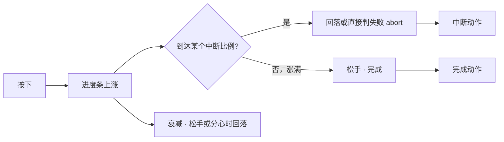

# 做一次临场长按

雾津河边叫魂、义庄里屏息过瘴气——有些时刻不能靠点选项解决，得让玩家**按住不放**，看着一条进度条一点点涨满，松早了不算数，中途还可能被鬼摸头**打断**。这种手感在编辑器里叫**临场长按**。这一页从零搭一条带中断的完整长按，接上完成动作，再用运行预览把「太虐」还是「太水」调出该有的分寸。

---

## 这是什么（30 秒看懂）

把临场长按想成一根点燃的引线：按住不放，进度条一点点涨满；松手太早，什么都不会发生；涨到某个比例时如果剧情设了「惊吓点」，可能会被硬生生打断，进度回落甚至直接判定失败。涨满了松手，才算真正完成，才会执行后续该发生的事。

一条临场长按由几块组成：一句蓄力过程中的提示文案、蓄满需要的秒数、松手或分心时的衰减速度、按住时的音效、进度条颜色、若干条「中断」、以及蓄满松手后要执行的完成动作。图对话、遭遇、热区、信号 Cue 都可以启动某一条临场长按，让玩家从「点选项」切换成「手感体验」。

读完这页你能：

- 独立搭一条带中断的完整临场长按，从身份信息、充能参数一路配到完成动作。
- 看懂每个参数具体怎么影响玩家的手感，知道该往哪个方向调「虐」或「水」。
- 把这条长按接到遭遇或对话的某个触发点上，用运行预览把「正常蓄满」「被中断」两种结局都走一遍。

---

## 入门：手把手做第一次

### 怎么开工具

主编辑器 → **叙事编排 → 临场长按**：

```bash
./dev.sh editor
```

### 先认几个词

| 词 | 大白话 |
|---|---|
| **蓄满秒数** | 不受衰减和中断打扰时，从零按满进度条理论上要多久 |
| **衰减速度** | 松手或分心时进度每秒回落多少，越大越考验「不能停」 |
| **中断** | 蓄到某个比例时可能触发的「惊吓点」，让进度回落或直接判失败 |
| **完成动作** | 蓄满并松手后跑的一串[动作](../editors/concepts/actions) |
| **中断动作** | 某条中断触发时单独跑的一串动作，和完成动作分开维护 |

### 第 1 步：新建一条临场长按

1. 临场长按列表点 **添加**，**id** 填一个一看就懂的名字，比如 `call_soul_hold`（叫魂长按）。
2. **提示（prompt）**填「按住念咒」——这是蓄力过程中屏幕上常驻显示的引导文案，支持富文本。
3. **松手提示**填「松手唤名」——松手瞬间闪现的提示，可留空。

### 第 2 步：定充能参数

1. **蓄满秒数**先给个 2.5 秒左右的初始值。
2. **衰减速度**给个适中的值。
这两个数字很难靠脑补判断手感，后面必须靠预览反复实按才知道「太虐还是太水」。

### 第 3 步：配表现

1. **按住音效**从下拉里选一个已登记的[音频](../editors/panels/audio)条目；选好后旁边有个「试听」按钮，可以直接在这里听效果，不用切去音频面板。
2. **蓄力条颜色**默认跟随系统默认色；如果想要专属颜色，勾选「自定义」再挑一个十六进制颜色——暗红色比较贴合雾津的恐怖氛围。

### 第 4 步：加一条中断

1. 中断列表点 **添加**。
2. **触发比例**填 0.6（蓄到六成时触发）。
3. **回落比例**填 0.3（触发后回落到三成，而不是直接清零，让玩家「差点成功」）。
4. 如果这个中断该是「直接判失败」，勾选 **abort**——勾选后回落比例不再生效，整次长按当场终止，而不是回落。
5. **中断时执行的动作**里加一条播惊吓音效，或扣一点状态类旗标的动作。

如果要加多条中断，务必让**触发比例从小到大**排列，面板上用上下移按钮调整顺序——顺序乱了判定行为会不符合预期。

### 第 5 步：配完成动作

**进度满时执行**里添加动作，比如：改旗标、播[信号 Cue](../editors/panels/cue-signal)、接一段[图对话](../editors/panels/dialogue-graph)。这是玩家蓄满松手后，游戏真正发生变化的地方——只有中断反馈、没有完成动作会让玩家觉得「蓄满了却什么都没发生」。

### 第 6 步：接到触发点

回到你要触发这条长按的地方——遭遇选项、热区、对话节点、信号 Cue 都可以——添加一条「启动某临场长按」类型的[动作](../editors/concepts/actions)，选刚才建好的 id。

### 第 7 步：保存与验证

1. **Ctrl+S** 保存。
2. **F5** 起运行预览，走到触发点，实按一次：
   - 正常按满松手：完成动作应该正确执行。
   - 中途松手：进度应该按衰减速度回落。
   - 按到中断比例附近：应该触发对应的回落或 abort，并播中断动作。

### 流程示意



---

## 雾津完整实例：河边叫魂

从零走一遍，做出雾津河边「叫魂」这段临场长按：

1. 临场长按列表新增，id 填 `call_soul_hold`。
2. **提示**填「按住念咒」；**松手提示**填「松手唤名」。
3. **蓄满秒数**填 3 秒；**衰减速度**给一个中等值——不要太快，河边叫魂应该给玩家一点容错，不是纯手速考验。
4. **按住音效**选一条已登记的低沉念咒声；试听确认效果贴合场景。
5. **蓄力条颜色**勾选自定义，选一个暗红色，贴合雾津的阴气感。
6. 添加一条中断：**触发比例** 0.4，**回落比例** 0.15；**中断条件**依赖旗标「鬼扰」为真（比如玩家处在鬼打墙位面激活期间）；中断动作播一段惊吓音效。
7. 再添加一条更狠的中断：**触发比例** 0.4（和上一条同一档，用于「鬼打墙位面」场景下的强化版）勾选 **abort**，直接判失败，动作里扣一点心理类旗标、播尖叫音效——这条专门覆盖玩家在最凶险的位面状态下强撑叫魂的情况。
8. **进度满时执行**：设旗标「叫魂成功」为真，发一个信号推进[叙事状态机](../editors/panels/narrative)，同时播[信号 Cue](../editors/panels/cue-signal) 的水面涟漪效果。
9. 打开[遭遇面板](./encounter)，找到「强行叫魂」这个选项，把它的结果动作设成「启动某临场长按」，选 `call_soul_hold`。
10. **Ctrl+S** 保存，**F5** 预览：普通位面状态下走一遍，看蓄到四成会不会触发温和的回落中断；切到鬼打墙位面激活期间再走一遍，确认蓄到四成会直接判失败并播尖叫音效；两种情况都正常蓄满一次，确认完成动作（旗标、信号、Cue）都按预期发生。

---

## 进阶：每一项都讲透

### 身份与提示

| 字段 | 说明 |
|---|---|
| id | 全表唯一，别处靠这个 id 启动这条长按 |
| 提示（prompt） | 长按过程中屏幕上常驻显示的引导文案，支持富文本 |
| 松手提示 | 松手瞬间闪现的提示，可留空 |

### 充能参数

| 参数 | 策划语义 |
|---|---|
| 蓄满秒数 | 理想情况下（不受衰减和中断打扰）从零按满进度条要多久 |
| 衰减速度 | 松手或分心时进度每秒回落多少，数值越大越考验「不能停」 |

这两个数字很难靠脑补判断手感，改完必须预览实按，光看数值猜不出「虐还是水」。

### 表现：音效与颜色

- **按住音效**：从已登记的[音频](../editors/panels/audio)里选，也允许手输 id（手输容易打错字导致长按全程静音，建议优先用下拉选）；面板自带试听按钮，选完直接能听。
- **蓄力条颜色**：有一个「是否自定义」的开关。不勾选就用系统默认色；勾选后才需要（也才允许）挑一个具体颜色。

### 中断（interrupts）：进度条上的「惊吓点」

一条长按可以配多个中断点，每个中断包含：

| 字段 | 说明 |
|---|---|
| 触发比例 | 蓄到多少比例（0～1）时触发这个中断。**多个中断按触发比例从小到大排列**，面板里可以用上下移按钮调整顺序，务必保持严格递增，不然判定顺序会乱 |
| 回落比例 | 触发后进度回落到的比例（比如从六成回落到三成，而不是直接清零，让玩家「差点成功」） |
| abort | 勾选后这个中断变成「直接判定失败」，此时回落比例不再生效——不是回落，是整次长按当场终止 |
| 中断时执行的动作 | 这个中断触发时单独跑的一串[动作](../editors/concepts/actions)，比如播惊吓音效、扣状态类旗标 |

**险境类长按至少配一条中断**：只有完成动作、没有中断的长按，一旦剧情设定里本该有「被打断」的可能性，玩家会觉得「明明该被吓到却毫无反馈」。

### 完成动作

蓄满并松手后跑的一串[动作](../editors/concepts/actions)——推进旗标、叙事信号、Cue 表现都放在这里，和中断动作分开维护，职责清楚。

### 和相关面板怎么配合

| 面板 | 关系 |
|---|---|
| [信号 Cue](../editors/panels/cue-signal) | 完成/中断时播放的表现效果 |
| [音频](../editors/panels/audio) | 按住音效的来源，先在这里登记好 |
| [位面](../editors/panels/plane) | 险境规则（比如同时叠加生命流失）常和长按搭配 |
| [遭遇](./encounter) | 「蛮干」路线的代价常常就是启动一条临场长按 |
| [动作总表](../editors/panels/actions) | 查「启动某临场长按」这类动作怎么用 |

### 批量做法与老手技巧

- **先定手感基准再批量搭**：项目里如果要做好几条临场长按（叫魂、屏息、贴符），先用一条调出「正常/紧张/险境」三档手感基准，再照着基准去搭其它条目，比每条都从头试快得多。
- **中断分档覆盖不同风险场景**：同一条长按可以配多条触发比例相近但严重程度不同的中断，分别对应「普通状态」和「危险位面」——本页雾津实例里 0.4 比例配了两条不同后果的中断，就是这个用法。
- **完成动作和中断动作各自独立测**：调试时建议先单独触发一次完成动作（正常按满走一次），再单独触发一次中断（故意在触发比例附近松手或等中断出现），分开验证，别图省事只测一种结局。

---

## 危险区与边界

临场长按条目本身很少出现「重建丢字段」的风险，真正需要留意的是**手感调校**和**联动动作是否测全**：

- 按住音效或蓄力条颜色若用手输而不是下拉选，没有强校验，写错字会导致长按全程静音，且不一定第一时间发现——优先用下拉选，手输后务必和[音频面板](../editors/panels/audio)登记表核对一致。
- 只配完成动作、不配中断，会让本该有「打断惊吓」的险境剧情缺了反馈。
- 中断的触发比例没按递增排列摆放，判定行为可能不符合预期，务必检查排列顺序。
- 长按失败的惩罚如果和[位面](../editors/panels/plane)的每秒掉血叠加，两边数值要一起测，避免玩家被双重惩罚打得措手不及。
- 更完整的边界说明见[危险区](../editors/concepts/danger-zone)。

---

## 常见问题

| 现象 | 原因 | 怎么办 |
|---|---|---|
| 长按全程静音 | 按住音效 id 写错或未登记 | 回[音频面板](../editors/panels/audio)核对，用下拉选而非手输 |
| 该被打断却毫无反应 | 没配中断，或中断的条件（如旗标）不成立 | 补一条中断并核对触发条件 |
| 一松就过难或过易 | 蓄满秒数 / 衰减速度数值不合适 | 预览反复迭代参数，别只靠数值猜手感 |
| 蓄满了但世界没变化 | 完成动作串是空的 | 补旗标/信号/Cue 等动作 |
| 双重暴毙 | 位面掉血叠加长按失败惩罚过猛 | 降低位面掉血速度，或放宽衰减数值 |
| 中断判定顺序不对 | 多个中断的触发比例没按递增排列 | 用上下移按钮重新排序 |
| 长按启动了但玩家根本没看到进度条 | 触发点选的动作类型不是「启动某临场长按」，或引用的 id 拼错 | 回触发点核对动作类型与 id 是否正确 |

---

## 相关

- [临场长按面板](../editors/panels/pressure-hold)
- [信号 Cue 面板](../editors/panels/cue-signal)
- [音频面板](../editors/panels/audio)
- [位面面板](../editors/panels/plane)
- [怎么编排动作](../editors/concepts/actions)
- [做一个遭遇](./encounter) —— 常见的触发点之一
- [按目标查：我想做…](./goal-index)
