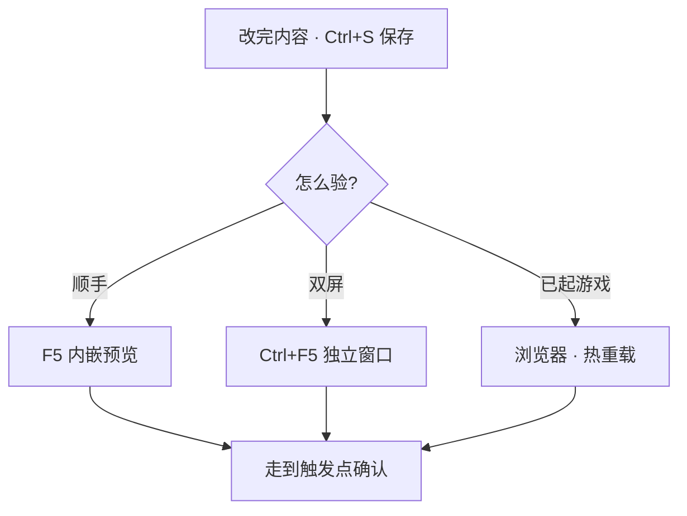

# 用运行预览验证改动

改了对白、摆了场景、调了滤镜——若不进游戏看一眼，心里总悬着。**运行预览**就是编辑器里的「当场验货」：保存 → 起游戏 → 走到触发点 → 确认。这一页把三种预览方式和常见习惯一次说清。

---

## 读完你能做到什么

- 用 **F5** 在主编辑器里内嵌预览
- 用 **Ctrl+F5** 独立窗口、或浏览器里已开的游戏验证
- 知道「先保存再预览」和「热重载」的差别
- 养成改完必验的闭环，少踩「改了没生效」

---

## 三种预览方式

| 方式 | 怎么开 | 适合什么时候 |
|---|---|---|
| **内嵌预览** | 主编辑器按 **F5** | 最常用；改完立刻在同窗口看 |
| **独立窗口** | **Ctrl+F5** | 想双屏：一边编辑一边全屏玩 |
| **浏览器游戏** | `./dev.sh game start` 后切浏览器 | 已长期开着游戏、靠自动刷新 |

停止内嵌或独立预览：**Shift+F5**。



---

## 第 1 步：打开主编辑器

```bash
./dev.sh editor
```

左侧导航树末尾有 **Game（运行预览）** 页——F5 后游戏画面嵌在这里。

---

## 第 2 步：内嵌预览（F5）

1. 改完当前面板，**Ctrl+S** 或 **Ctrl+Shift+S** 保存
2. 按 **F5**
3. 编辑器会先保存，再启动游戏开发服，把画面嵌进 Game 页
4. 用键盘操作走进场景，触发你对白/热区/商店/小游戏

:::tip[F5 不是万能刷新]
F5 会**重新起预览**。若你已在预览里，小改动有时保存后预览会自动跟上；若完全没反应，**Shift+F5** 停掉再 **F5** 重来。
:::

### 操作示意

<svg viewBox="0 0 720 380" xmlns="http://www.w3.org/2000/svg" role="img" aria-label="运行预览示意" style={{width:'100%', height:'auto'}}>
  <rect width="720" height="380" fill="#1a1510" rx="8"/>
  <rect x="16" y="16" width="160" height="348" fill="#231c14" stroke="#3a2f20" rx="6"/>
  <text x="96" y="44" textAnchor="middle" fill="#c9bda1" fontSize="10">导航树</text>
  <text x="32" y="320" fill="#e0a44e" fontSize="10">Game ◀ 预览页</text>
  <rect x="188" y="16" width="516" height="348" fill="#0d1117" stroke="#e0a44e" rx="6"/>
  <text x="446" y="190" textAnchor="middle" fill="#5a8a86" fontSize="14">游戏画面 · 内嵌 Web 预览</text>
  <rect x="188" y="16" width="516" height="28" fill="#2a2218" rx="6"/>
  <text x="446" y="34" textAnchor="middle" fill="#8a7a5c" fontSize="10">F5 启动 · Shift+F5 停止</text>
</svg>

---

## 第 3 步：独立窗口（Ctrl+F5）

和 F5 一样先保存再起服，但游戏在**单独窗口**打开——适合：

- 外接显示器全屏玩
- 内嵌区域太小，看不清立绘或小游戏

---

## 第 4 步：浏览器 + 热重载

若你早已另开终端跑着：

```bash
./dev.sh game start
```

浏览器里地址一般是 `http://localhost:5173`（端口占用时会变，看终端提示）。主编辑器保存后，浏览器**多数情况**会自动刷新进新数据。

适合长时间开着游戏、频繁改小文案。若改了结构型内容（新场景、新任务链），仍建议 **F5** 完整预览一次。

---

## 验什么、怎么验

按你刚改的内容列检查单：

| 你改了 | 预览时做 |
|---|---|
| 对白 | 走到触发点，看台词、选项、分支 |
| 场景 / NPC | 走进场景，看位置、立绘、碰撞 |
| 物品 / 商店 | 买一件、用一件、看背包 |
| 滤镜 / 深度 | 看色调、绕障碍物走一圈 |
| 过场 / 视差 | 从触发点播完整段 |
| 小游戏 | 玩通胜利和失败两条路 |
| 档案 / 音频 | 开书匣、听 BGM 与音效 |

改一处，验一处——别攒十处改动最后一起试，出了问题不知道是哪一刀。

---

## 和校验命令配合

预览是「眼睛看」；数据有没有硬错误，可以另跑：

```bash
./dev.sh validate-data
```

校验不过，预览里也可能怪——先修红灯再 F5。详见 [出问题怎么办](./troubleshooting)。

---

## 雾津小例子

你刚改了关二狗在**满堂茶客**的一句台词，又调了茶馆滤镜：

1. 图对话保存 → **F5**
2. 走进茶馆触发对话，对台词
3. **Shift+F5** 停预览，场景面板确认滤镜 → 再 **F5** 只看色调
4. 都对了，这条折子才算落笔

---

## 接下来读什么

| 页面 | 内容 |
|---|---|
| [边改边看：运行预览](../editors/main-editor/run-preview) | 手册版详解 |
| [主编辑器怎么逛](../editors/main-editor/basics) | 保存、撤销 |
| [出问题怎么办](./troubleshooting) | 改了没生效等 |
| [5 分钟跑起来](./intro) | 第一次 F5 |
