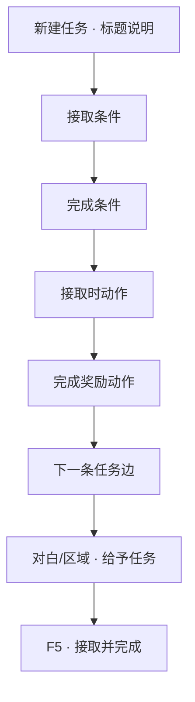

# 做一条任务线

寻狗不是闲逛——玩家得知道「现在要干什么」。**任务**就是账本上的条目：标题、说明、什么时候能接、怎样算做完、做完给什么、下一步接哪条。这一页做一条完整的支线练手。

---

## 这是什么（30 秒看懂）

任务面板就像雾津寻狗记的**账本**：每一条任务是账本上的一行——写着标题、什么情况下能记上这一笔（接取条件）、怎样才算这笔账清了（完成条件）、记上这一笔的时候顺手干点什么（接取时动作）、账清了之后给玩家什么（奖励）、还有清账后自动翻到账本的哪一页（下一条任务）。任务本身分**组**，像账本被分成「主线」「支线」几个分册，还能有父子嵌套关系。

任务写在账本上不会自己「跳出来」——得有人在游戏里的某个时刻真的执行一条「给予任务」的动作，账本上才会真正出现这一行。这也是这一页练手时最容易漏掉、也最容易让人以为「任务面板做完了怎么游戏里没反应」的一步。

## 读完你能做到什么

- 在任务面板新建任务并放进分组
- 写接取门槛、完成条件、接取时与完成时的动作
- 链到下一条任务
- 预览里接任务、完成任务、在任务面板看到状态变化

---

## 怎么开工具

主编辑器 → **叙事编排 → 任务**

分组在同一面板或 **任务分组** 区域管理。

条件与动作用到的共享控件：

- [怎么设条件](../editors/concepts/conditions)
- [怎么编排动作](../editors/concepts/actions)

---

## 任务里几个词（第一次见）

| 词 | 大白话 |
|---|---|
| **任务** | 一条有标题、进度、奖励的 quest |
| **分组** | 任务簿里的文件夹，分主线 / 支线 |
| **接取条件** | 不满足则接不到 |
| **完成条件** | 全满足则任务变「已完成」 |
| **接取时动作** | 刚接到手立刻干的事（播对白、设旗标） |
| **奖励动作** | 完成时干的事（给物品、开下一段） |

术语详情 [术语表](../reference/glossary)。

---

## 手把手逐步操作

*任务面板：左侧是分组与任务的树，中间关系图显示任务先后与支线。*

### 第 1 步：新建任务

1. 任务列表 **新增**
2. 填 **标识**（系统用）、**标题**、**说明**（玩家任务面板里看的富文本）
3. **类型**：主线 / 支线等，按项目选项选
4. **所属分组**：选「寻狗 · 雾津」一类分组；没有分组先 **新增分组**

### 第 2 步：接取条件

「谁能接、什么时候能接」——例如：

- 某 **旗标** 为真（已跟李天狗说过话）
- 某 **任务** 已完成（上一环做完）
- **组合条件**：要 A 且 B

留空表示默认能接（仍可能被叙事状态机 gate，那是更高层的事）。

### 第 3 步：完成条件

「怎样算做完」——常见写法：

- 旗标 `found_clue_tea` 为真
- 任务「打听神仙顶」已完成（若做链式）
- 持有某 **物品** 数量 ≥ 1

全部满足时任务自动变完成（或按项目规则触发完成动作）。

### 第 4 步：接取时与奖励动作

| 时机 | 例子 |
|---|---|
| **接取时** | 播一句对白；设旗标 `quest_dog_active` |
| **完成时（奖励）** | 给物品「茶馆线索」；设旗标；**启动对白图** 收尾 |

点 **添加动作** 逐项选。完成时也可 **开启下一条任务**（若用动作类型支持）或靠 **下一条任务** 边自动接。

### 第 5 步：链下一条任务

**下一条任务** 列表：添加指向另一条任务的边。

- 可设 **绕过接取条件** —— 上一条完成直接塞给玩家，不用再验门槛
- 边上可加 **条件** —— 分岔：夸过茶馆才开 A 线，装穷才开 B 线

拖拽可改任务在分组里的父子关系（有环会拦）。

### 第 6 步：让任务能被接到

任务面板里写好不会自己跳出来，要游戏里有 **接取动作**，例如：

- **对白图 · 跑动作** → 「给予任务」
- **区域进入** → 「给予任务」
- **叙事状态机** 进入某状态时给予（进阶，见 [叙事状态机](../editors/narrative-domain/narrative-editor-web)）

本教程练手：在关二狗对白里 **跑动作 → 给予任务**，选你刚建的任务。

### 第 7 步：验证

1. **Ctrl+S** 保存任务与对白
2. **F5** 预览
3. 触发接取 → 任务面板应出现新条目
4. 满足完成条件 → 变已完成，奖励动作生效

---

## 流程示意

---

## 雾津完整实例

**任务线**：「打听神仙顶」（支线），完成后自动解锁「寻狗 · 码头」任务，但只有在玩家先夸过评书的前提下才走这条支线，装穷则走另一条独立小任务。

1. 标题：「神仙顶在哪」；说明：「茶馆里听了一嘴，得问清楚。」
2. **所属分组**：「寻狗 · 雾津」
3. 接取条件：旗标 `heard_shenxian_ding`（茶馆听过评书，见 [写一段带选择的对白](./branching-dialogue) 里「硬夸」分支设的旗标）
4. 完成条件：旗标 `asked_li_tiandog` 为真（跟李天狗问过）
5. 接取时：播脚本对白「得找道士问。」
6. 完成时：给物品「神仙顶传闻」；下一条边指向「寻狗 · 码头」任务，边上加条件「旗标 `tea_praised` 为真」（只有夸过评书这条线才自动续上）
7. 李天狗对白 **跑动作** 里 **设旗标** `asked_li_tiandog`；评书区域 **给予任务**
8. **F5** 走一遍：听评书选硬夸 → 任务进簿 → 问李天狗 → 完成 → 「寻狗 · 码头」自动出现；再用装穷路线走一遍，确认「寻狗 · 码头」这次不会自动续上

---

## 常见卡点

**任务写好了，游戏里完全没出现？**
八成是漏了「让任务能被接到」这一步——任务面板本身只是登记，没有任何东西会自动把它塞进玩家的任务簿。回去检查是不是真的有一条「给予任务」动作在某处（对白、区域、任务链）被执行到了。

**接取条件明明满足了，还是接不到？**
先确认条件本身写对了（旗标名有没有拼错、任务状态选的是「进行中」还是「已完成」）。如果条件确实没问题，可能是被更高层的**叙事状态机**挡住了——叙事图可能有自己的门控逻辑，这一层不在任务面板本身，需要去 [叙事状态机](../editors/narrative-domain/narrative-editor-web) 里查。

**完成条件都满足了，任务却一直不变成已完成？**
用运行预览逐条对照完成条件，确认每一项真的都满足了——常见是「持有某物品数量 ≥ 1」这类条件，物品其实在别的流程里被消耗掉了，玩家手里其实已经没有了。

**任务完成了，但玩家感觉不到（没提示、没反馈）？**
奖励动作只改了旗标、给了物品，但没有任何可见的提示（没配对应的文案或提示动作），玩家很难注意到任务已经完成。建议奖励动作里至少配一条能被看到/听到的反馈。

**「下一条任务」的边意外跳过了一大段主线？**
检查这条边有没有勾选「绕过接取条件」——勾了之后，只要上一条任务一完成，下一条不再验证任何门槛就直接塞给玩家，如果这条边连的是主线关键任务，等于让玩家跳过了一整段该走的流程。

**把任务拖到别的分组下，提示环检测拦住了？**
分组和任务之间的父子关系不能拖出循环（A 的子是 B，B 的子又变成 A 这种）。看到环检测提示就换一种拖法，不要硬拖。

---

## 进阶变体

- **多接取入口共用同一条任务**：给予任务的动作可以出现在不止一个地方——比如既在李天狗的对白里给，也在评书热区里给，只要玩家从任意一处走到这一步都能接到，不必强求玩家走某一条固定路径。
- **下一条任务边加条件做分岔账本**：完成一条任务后，可以同时连出好几条不同的「下一条任务」边，每条各自加条件——比如夸过评书走一条支线，装穷走另一条，玩家账本上后续出现的条目会因为之前的选择而不同。
- **绕过接取条件做"强制推进"**：正常流程里，下一条任务还是要验证自己的接取条件；但如果某条任务就是应该在上一条完成后立刻、无条件地塞给玩家（比如主线关键节点），把这条边设成绕过接取条件即可，不用再给下一条任务额外配一套形同虚设的条件。
- **任务分组做主线/支线的可视化管理**：分组树支持父子嵌套，可以把「寻狗记」下面细分成「雾津」「码头」「城隍庙」几个子分组，支线任务各自挂在对应地点的分组下，任务多了也不至于在一份长列表里迷路。
- **完成时启动对白图收尾**：奖励动作除了给物品、设旗标，还可以直接启动一张对白图——做「任务完成后 NPC 说一句总结性的话」，比单纯弹一个完成提示更有叙事感。
- **旧式「下一条任务 id」已废弃，别再用**：如果你在老项目里见过某任务身上有一个单独的「下一任务 id」字段，那是旧写法，现在统一改用**下一条任务边**来连接，边上还能加条件和绕过开关，表达力比单一 id 强得多。

---

## 相关手册

- [任务面板](../editors/panels/quest)
- [怎么设条件](../editors/concepts/conditions)
- [怎么编排动作](../editors/concepts/actions)
- [写一段带选择的对白](./branching-dialogue) —— 接取/完成常绑对白
- [排一场过场](./cutscene) —— 接取/完成时常播过场
- [做一个遭遇](./encounter) —— 任务完成后可开遭遇
