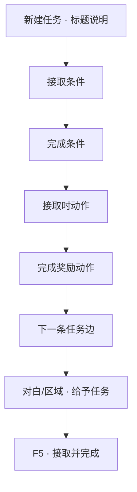

# 做一条任务线

寻狗不是闲逛——玩家得知道「现在要干什么」。**任务**就是账本上的条目：标题、说明、什么时候能接、怎样算做完、做完给什么、下一步接哪条。这一页做一条完整的支线练手。

---

## 读完你能做到什么

- 在任务面板新建任务并放进分组
- 写接取门槛、完成条件、接取时与完成时的动作
- 链到下一条任务
- 预览里接任务、完成任务、在任务面板看到状态变化

---

## 怎么开工具

主编辑器 → **叙事编排 → 任务**

分组在同一面板或 **任务分组** 区域管理。

条件与动作用到的共享控件：

- [怎么设条件](../editors/concepts/conditions)
- [怎么编排动作](../editors/concepts/actions)

---

## 任务里几个词（第一次见）

| 词 | 大白话 |
|---|---|
| **任务** | 一条有标题、进度、奖励的 quest |
| **分组** | 任务簿里的文件夹，分主线 / 支线 |
| **接取条件** | 不满足则接不到 |
| **完成条件** | 全满足则任务变「已完成」 |
| **接取时动作** | 刚接到手立刻干的事（播对白、设旗标） |
| **奖励动作** | 完成时干的事（给物品、开下一段） |

术语详情 [术语表](../reference/glossary)。

---

## 逐步操作

### 第 1 步：新建任务

1. 任务列表 **新增**
2. 填 **标识**（系统用）、**标题**、**说明**（玩家任务面板里看的富文本）
3. **类型**：主线 / 支线等，按项目选项选
4. **所属分组**：选「寻狗 · 雾津」一类分组；没有分组先 **新增分组**

### 第 2 步：接取条件

「谁能接、什么时候能接」——例如：

- 某 **旗标** 为真（已跟李天狗说过话）
- 某 **任务** 已完成（上一环做完）
- **组合条件**：要 A 且 B

留空表示默认能接（仍可能被叙事状态机 gate，那是更高层的事）。

### 第 3 步：完成条件

「怎样算做完」——常见写法：

- 旗标 `found_clue_tea` 为真
- 任务「打听神仙顶」已完成（若做链式）
- 持有某 **物品** 数量 ≥ 1

全部满足时任务自动变完成（或按项目规则触发完成动作）。

### 第 4 步：接取时与奖励动作

| 时机 | 例子 |
|---|---|
| **接取时** | 播一句对白；设旗标 `quest_dog_active` |
| **完成时（奖励）** | 给物品「茶馆线索」；设旗标；**启动对白图** 收尾 |

点 **添加动作** 逐项选。完成时也可 **开启下一条任务**（若用动作类型支持）或靠 **下一条任务** 边自动接。

### 第 5 步：链下一条任务

**下一条任务** 列表：添加指向另一条任务的边。

- 可设 **绕过接取条件** —— 上一条完成直接塞给玩家，不用再验门槛
- 边上可加 **条件** —— 分岔：夸过茶馆才开 A 线，装穷才开 B 线

拖拽可改任务在分组里的父子关系（有环会拦）。

### 第 6 步：让任务能被接到

任务面板里写好不会自己跳出来，要游戏里有 **接取动作**，例如：

- **对白图 · 跑动作** → 「给予任务」
- **区域进入** → 「给予任务」
- **叙事状态机** 进入某状态时给予（进阶，见 [叙事状态机](../editors/narrative-domain/narrative-editor-web)）

本教程练手：在关二狗对白里 **跑动作 → 给予任务**，选你刚建的任务。

### 第 7 步：验证

1. **Ctrl+S** 保存任务与对白
2. **F5** 预览
3. 触发接取 → 任务面板应出现新条目
4. 满足完成条件 → 变已完成，奖励动作生效

---

## 流程示意

---

## 雾津小例子

**任务线**：「打听神仙顶」（支线）

1. 标题：「神仙顶在哪」；说明：「茶馆里听了一嘴，得问清楚。」
2. 接取条件：旗标 `heard_shenxian_ding`（茶馆听过评书）
3. 完成条件：旗标 `asked_li_tiandog` 为真（跟李天狗问过）
4. 接取时：播脚本对白「得找道士问。」
5. 完成时：给物品「神仙顶传闻」；下一条边指向「寻狗 · 码头」任务（若已有）
6. 李天狗对白 **跑动作** 里 **设旗标** `asked_li_tiandog`；评书区域 **给予任务**
7. **F5** 走一遍：听评书 → 任务进簿 → 问李天狗 → 完成

---

## 相关手册

- [任务面板](../editors/panels/quest)
- [怎么设条件](../editors/concepts/conditions)
- [怎么编排动作](../editors/concepts/actions)
- [写一个带选择的对白](./branching-dialogue) —— 接取/完成常绑对白
- [做一个遭遇](./encounter) —— 任务完成后可开遭遇
