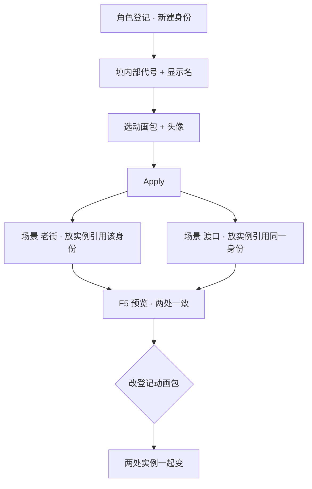

# 登记一个新角色

货郎老周要在雾津老街摆一个摊子，又要在渡口再支一个摊子——两个摊位站的都是同一个人，脸和动画不该分别做两份。这一页教你在**角色登记**面板给他建一份身份档案，再到两张场景里各放一个实例引用同一份身份，登记一次，处处能用。

---

## 这是什么（30 秒看懂）

把角色登记想成雾津折子戏的**演员表**：演员表上写着「货郎老周」这个角色长什么脸、穿什么动画、说话时用哪张头像。具体某一幕他站在台上哪个位置、朝哪边，是场景那边的事——同一个角色可以在很多幕戏里出现，但演员表只有一份，不用每一幕都重新描一次脸。

这正是角色登记和场景 NPC 的分工：**登记管「是谁、长什么样」**，**场景实例管「站哪、朝哪、跟哪张对话」**。两个摊位的老周共用同一份登记，各自摆一个自己的实例。

## 读完你能做到什么

- 在角色登记面板新建一条角色身份：内部代号、显示名、动画包、对话头像
- 在两张不同场景里各放一个 NPC 实例，都指向同一份登记身份
- 弄清楚「改登记」和「改某个场景实例」分别会影响多大范围
- 运行预览验证：两个摊位的老周脸和动画一致，改一次登记两边一起变

---

## 怎么开工具

主编辑器 → **物理世界 → 角色登记**（建身份）
主编辑器 → **物理世界 → 场景**（放实例）

```bash
./dev.sh editor
```

---

## 手把手逐步操作

### 第 1 步：打开角色登记，新建一条身份

1. 打开角色登记面板
2. 点**新建**
3. **内部代号**填一个稳定、以后不会随便再改的代号——场景、对话里引用的都是这个代号，建议用拼音或英文，别用中文，也别之后手痒改它
4. **显示名**填玩家看到的名字，比如「货郎老周」

### 第 2 步：选动画包

1. 检视器里「动画」下拉，选老周挑担吆喝那套动画
2. 如果下拉是空的，说明这份动画还没通过动画生产流程产出，先去把动画做出来再回这里选，别硬凑一套不合适的先顶上

### 第 3 步：配对话头像

1. 对话头像选老周的立绘那一张
2. 如果动画包和立绘用的是同一个名字，不用手动选——编辑器会自动按动画包的名字去找同名立绘；名字对不上时才需要手动指定头像

### 第 4 步：Apply 保存

Apply 之后，这份身份就登记在册了，但还没有任何一个场景引用它——游戏里目前还看不到货郎老周这个人，下一步要去场景放实例，登记不等于放人。

### 第 5 步：在雾津老街放第一个实例

1. 打开雾津老街场景
2. 新增 NPC 实例，身份选刚登记的货郎老周
3. 拖到老街那个固定摆摊的位置，朝向对着街心

不用重新填动画和头像，这两项默认都跟着登记走。

### 第 6 步：在渡口再放第二个实例，共用同一身份

1. 打开渡口场景
2. 新增 NPC 实例，身份**同样选**货郎老周（不是新建一份身份）
3. 拖到渡口码头边合适的摊位位置

这两个实例现在共用同一份登记档案——改登记的动画包，两边会一起变。除非之后在某一个实例上单独覆盖动画或头像，那个实例才会自己「闹独立」，不再跟着登记走。

### 第 7 步：保存与验证

1. 两张场景各自 **Ctrl+S**
2. **F5** 运行预览，分别走到老街和渡口，确认两处的老周脸、动画、名字一致
3. 回角色登记换一次动画包再 Apply，两处 NPC 应该一起变样，不用逐场景改

---

## 流程示意



---

## 雾津完整实例

**任务**：给货郎老周建一份身份，在老街和渡口各摆一个摊位实例，共用同一张脸和动画；后续想给他整个换一套新动画，只改一处。

1. 角色登记新建，内部代号定为一个稳定的拼音代号，显示名「货郎老周」，动画选挑担吆喝套，头像走自动同名匹配
2. 雾津老街场景放实例，靠墙根摆摊，朝向街心
3. 渡口场景再放一个实例，靠船板边，朝向码头
4. 图对话给老周写两句不同的开场白——老街这份和渡口这份对话内容可以完全不一样，这不影响身份是不是共用；对话挂在场景实例这一层，跟登记那层没关系
5. 运行预览分别走到两处：老周的脸、走路动画、头像应该一致，只是两边说的台词不同
6. 后续项目决定给老周整个换一套新动画（比如加了顶斗笠），回角色登记改一次动画包，两处摊位一起换新装扮，不用跑两趟场景各改一次

---

## 常见卡点

**登记了，但游戏里看不到人？**
这份身份只是建了档案，还没在任何场景放实例。去场景面板加一个 NPC，身份选这条登记，才会真正出现在地图上。

**两个摊位的老周，一个换了新动画，另一个没变？**
大概率是某个场景实例上单独覆盖过动画包，那个实例不再跟登记同步。需要在这个具体实例上清空覆盖，才会重新回归登记默认。

**内部代号想改个更顺口的？**
尽量别改。场景、对话、任务只要引用多了，代号一旦改动，所有引用都得跟着找一遍手动改，风险比改显示名大得多——想换个名字，改显示名就够，代号保持不变。

**头像和动画对不上？**
检查文件命名是不是没对齐——动画包和立绘集不同名的话，自动匹配会找不到对应的头像，这种情况需要手动指定头像。

**删掉登记后，场景里的老周变成怪样子或报错？**
删登记前要确认所有场景实例、所有图对话里的 speaker 都已经不再引用这个身份，不然那些实例会变成悬空引用，预览里可能变成默认人或直接报错。先解绑再删。

---

## 进阶变体

- **同一身份，实例各自穿不同「衣服」**：如果老周在渡口那天心情不同、想换个坐姿或换件外套，不必为此新建一份身份——直接在渡口那个实例上单独覆盖动画或初始动作，老街那份实例保持空覆盖继续跟登记走。两份实例各管各的表现，身份始终只有一份。
- **先想清楚「共用」还是「分身」**：如果老周和另一个货郎其实是完全不同的两个人，只是长得像、动画类似，那应该各自登记一份身份，而不是硬凑成共用——共用身份的前提是「这本来就是同一个人」，不是「看起来差不多就省事共用」。判断标准很简单：改一个人的脸，你希不希望另一个也跟着变，希望就共用，不希望就分开登记。
- **代号先定规则，后面才好排查**：项目里角色一多，内部代号最好定一套统一的命名习惯（比如都用拼音全拼、或者都带一个身份类别前缀），下拉列表长了之后，靠这套习惯一眼能认出是谁，比东一个西一个的命名方式好排查得多。
- **头像同名匹配省一步，但别把它当成必须**：动画包和立绘用同一个名字确实能少填一项，但如果美术给的资源命名习惯本来就不统一，不必硬凑同名去省这一步——直接手动指定头像更省心，也不容易在资源改名后突然找不到人脸。
- **换装/换动画先在登记层做一次全局验证**：给一个已经在好几张场景里摆了实例的角色换动画包，Apply 之后建议把所有引用这份身份的场景都过一遍运行预览，确认每一处都跟着变了、没有某个实例因为历史遗留的覆盖而卡在旧动画上。

---

## 相关

- [角色登记面板](../editors/panels/character) —— 身份、动画、头像完整说明
- [场景面板](../editors/panels/scene) —— NPC 实例怎么放、怎么覆盖
- [图对话面板](../editors/panels/dialogue-graph) —— 给实例绑对话
- [玩家化身面板](../editors/panels/avatar) —— 主角自己走另一套，不归本面板管
- [放一个会说话的 NPC](./place-npc) —— 下一步：让实例真正能开口
- [按目标查：我想做…](./goal-index)
