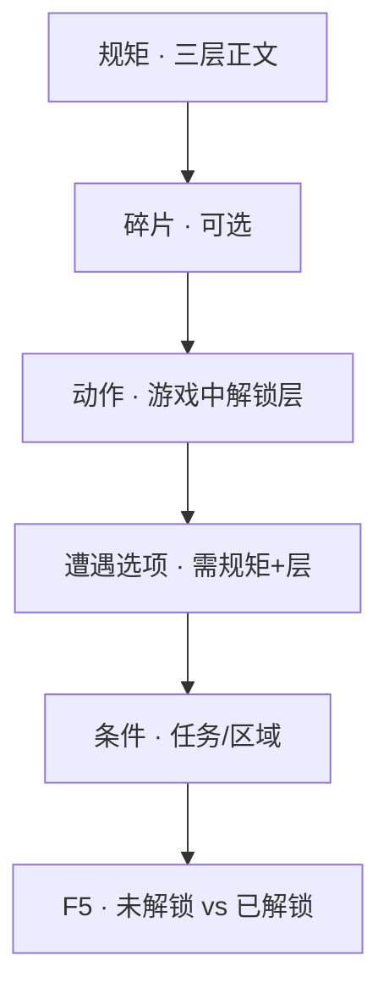

# 立一条规矩

雾津的人讲**规矩**——不是法律，是象、理、术三层里摸出来的门道。玩家规矩本里逐层解锁；**遭遇**选项、**对白**门槛、**任务**条件都会问：你懂不懂这条规矩、懂到第几层。这一页**立一条规矩**，再让它在场景里生效。

---

## 读完你能做到什么

- 在规矩面板新建规矩，写象 / 理 / 术三层正文
- 加规矩**碎片**（收集物式的条目）
- 让遭遇选项或条件检查这条规矩
- 预览里确认：未解锁时选不了，解锁后选项可用

---

## 怎么开工具

主编辑器 → **规则与经济 → 规矩**

碎片、分类与三层文本都在同一面板。

```bash
./dev.sh editor
```

玩家侧怎么守规矩见 [玩家手册 · 规矩系统](../player/intro)（玩法概览）；本页只讲**怎么编**。

---

## 规矩三层（第一次见）

| 层 | 大白话 |
|---|---|
| **象** | 最浅：看见表象、记个大概 |
| **理** | 中间：懂缘由、能照着做 |
| **术** | 最深：会施展、能用在险境 |

每条规矩有三段文字（加 **未解锁提示**）。玩家逐层解锁；**遭遇**里可要求「至少 **理** 层」才显示某选项。

术语 [术语表 · 规矩](../reference/glossary)。

---

## 逐步操作

### 第 1 步：新建规矩

1. 规矩列表 **新增**
2. 填 **标识**、**完整名**、**未完成名**（玩家只拿到象层时显示的简称）
3. **分类**：象理术体系下的分类（下拉）
4. 三层 **正文**（富文本）：
   - **象**：「纸钱逆时针转，别踩进圈里。」
   - **理**：「煞随旋走，逆踩则引上身。」
   - **术**：「念咒七步，步末吐浊气。」
5. **未解锁提示**：玩家还没拿到这层时，规矩本上显示的模糊说明

保存时空层可能被编辑器填默认占位——尽量每层都写满。

### 第 2 步：加碎片（可选）

**碎片**像散落的纸条，收集后推进规矩层：

1. 碎片列表 **新增**
2. **文字**、所属 **规矩**（只读，自动绑当前规矩）
3. **层**（象/理/术）、**来源**说明（设计备注）

游戏里通过 **给物品**、**档案**、**遭遇奖励** 等动作把碎片交给玩家；具体给法用 [怎么编排动作](../editors/concepts/actions) 里与规矩/物品相关的项。

### 第 3 步：让玩家解锁（测试用）

正式流程靠剧情给；**预览测试**时可临时：

- **跑动作 → 解锁规矩层**（或项目里等价的给予规矩/设层动作）
- 或在测试存档启动旗标里带上已解锁（全局配置 · 启动旗标，见 [全局配置](../editors/panels/config)）

确认测试存档里 **理** 层已开，再去验遭遇选项。

### 第 4 步：挂到遭遇（最常见）

1. 打开 [做一个遭遇](./encounter) 里建的遭遇
2. 某选项 **所需规矩** 选「破煞咒」，**层** 选 **理**
3. 未达层：选项灰掉或显示 **禁点提示**

也可在 **条件** 里检查规矩层（任务、区域、热区门槛）。

### 第 5 步：挂到场景叙事（可选）

- **区域进入** → 动作 **启用规矩Offer**（若项目用槽位随机教规矩——高级用法见 [规矩面板](../editors/panels/rule)）
- **对白 · 跑动作** → 给规矩或给碎片

### 第 6 步：验证

1. **Ctrl+S** 保存规矩与遭遇
2. **F5** 两次：  
   - 未解锁：**理** 选项不可选  
   - 用测试动作解锁后：选项可选，结果符合设计

---

## 流程示意



---

## 雾津小例子

**规矩**：「破煞咒」（城隍庙线）

1. 完整名：「破煞咒」；未完成名：「念咒驱邪（不全）」
2. 象：「煞在旋里，别乱踩。」
3. 理：「逆时针踏七步，步末吐气。」
4. 术：「配合符纸，影壁后亦可用。」
5. 碎片一条：「李天狗袖里掉的咒诀残页」→ **象** 层
6. 遭遇「影壁煞气」里「念破煞咒」选项需 **理** 层
7. 李天狗对白 **跑动作** 在任务完成后 **解锁规矩层** 到 **理**
8. **F5**：任务前选不了；任务后可选，煞气清除

---

## 相关手册

- [规矩面板](../editors/panels/rule)
- [遭遇面板](../editors/panels/encounter)
- [怎么编排动作](../editors/concepts/actions)
- [怎么设条件](../editors/concepts/conditions)
- [画一片区域触发剧情](./trigger-zone) —— 进庙区域可教规矩
- [术语表](../reference/glossary)

---

## 教程小结

到这里，上手十课收束：

| 课 | 你学会了 |
|---|---|
| [5 分钟跑起来](./intro) | 起游戏、开编辑器、改对白 |
| [改对白](./first-line) | 台词节点 |
| [摆场景](./first-scene) | 场景、出生点 |
| [放 NPC](./place-npc) | 会说话的人 |
| [画区域](./trigger-zone) | 踩进就触发 |
| [分支对白](./branching-dialogue) | 选项 |
| [过场](./cutscene) | 自动演出 |
| [任务](./quest) | 任务线 |
| [遭遇](./encounter) | 选项判定 |
| **立规矩** | 象理术与门槛 |

下一批可继续 [导入素材](./import-art)（待写）、[运行预览验证](../editors/main-editor/run-preview) 等。书案上的折子，才刚写厚。
