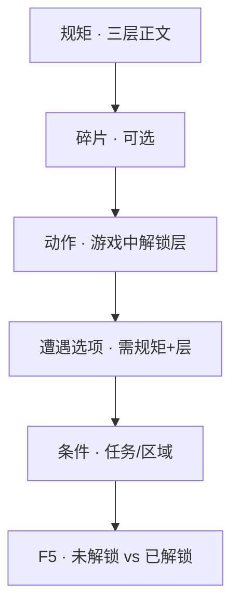

# 立一条规矩

雾津的人讲**规矩**——不是法律，是象、理、术三层里摸出来的门道。玩家规矩本里逐层解锁；**遭遇**选项、**对白**门槛、**任务**条件都会问：你懂不懂这条规矩、懂到第几层。这一页**立一条规矩**，再让它在场景里真正生效。

---

## 这是什么（30 秒看懂）

把规矩想成城隍庙墙上贴的一张「符咒教程」——但不是一次性全贴出来，而是分三层揭开：路过的人只看见个影子（**象**层，「似乎听过，但记不清全文」）；认真打听的人能懂个大概道理（**理**层，「知道缘由、能照着做」）；真正学全、亲手验证过的人才拿到最深一层（**术**层，「会施展、能用在险境」）。玩家在游戏里通过剧情、碎片一点点解锁这三层，解锁到第几层，就决定了他在遭遇里能不能选某个选项、对话里能不能接某句台词。

规矩和"旗标"不一样：旗标是一个开关（有/没有），规矩是**一条有深浅的知识**，同一条规矩在不同解锁阶段，游戏里显示的文字都不同。这是规矩系统最容易被新手忽略、也最出彩的地方。

读完这页你能：

- 在规矩面板新建规矩，写好象 / 理 / 术三层正文与未解锁提示。
- 加规矩**碎片**（收集物式的条目），让玩家靠捡东西逐步学会规矩。
- 让遭遇选项或条件检查这条规矩的解锁层级。
- 用预览确认：未解锁时选不了，解锁后选项可用，三层文字确实不一样。

---

## 入门：手把手做第一次


*规矩面板：左侧规矩列表（如「城隍庙后山三更勿去」），右侧配象/理/术三层。*

### 怎么开工具

主编辑器 → **规则与经济 → 规矩**：

```bash
./dev.sh editor
```

碎片、分类与三层文本都在同一面板里维护。玩家侧「怎么守规矩」的玩法讲解见 [玩家手册 · 规矩系统](../player/rules)（面向玩家的说法）；本页只讲**怎么编**。

### 规矩三层（第一次见）

| 层 | 大白话 |
|---|---|
| **象** | 最浅：看见表象、记个大概 |
| **理** | 中间：懂缘由、能照着做 |
| **术** | 最深：会施展、能用在险境 |

每条规矩有三段正文（外加一条**未解锁提示**）。玩家逐层解锁；**遭遇**里可以要求「至少 **理** 层」才显示某选项。术语见 [术语表](../reference/glossary)。

### 第 1 步：新建规矩

1. 规矩列表 **新增**。
2. 填 **标识（id）**、**完整名**（学全后玩家看到的名字）、**未完成名**（玩家只拿到象层时显示的简称，营造「还没学全」的神秘感）。
3. **分类**：象理术体系下的分类下拉，比如「民俗」「口传」。
4. 填三层 **正文**（富文本）：
   - **象**：「纸钱逆时针转，别踩进圈里。」
   - **理**：「煞随旋走，逆踩则引上身。」
   - **术**：「念咒七步，步末吐浊气。」
5. **未解锁提示**：玩家还没拿到这层时，规矩本上显示的模糊说明。

:::tip[三层别写成一样]
三层文字如果内容差不多，玩家学全前后不会有「仪式感」。象层要写得模糊、留悬念；理层给出能照做的实操；术层再补充更深的用法或注意事项。三段拉开差距，解锁的成就感才出得来。
:::

保存时空着的层可能被编辑器**回填默认占位文案**——别指望留空就不显示，尽量每层都写满。

### 第 2 步：加碎片（可选）

**碎片**像散落的纸条，收集后推进规矩层：

1. 碎片列表 **新增**。
2. 填 **文字**；所属 **规矩** 是只读字段，自动绑定当前正在编辑的规矩。
3. 选 **层**（象/理/术，表示这条碎片对应解锁哪一层）、填**来源**说明（纯设计备注，玩家看不到）。

游戏里通过**给物品**、**档案首次阅读**、**遭遇奖励**等动作把碎片交给玩家；具体怎么给，用 [怎么编排动作](../editors/concepts/actions) 里与规矩/碎片相关的动作类型。

### 第 3 步：让玩家解锁（测试用）

正式流程应该靠剧情推动碎片收集自然解锁；**预览测试**阶段可以临时走捷径：

- 用**跑动作 → 解锁规矩层**（或项目里等价的给予规矩/设层动作）手动把某规矩推到某层。
- 或者在测试存档的**启动旗标**里预先带上「已解锁」状态（[全局配置面板](../editors/panels/config) → 启动旗标）。

测试前先确认存档里目标层（比如 **理**）已经打开，再去验证遭遇选项是否可点。

### 第 4 步：挂到遭遇（最常见用法）

1. 打开 [做一个遭遇](./encounter) 里建好的遭遇。
2. 某个选项的 **所需规矩** 选「破煞咒」，**规矩层** 选 **理**。
3. 未达到该层时，这个选项应该灰掉或显示**禁点提示**；达到层级后可以正常点选。

也可以在**条件**里检查规矩层，用在任务前置、区域进入门槛、热区显示条件上。

### 第 5 步：挂到场景叙事（可选）

- **区域进入** → 动作里用「启用规矩 Offer」（如果项目用槽位随机教规矩这种高级用法，见 [规矩面板](../editors/panels/rule) 里的详细说明）。
- **对白 · 跑动作** → 用给规矩或给碎片的动作，让某句台词讲完顺带教会玩家一层。

### 第 6 步：验证

1. **Ctrl+S** 保存规矩与遭遇。
2. **F5** 起运行预览，测两次：
   - 未解锁状态：**理** 层要求的选项不可选。
   - 用测试动作解锁到理层后：选项可选，结果符合设计。

### 流程示意



---

## 雾津完整实例：破煞咒（城隍庙线）

1. 新建规矩，完整名「破煞咒」；未完成名「念咒驱邪（不全）」。
2. 象层：「煞在旋里，别乱踩。」
3. 理层：「逆时针踏七步，步末吐气。」
4. 术层：「配合符纸，影壁后亦可用。」
5. 未解锁提示：写一句模糊的暗示，比如「庙祝念叨过什么，但你没听全。」
6. 新增碎片一条：「李天狗袖里掉的咒诀残页」，层选 **象**，来源写「李天狗对话掉落」。
7. 打开遭遇「影壁煞气」（见 [做一个遭遇](./encounter)），「念破煞咒」选项所需规矩选「破煞咒」，规矩层选 **理**。
8. 李天狗的对白节点里，在某句任务完成后的对白上用**跑动作**，把「破煞咒」**解锁规矩层**到 **理**。
9. **F5** 验证：任务完成前，「念破煞咒」选项应该选不了；任务完成后再进遭遇，选项可选，煞气清除成功。

---

## 进阶：每一项都讲透

### 规矩字段逐条讲透

- **标识（id）**：全局唯一，遭遇、条件、动作都靠这个引用，一旦大量引用后不要轻易改名。
- **完整名 / 未完成名**：一个是学全后的正式名字，一个是没学全时的简称，两者配合能做出「玩家一开始只知道这东西叫『??礼法』，学全后才知道全名叫『纸人巷礼』」的效果。
- **分类**：象理术体系下的归类（民俗、口传、实证等，具体分类以你项目配置为准），主要用于规矩本里分组展示，不影响解锁逻辑本身。
- **象/理/术三层正文**：核心内容，三层应该有明显的信息量递进——象层留悬念、理层给做法、术层给进阶用法或例外情况。
- **未解锁提示**：玩家完全没摸到这条规矩时，规矩本上显示的占位文字，通常写得含糊、吊胃口，比如「似乎听过，但记不清全文」。

### 碎片字段逐条讲透

- **文字**：碎片本身的内容，通常是一句台词或一段残缺的条文，玩家捡到后能读到这句话。
- **所属规矩**：只读，自动绑定你当前正在编辑的规矩——想让某条碎片归到别的规矩，要去那条规矩下新建，而不是在这里改绑定。
- **层**：这条碎片对应推进到哪一层，多条碎片可以对应同一层（凑齐几条才真正解锁），也可以分别对应象/理/术三层。
- **来源**：纯设计备注，方便你自己或团队记录「这条碎片是从哪个任务/对话/掉落表来的」，玩家看不到。

### 三层解锁的进阶用法

- **规矩层可以和消耗物品叠加**：在遭遇里，一个高门槛选项可以同时要求「规矩层至少理」+「消耗一份符纸」，做出「你既要懂，又要有准备」的最优解路线（详见 [做一个遭遇](./encounter)）。
- **规矩层可以做隐藏内容的钥匙**：档案、见闻录的某些条目，可以设置成「规矩到术层才解锁阅读」，作为给深度玩家的彩蛋。
- **规矩验证的进阶写法**：已验证层（本页示例里的术层，或项目里对应的「已验证」文本）通常用来补充「这条规矩在更凶险的场合怎么用」，比如夜位面下的额外禁忌——这也是规矩系统和 [位面](../editors/panels/plane) 联动的常见写法。

### 和其他面板怎么配合

- **遭遇面板**：规矩层是遭遇选项最常见的门槛类型，见 [做一个遭遇](./encounter)。
- **图对话**：对话选项也能带规矩提示，玩家没到对应层时会显示对应的禁点提示。
- **任务面板**：任务的前置条件或完成条件也能检查规矩层，比如「先懂破煞咒理层，才能接下一条庙祝任务」。
- **旗标面板**：规矩本身的解锁进度，底层往往和旗标关联，方便条件判断，具体机制以项目实现为准。
- **档案面板**：见闻录、人物簿的「首次阅读」动作常用来发放规矩碎片，把阅读行为和规矩收集绑在一起。

### 批量做法与老手技巧

- **一条规矩多来源**：碎片来源可以是对话、见闻录、遭遇奖励，混合安排能让玩家不必守着一个任务线才能凑齐规矩，探索感更强。
- **提前规划分类**：给规矩定好分类体系（象理、口传、实证……）之后再批量新建，比先建一堆规矩再回头分类省事得多。
- **同一规矩跨位面差异化**：夜位面、闪回等特殊场景下，同一条规矩的「已验证层」文字可以额外补充一句专属注解，玩家会感觉「规矩在不同场合有不同讲究」，比重新建一条新规矩更省维护。
- **未解锁提示的写作技巧**：这句话要让玩家「知道有这么回事，但读不出实操细节」，避免直接剧透理层内容。

---

## 危险区与边界

- 规矩数据在老版本迁移或大改时，编辑器保存可能会**清掉旧 schema 里的过时字段**（比如老版本遗留的 `description`/`source` 等混写字段）——从老档案迁移规矩后，先 Apply 一次，检查三层文案有没有意外丢失。
- **碎片的所属规矩**是只读绑定，删除或迁移规矩时要确认没有掉落表、动作还在发放已经不存在的碎片 id。
- 空层被编辑器回填默认占位这件事本身不算"丢数据"，但容易让人误以为"留空=不显示"，写内容时要显式填好每一层，不要留空赌运气。
- 更系统的危险区说明见 [危险区](../editors/concepts/danger-zone) 与 [可编辑面参考](../reference/danger-zone)。

---

## 常见问题

| 现象 | 原因 | 怎么办 |
|---|---|---|
| 遭遇里对应选项永远是灰的 | 规矩 id 或规矩层没对齐规矩面板里的实际配置 | 回规矩面板核对 id 拼写与三层是否都填了 |
| 学全前后感觉没区别 | 三层写成了差不多的内容 | 重写象/理层，拉开信息量差距 |
| 碎片怎么收都凑不齐 | 碎片的所属规矩绑错了规矩 | 回对应规矩下新建碎片，而不是在别处改绑定 |
| 规矩本上莫名多出占位文案 | 某一层留空，被编辑器回填默认值 | 显式填一句你想要的短句 |
| 已解锁但遭遇/对话仍判定失败 | 层级判断的层选错（比如要求象却填了理） | 核对遭遇/条件里规矩层的具体选择 |
| 从老存档迁移后规矩文案变了 | 老 schema 字段被保存时清理 | Apply 后逐条核对三层文案，缺的补回来 |

---

## 相关

- [规矩面板](../editors/panels/rule)
- [遭遇面板](../editors/panels/encounter)
- [怎么编排动作](../editors/concepts/actions)
- [怎么设条件](../editors/concepts/conditions)
- [画一片区域触发剧情](./trigger-zone) —— 进庙区域可教规矩
- [术语表](../reference/glossary)

---

## 教程小结

到这里，上手十课收束：

| 课 | 你学会了 |
|---|---|
| [5 分钟跑起来](./intro) | 起游戏、开编辑器、改对白 |
| [改对白](./first-line) | 台词节点 |
| [摆场景](./first-scene) | 场景、出生点 |
| [放 NPC](./place-npc) | 会说话的人 |
| [画区域](./trigger-zone) | 踩进就触发 |
| [分支对白](./branching-dialogue) | 选项 |
| [过场](./cutscene) | 自动演出 |
| [任务](./quest) | 任务线 |
| [遭遇](./encounter) | 选项判定 |
| **立规矩** | 象理术与门槛 |

下一批可继续 [导入素材](./import-art)、[加物品开商店](./item-shop) 等。书案上的折子，才刚写厚。
