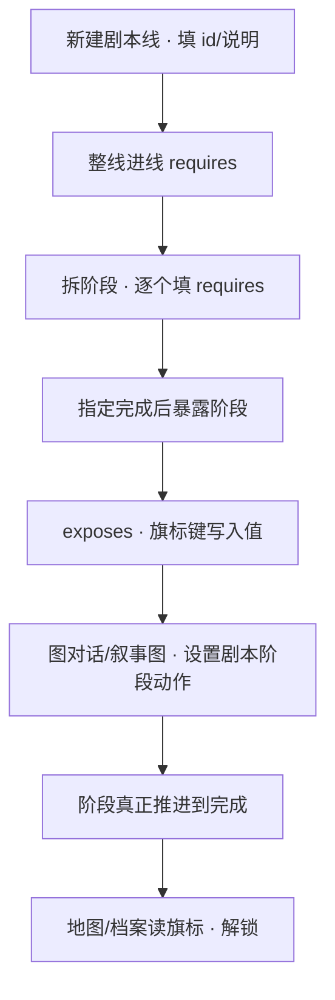

# 搭一条剧本线

寻狗记不是一锅乱炖——城隍庙进香这种段落，得有先后次序：先排队，再上香，最后求签，求完签地图上才会多亮一个点。这种"一章故事分几拍走"的活，就交给**剧本**面板。这一页带你从零搭一条完整的剧本线，走完最后一拍，联动解锁地图或档案。

---

## 这是什么（30 秒看懂）

把剧本想成雾津折子戏的一份"章回提纲"：一整条线是一"章"，章里再分几"拍"（阶段）——庙前排队是第一拍，上香是第二拍，求签是第三拍。每一拍要满足什么条件才能翻过去、翻到最后一拍之后又该解锁点什么（地图上多亮一个点、档案里多一条见闻），都写在这份提纲上。

有一点必须先说清楚：剧本本身**不会自己演**。它只是一份进度记录和门槛清单——真正让台词说出来、让画面动起来的，是[图对话](../editors/panels/dialogue-graph)或[叙事状态机](../editors/panels/narrative)里的动作在跑。你得在对话或叙事图的合适时机，亲手放一条"设置剧本阶段"的动作，账本上这一拍才会真的翻过去。这也是新手最容易卡住的地方——以为剧本面板填完就自动生效了，其实那只是登记，得有人在别处真的去推它一把。

## 读完你能做到什么

- 新建一条剧本线，填好整线的进线门槛
- 拆出几个阶段，逐个设阶段自己的前置条件
- 指定"走到哪一拍算完成这条线"，并暴露一个旗标
- 在图对话/叙事图里放动作真正推进阶段
- 让地图或档案读这个旗标，联动解锁

---

## 手把手逐步操作

### 第 1 步：打开剧本面板，新建一条线

```bash
./dev.sh editor
```

进入主编辑器后，走 **叙事编排 → 剧本**。左侧列表点**添加**，新建一条剧本线，填一个**id**（比如取名"城隍庙进香"这条线的编号）。id 要唯一，留空或跟别的线重名，保存工程时会直接校验不过。

### 第 2 步：写说明，决定要不要手动开场/收场

填**description**，随便写，就是给自己看的备注，不影响任何判定——比如写"雾津寻狗记：城隍庙进香一段"。

再看**整条线手动激活/完成**这个开关。大多数章节段落不用勾——线本身满足进线门槛就自动能推进；只有你确实需要"必须有人在某处显式喊一声'这条线开始了'才能推第一拍，喊一声'结束了'才彻底封死"的场合才勾上这个开关，勾上之后要记得在图对话或别的地方安排好"激活剧本""完成剧本"这两个动作，编辑器不会替你检查这两个动作有没有真的按顺序被执行到。本教程练手先不勾，走默认的自动流程。

### 第 3 步：填整条线的进线门槛

**scenario 进线 requires**：整条线得满足什么才能启动，比如"某个旗标为真"。支持"与"（全部满足）、"或"（任一满足），更复杂的关系用高级模式手写；两种写法别混用，混用了条件会永远判定不满足。

本教程练手先留空，表示默认能启动。

### 第 4 步：拆阶段，逐个填前置

在 **phases** 表里点**添加阶段**，依次新建几拍，比如"庙前排队""上香""求签"。每一行填：

- **阶段名**：这一拍的名字，后面无论是本线内部别的阶段引用它，还是图对话里"设置剧本阶段"动作要指名推进它，都靠这个名字。
- **requires**：这一拍要满足什么才算能翻过去；填的通常是别的阶段名，意思是"那一拍必须先到完成"。比如"上香"的 requires 填"庙前排队 完成"；"求签"的 requires 填"上香 完成"。

阶段行可以**拖行号**调整前后顺序，调完记得从头预览一遍，别攒到最后一次性测。

有一列叫**清单默认 status**，只是给你自己看的文档默认值，跟游戏运行时会不会认为这一拍已经完成没有任何关系——运行时不管这一列写的是什么，一律先当作"还没开始"，只有真的执行了"设置剧本阶段"动作才会推进。改这一列的值不会让玩家一开局就"免费"跳过某一拍。

### 第 5 步：指定完成后暴露哪一拍、暴露什么

**完成后暴露阶段**：选一个阶段，比如"求签"——当这一拍真的被推到完成时，会触发下面这张表的写入。

**exposes**：一张"旗标键 → 写入值"的表。这里要填的旗标，得先去[旗标面板](../editors/panels/flags)登记过，而且值的类型（是非 / 数值 / 文字）要跟登记表里对上，类型对不上会出问题。本教程练手：先去旗标面板登记一个旗标，取名"求签完成"，再回来在 exposes 表里填这个旗标键，写入值设为"是"。

### 第 6 步：保存

点 **Apply**（或对应的保存操作）。id 重复、留空，或阶段 requires 里的与/或/高级模式混用不一致，这一步都会校验不过，回去逐项核对。

### 第 7 步：去图对话/叙事图里真正推进阶段

剧本面板本身不会自动翻页，得有动作在跑：

1. 打开[图对话](../editors/panels/dialogue-graph)，找到（或新建）关二狗在庙前排队时的对白，在对白结束处的**跑动作**节点里，添加**设置剧本阶段**动作，指定这条线，把阶段设到"庙前排队 完成"。
2. 上香环节同理：上香这段演出（可以是一段简单对白，也可以是[过场](./cutscene)）结束时，跑动作里加"设置剧本阶段"，推到"上香 完成"。
3. 求签环节结束时（对白或小游戏结束），加"设置剧本阶段"，推到"求签 完成"——这一步一触发，前面配好的 exposes 就会真正写入旗标。

### 第 8 步：让地图或档案读这个旗标

去[地图面板](../editors/panels/map)，找到码头对岸这类想要解锁的节点，把它的解锁条件设成读取"求签完成"这个旗标为真。或者去[档案面板](../editors/panels/archive)，把一条见闻录条目的解锁条件也设成同一个旗标。地图、档案两边都可以同时读同一个旗标，不用各自重复写一套判断逻辑。

### 第 9 步：验证

1. 保存工程（Ctrl+S 或对应的全部保存操作）
2. F5 运行预览
3. 从排队走到上香走到求签，逐拍确认剧本面板（或工作台运行时调试）里阶段状态确实在跟着推进
4. 求签完成瞬间，回地图/档案确认对应节点/条目由锁定变解锁

---

## 流程示意



---

## 雾津完整实例

**剧本线**："城隍庙进香"（对应真实场景：城隍庙），分三拍：庙前排队 → 上香 → 求签，求签完成后地图上的"码头对岸"节点解锁，档案里多一条"求签记"见闻。

1. 剧本面板新建一条线，id 填"城隍庙进香"，description 写"雾津寻狗记：进城隍庙求签一段"。不勾手动生命周期，进线 requires 留空。
2. phases 依次添加"庙前排队"（requires 留空，默认能开始）、"上香"（requires 填"庙前排队 完成"）、"求签"（requires 填"上香 完成"）。
3. 完成后暴露阶段选"求签"；exposes 表填旗标"求签完成"，写入值设为"是"（这个旗标提前已去旗标面板登记过，类型选"是非"）。
4. Apply 保存。
5. 打开图对话：关二狗在庙前排队的一段对白，结尾跑动作加"设置剧本阶段"→ 这条线 → 推到"庙前排队 完成"。
6. 上香环节的一段短过场，结尾同样加"设置剧本阶段"→ 推到"上香 完成"。
7. 求签环节（一段对白或小游戏）结束时，跑动作加"设置剧本阶段"→ 推到"求签 完成"。
8. 地图面板："码头对岸"节点的解锁条件设为旗标"求签完成"为真。档案面板：新增"求签记"见闻条目，解锁条件同样设为这个旗标。
9. F5 从头走一遍：排队对话走完 → 上香过场走完 → 求签对话走完 → 回地图看"码头对岸"由灰变亮，回档案看"求签记"出现在见闻录里。

---

## 常见卡点

**剧本面板都填好了，游戏里阶段却完全不动？**
最常见的原因是漏了"去图对话或叙事图里放一条'设置剧本阶段'动作"这一步——剧本面板只是登记进度和门槛，没有任何东西会自动帮你翻页。回去检查是不是真的有动作在某处被执行到了。

**把"清单默认 status"手动改成"完成"，开局却没生效？**
这一列只是给你自己看的文档默认值，不参与运行时判定。无论写的是什么，游戏运行时都从"还没开始"算起，唯一能真正推进阶段的是"设置剧本阶段"动作。

**地图/档案该解锁的东西没解锁？**
先确认 exposes 表里真的写了这个旗标，而且这个旗标已经在旗标面板登记过、类型对得上；再确认求签这一拍确实被"设置剧本阶段"动作推到了完成——没走到最后一拍，暴露压根不会触发。

**阶段一直卡在还没开始，怎么翻都翻不过去？**
八成是 requires 写错了——检查填的阶段名有没有拼对，或者与/或/高级模式混用了导致条件永远不成立。逐条核对，别攒到最后一起查。

**求签这一拍完成了，但下一次进游戏又要重新走一遍？**
确认求签对应的"设置剧本阶段"动作确实被执行到了，而不是玩家绕过了触发点（比如对话没走到最后一句就退出了）；也确认存档正常保存了这条线的进度。

**把手动生命周期开关打开后，剧本死活推不动第一拍？**
勾了这个开关，第一拍开始前必须先有一条"激活剧本"动作被执行、并且真的通过了整线的进线门槛，否则后面的"设置剧本阶段"都不会生效。回去确认"激活剧本"动作有没有被安排在某处、门槛条件是不是真的满足了。

---

## 相关

- [剧本面板](../editors/panels/scenarios)
- [叙事状态机](../editors/panels/narrative)
- [旗标面板](../editors/panels/flags)
- [地图面板](../editors/panels/map)
- [档案面板](../editors/panels/archive)
- [图对话面板](../editors/panels/dialogue-graph)
- [怎么编排动作](../editors/concepts/actions)
- [怎么设条件](../editors/concepts/conditions)
- [按目标查：我想做…](./goal-index)
