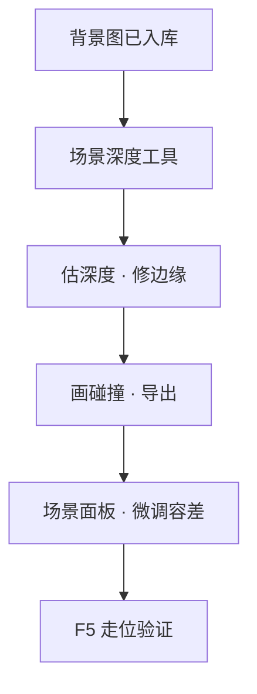

# 给场景加遮挡/深度

等距场景里，若所有人像贴在一张平板上，街就假了。**深度**告诉游戏：哪儿靠前、哪儿靠后，角色走过去该被桌腿挡住还是露在外面。这一页用**场景深度工具**给背景建深度图与碰撞，再回主编辑器验走位。

---

## 读完你能做到什么

- 理解**深度**与**遮挡**在玩家眼里的效果
- 用场景深度工具从背景图生成深度、编辑碰撞
- 知道主编辑器里能改哪些、不能改哪些深度相关项
- 运行预览里走一圈，确认穿模和挡人正常

---

## 先搞清这件事

| 词 | 大白话 |
|---|---|
| [深度](../reference/glossary) | 画面里远近关系——离镜头近的挡远的 |
| 碰撞 | 角色不能穿过去的区域，常跟桌椅、墙柱对齐 |

主编辑器的**场景**面板能调**容差、地面偏移**等少量深度相关项；**背景层、深度图主体、碰撞数据**在编辑器里是盲区，要靠**场景深度工具**导出。详见 [危险区](../editors/concepts/danger-zone)。

---

## 第 1 步：准备背景图

背景图应先入库（见 [导入一张素材](./import-art)）。确认场景在**场景**面板里已指向这张背景。

---

## 第 2 步：打开场景深度工具

```bash
./dev.sh editor
```

菜单 → **工具 → 外部工具（新进程）** → **场景深度**。

工具打开后加载当前工程的场景列表，选中要处理的场景——例如雾津**满堂茶客**茶馆内景。

---

## 第 3 步：生成与修整深度

界面大致分三块：参数区、深度预览、原图对照。

1. **选场景、对背景**——确认加载的是茶馆那张内景
2. **估算深度**——工具根据画面自动估一版深度图（远近灰度）
3. **人工修**——桌沿、栏杆、柱子边缘要修准，不然角色会像穿桌而过
4. **编辑碰撞**——在走不过去的地方勾碰撞区，跟深度前景对齐
5. **导出**——写回工程，场景就能用这份深度数据

### 操作示意

<svg viewBox="0 0 720 400" xmlns="http://www.w3.org/2000/svg" role="img" aria-label="场景深度工具示意" style={{width:'100%', height:'auto'}}>
  <rect width="720" height="400" fill="#1a1510" rx="8"/>
  <rect x="16" y="16" width="140" height="368" fill="#231c14" stroke="#3a2f20" rx="6"/>
  <text x="86" y="44" textAnchor="middle" fill="#c9bda1" fontSize="10">场景 · 模型 · 映射</text>
  <rect x="170" y="16" width="320" height="240" fill="#2a2218" stroke="#3a2f20" rx="6"/>
  <text x="330" y="140" textAnchor="middle" fill="#8a7a5c" fontSize="12">原图</text>
  <rect x="170" y="268" width="320" height="116" fill="#1a2a28" stroke="#5a8a86" rx="6"/>
  <text x="330" y="330" textAnchor="middle" fill="#5a8a86" fontSize="12">深度图预览</text>
  <rect x="506" y="16" width="198" height="368" fill="#1f1810" stroke="#3a2f20" rx="6"/>
  <text x="605" y="44" textAnchor="middle" fill="#c9bda1" fontSize="11">碰撞编辑</text>
  <rect x="522" y="320" width="166" height="48" fill="none" stroke="#e0a44e" strokeWidth="2" rx="4"/>
  <text x="605" y="350" textAnchor="middle" fill="#e0a44e" fontSize="11">导出到工程</text>
</svg>

---

## 第 4 步：主编辑器微调

回 **场景**面板：

- **深度容差**：角色脚边和地面缝太大就调一点
- **地面偏移**：整体抬高或压低角色贴地感

别指望在这里改背景层列表——没有入口，回场景深度工具。

---

## 第 5 步：运行预览走查

**F5** 进场景，沿桌边、柱边、柜台走一圈：

| 检查项 | 合格长什么样 |
|---|---|
| 遮挡 | 走到桌后时，身子被桌沿挡住 |
| 碰撞 | 穿不过桌心、墙柱 |
| 排序 | 远近切换时不突然闪到最前或最后 |

---

## 流程示意



---

## 雾津小例子

**满堂茶客**里关二狗要绕到说书台侧面听书——台子得挡人：

1. 场景深度工具选茶馆场景，对说书台、茶桌估深度
2. 台沿修实，碰撞挡住台面内部
3. 导出后场景面板把地面偏移调到脚贴砖缝
4. **F5** 操控关二狗绕台走，看侧身时是否被台沿遮住半截身子

深度对了，茶客才坐得住场。

---

## 接下来读什么

| 页面 | 内容 |
|---|---|
| [场景深度工具](../editors/render-domain/scene-depth-editor) | 工具说明 |
| [场景面板](../editors/panels/scene) | 场景里能改什么 |
| [危险区](../editors/concepts/danger-zone) | 深度相关盲区 |
| [做一个视差过场](./parallax) | 多层背景动起来 |
