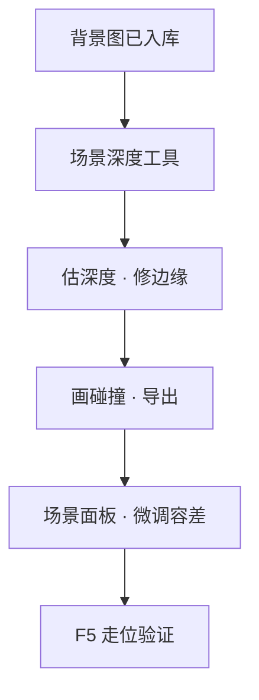

# 给场景加遮挡/深度

等距场景里，若所有人像贴在一张平板上，街就假了。**深度**告诉游戏：哪儿靠前、哪儿靠后，角色走过去该被桌腿挡住还是露在外面。

**正典深度 + 角色照明导出**请优先走 **[角色照明实验室](../editors/render-domain/character-lighting-lab)**（`./dev.sh char-lighting` → 导出场景深度 / 导出照明）。原理见 [伪世界角色照明](../dev/character-lighting)。本页描述的旧**场景深度工具**仍可用于遮挡 / 碰撞对照与救急，但不要再把它当成照明管线的平行数据源。

---

## 这是什么（30 秒看懂）

把场景背景想成一张画在纸上的茶馆全景图——纸是平的，但画面里桌子近、后墙远。**深度**就是给这张平面画补一层「远近说明书」：告诉游戏画面里哪块是近景（桌子、栏杆），哪块是远景（后墙）。有了这份说明书，游戏才知道角色走到桌子后面时该被挡住半身，而不是像贴纸一样永远浮在画面最上层。**碰撞**是另一件事——它划出「这块地方角色走不过去」的区域，通常跟深度里的前景对齐（桌腿挡视线的地方，往往也挡走位）。

主编辑器的**场景**面板只能调**容差、地面偏移**这类微调参数；真正生成深度图和编辑碰撞形状，要靠专门的**场景深度工具**——这是编辑器的一处"盲区"，改不了、也不该硬改，见 [危险区](../editors/concepts/danger-zone)。

读完这页你能：

- 理解**深度**与**遮挡**在玩家眼里的效果。
- 用场景深度工具从背景图生成深度、编辑碰撞。
- 知道主编辑器里能改哪些、不能改哪些深度相关项。
- 运行预览里走一圈，确认穿模和挡人正常。

---

## 入门：手把手做第一次

### 先搞清这件事

| 词 | 大白话 |
|---|---|
| [深度](../reference/glossary) | 画面里远近关系——离镜头近的挡远的 |
| 碰撞 | 角色不能穿过去的区域，常跟桌椅、墙柱对齐 |

主编辑器的**场景**面板能调**容差、地面偏移**等少量深度相关项；**背景层、深度图主体、碰撞数据**在编辑器里是盲区，要靠**场景深度工具**导出。详见 [危险区](../editors/concepts/danger-zone)。

### 第 1 步：准备背景图

背景图应先入库（见 [导入一张素材](./import-art)）。确认场景在**场景**面板里已指向这张背景。

### 第 2 步：打开场景深度工具

```bash
./dev.sh editor
```

菜单 → **工具 → 外部工具（新进程）** → **场景深度**。

工具打开后加载当前工程的场景列表，选中要处理的场景——例如雾津**满堂茶客**茶馆内景。

### 第 3 步：生成与修整深度

界面大致分三块：参数区、深度预览、原图对照。

1. **选场景、对背景**——确认加载的是茶馆那张内景。
2. **估算深度**——工具根据画面自动估一版深度图（远近灰度）。
3. **人工修**——桌沿、栏杆、柱子边缘要修准，不然角色会像穿桌而过。
4. **编辑碰撞**——在走不过去的地方勾碰撞区，跟深度前景对齐。
5. **导出**——写回工程，场景就能用这份深度数据。

### 操作示意

<svg viewBox="0 0 720 400" xmlns="http://www.w3.org/2000/svg" role="img" aria-label="场景深度工具示意" style={{width:'100%', height:'auto'}}>
  <rect width="720" height="400" fill="#1a1510" rx="8"/>
  <rect x="16" y="16" width="140" height="368" fill="#231c14" stroke="#3a2f20" rx="6"/>
  <text x="86" y="44" textAnchor="middle" fill="#c9bda1" fontSize="10">场景 · 模型 · 映射</text>
  <rect x="170" y="16" width="320" height="240" fill="#2a2218" stroke="#3a2f20" rx="6"/>
  <text x="330" y="140" textAnchor="middle" fill="#8a7a5c" fontSize="12">原图</text>
  <rect x="170" y="268" width="320" height="116" fill="#1a2a28" stroke="#5a8a86" rx="6"/>
  <text x="330" y="330" textAnchor="middle" fill="#5a8a86" fontSize="12">深度图预览</text>
  <rect x="506" y="16" width="198" height="368" fill="#1f1810" stroke="#3a2f20" rx="6"/>
  <text x="605" y="44" textAnchor="middle" fill="#c9bda1" fontSize="11">碰撞编辑</text>
  <rect x="522" y="320" width="166" height="48" fill="none" stroke="#e0a44e" strokeWidth="2" rx="4"/>
  <text x="605" y="350" textAnchor="middle" fill="#e0a44e" fontSize="11">导出到工程</text>
</svg>

### 第 4 步：主编辑器微调

回 **场景**面板：

- **深度容差**：角色脚边和地面缝太大就调一点。
- **地面偏移**：整体抬高或压低角色贴地感。

别指望在这里改背景层列表——没有入口，回场景深度工具。

### 第 5 步：运行预览走查

**F5** 进场景，沿桌边、柱边、柜台走一圈：

| 检查项 | 合格长什么样 |
|---|---|
| 遮挡 | 走到桌后时，身子被桌沿挡住 |
| 碰撞 | 穿不过桌心、墙柱 |
| 排序 | 远近切换时不突然闪到最前或最后 |

### 流程示意



---

## 雾津完整实例：满堂茶客说书台

**满堂茶客**里关二狗要绕到说书台侧面听书——台子得挡人：

1. 场景深度工具选茶馆场景，对说书台、茶桌估深度。
2. 台沿修实，碰撞挡住台面内部，留出过道让角色能绕过去。
3. 导出后场景面板把地面偏移调到脚贴砖缝。
4. **F5** 操控关二狗绕台走，看侧身时是否被台沿遮住半截身子，碰撞是否卡得刚刚好（不多不少）。

深度对了，茶客才坐得住场。

---

## 进阶：每一项都讲透

### 深度估算与人工修整的讲究

- **自动估算只是起点**：工具根据画面自动估一版深度图（远近灰度），但等距场景里桌沿、栏杆、柱子这类边缘轮廓，自动估算经常不够准，必须**人工修整**——前景（离镜头近的桌沿）要修得比自动估算的更「近」，否则角色走过去时会像穿桌而过。
- **边缘是最容易出问题的地方**：深度不是整块区域一个数值，而是沿着物件轮廓渐变的，桌腿、柱子这类细长物件的边缘修不准，最容易表现成「角色一半在桌前、一半在桌后」的诡异穿模效果。
- **换背景必须重新跑深度**：只要背景图本身换了一张新图（哪怕只是替换分辨率或裁切），旧的深度数据就不能复用，必须回场景深度工具重新估算整个流程。

### 碰撞编辑的讲究

- **碰撞要和深度前景对齐**：碰撞区域划分的原则是"挡视线的地方，通常也该挡走位"——如果碰撞比深度前景划得更大，角色会在离桌子还有一段距离时就被莫名挡住；划得更小，则会出现视觉上被挡住了但角色其实还能穿过去的违和感。
- **留出过道**：编辑碰撞时要注意给角色留出合理的绕行路径，不要把整片区域都封死，尤其像说书台这种玩家需要绕到侧面的场景，过道宽度要留够。

### 场景面板能调的少量参数

- **深度容差**：调整角色脚边和地面缝隙的容忍范围，当发现角色脚底和地面之间有明显缝隙或悬空感时，可以先尝试调这个参数，不一定要马上回场景深度工具重新做。
- **地面偏移**：整体抬高或压低角色的贴地感，用于微调角色视觉上"踩在地上"的高度，跟深度图本身的精细程度是两回事。
- 这两个参数是编辑器留给你的"最后一公里"调整口子，能解决的问题范围有限——如果发现问题出在遮挡本身不对，而不是贴地高度的细微偏差，就应该回场景深度工具而不是死磕这两个参数。

### 和光照体积的配合

- 场景深度工具产出的深度图，除了给遮挡和碰撞用，还是 [光照体积烘焙](../editors/render-domain/lightvolume-lab) 的**输入数据**——光照体积需要知道空间里哪里近哪里远，才能烘焙出「角色走近灯笼时脸部局部提亮」这类效果。深度图不准，光斑就会飘在半空，光照效果自然也跟着出问题。
- 建议的工序顺序是：先把场景深度做扎实（遮挡、碰撞都验证过没问题），再去做光照体积烘焙——反过来做的话，深度一旦返工重做，光照体积往往也要跟着重烘。

### 批量与效率窍门

- **新场景一次做完深度+碰撞**：新场景背景画完后，建议深度和碰撞一起做完再摆 NPC，避免后面发现遮挡问题时还要回头补做，牵连已经摆好的实体位置。
- **只改容差/偏移优先在场景面板尝试**：遇到贴地缝隙、整体高低这类小问题，先在场景面板试参数，比直接开重量级的场景深度工具流程更快。
- **深度问题优先怀疑边缘**：角色穿模、遮挡不对的排障顺序，通常应该先看深度图在物件边缘处修得准不准，而不是先怀疑碰撞形状——遮挡观感的问题九成来自深度边缘不够准。

---

## 危险区与边界

- **背景层与深度图主体、碰撞数据是编辑器的盲区**：主编辑器场景面板完全没有入口能编辑这些内容，只能通过场景深度工具生成和导出——不要尝试在别处手改，也不用花时间在场景面板里找相关入口。
- **未导出就预览等于用旧数据**：在场景深度工具里改完深度、碰撞后，一定要点导出，主编辑器和 F5 运行预览用的都是已经导出到工程里的数据，工具里没导出的改动不会生效。
- **深度与滤镜、碰撞与视差是不同的工序**，本工具只管深度与碰撞，色调交给 [滤镜工具](./filter)，多层背景动效交给视差编辑器——排查问题时先分清是哪条线出的错，别在错的工具里找答案。
- 更系统的哪里改了会丢，参考 [危险区](../editors/concepts/danger-zone)。

---

## 常见问题

| 现象 | 原因 | 怎么办 |
|---|---|---|
| 角色走到桌子后面却没被挡住 | 深度前景边缘没修准，或碰撞与深度没对齐 | 回场景深度工具，人工修整桌沿等边缘，重新导出 |
| 角色能穿过桌腿、墙柱 | 碰撞区域划得太小，或漏了某个前景物件 | 补齐碰撞区域，与深度前景对齐后重新导出 |
| 碰撞区域离桌子很远就挡住人 | 碰撞划得比深度前景大太多 | 缩小碰撞区域边界，贴近实际前景轮廓 |
| 改完深度，预览里还是老样子 | 忘记在工具里点导出 | 回场景深度工具确认已导出到工程约定位置 |
| 脚底和地面有明显缝隙 | 地面偏移或深度容差需要微调 | 先在场景面板试调这两个参数 |
| 换了新背景图，遮挡全乱了 | 旧深度数据是给旧背景做的，不能复用 | 针对新背景图重新跑一遍估算与人工修整 |

---

## 接下来读什么

| 页面 | 内容 |
|---|---|
| [角色照明实验室](../editors/render-domain/character-lighting-lab) | 正典深度 + 照明载荷主路径 |
| [伪世界角色照明](../dev/character-lighting) | 原理 → 运行时同式 |
| [场景深度重建工具](../editors/render-domain/scene-depth-editor) | 旧深度工具（对照 / 救急） |
| [场景面板](../editors/panels/scene) | 场景里能改什么 |
| [光照体积烘焙](../editors/render-domain/lightvolume-lab) | 消费深度图烘焙光照 |
| [调一个画面滤镜](./filter) | 整屏色调，和深度是两条线 |
| [做一个视差过场](./parallax) | 多层背景随镜头移动，另一种"远近"玩法 |
| [危险区](../editors/concepts/danger-zone) | 深度相关盲区 |
