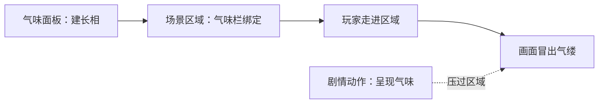

# 配一个气味

雾津不只有画面和声音——渡口的河腥、纸人巷的浆糊味、鬼打墙的腐水味，都是屏幕上一缕若隐若现的气缕在提醒玩家"你正闻到什么"。这一页带你建好一种气味的长相，再把它挂到场景的一块区域上，让玩家一走进去就自动闻到。

---

## 这是什么（30 秒看懂）

气味这件事拆成两半来做：

1. **气味长得什么样、怎么飘**——登记在一张气味长相表里，本页教你在这里建。
2. **具体在哪儿、什么时候真的冒出来**——不在这张表里设，而是去场景的区域里、或剧情的动作编排里指定。

打个雾津比方：气味长相就像香案上编好号的香型（"陈年焚香""河腥""血锈"……），而"这块地方要不要点这炷香、点多浓"是场景那边自己的决定，不是香型本身管的事。

读完这页你能：

- 建一条气味的长相（颜色、飘动方式）。
- 把它挂到场景的一块区域上，让玩家走进去自动闻到。
- 分清"区域自己冒出来的气味"和"剧情硬压上去的气味"谁听谁的。

---

## 手把手逐步操作

### 第 1 步：建一条气味长相

打开主编辑器，进**资源 → 气味**：

1. 点新建，起个名字，比如"浆糊味"。
2. 选一个在屏幕上呈现的颜色。
3. 飘动几项参数（往上飘的速度、左右摆的幅度、摆动快慢、不规则抖动量）先都用默认值就好，不用一开始就精调。

### 第 2 步：调飘动手感，边看边调

面板右侧有实时预览，改参数立刻能看到这缕气味在屏幕上怎么飘，不用来回进游戏试。需要"贴地不太往上走"的沉味（比如腐水、浆糊）就打开对应的开关；需要"飘法诡异、不安"的味道（比如鬼打墙）就打开另一个开关。

### 第 3 步：保存

调满意后点保存。

### 第 4 步：把它挂到场景的一块区域上

去[场景](../editors/panels/scene)面板，选中你要配味的区域，展开**气味**折叠栏：

- **气味**：下拉选刚建好的这条长相。
- **浓度**：默认 60，数值越大气味越浓。
- **方位偏向**：默认居中，往哪个方向偏，气缕就往那一侧拖，用来模拟"味道来源在那一侧"。
- **波动**：勾选后气味在画面上会明灭跳动，适合不稳定的味道，先不勾也没问题。

### 第 5 步：运行预览验证

保存后 **F5** 走进这个区域，看画面上有没有冒出对应颜色的气缕提示；再走出区域，确认气味会自动收回。

---

## 流程示意

---

## 雾津完整实例：纸人巷的浆糊味

关二狗走进纸人巷，你想让他自动闻到一股温吞的浆糊味，和鬼打墙那股不安的腐水味形成明显反差：

1. **资源 → 气味**新建一条"浆糊味"，颜色选偏柔和的黄色。
2. 勾选"贴地飘"，让这股味道沉着不太往上走，贴合浆糊粘稠的质感；不勾"飘法诡异"，因为这不是超自然场景。
3. 在右侧预览里调上升速度、摆幅、摆频，让整体看起来温吞不急躁。
4. 保存这条气味长相。
5. 打开纸人巷的场景，选中巷子那块区域，展开气味栏：气味选"浆糊味"，浓度调到 50 左右（不用太冲），方位偏向朝纸人摊那一侧稍微偏一点。
6. **F5** 让关二狗走进纸人巷，确认画面冒出柔黄色的气缕，飘法偏沉、不往上冲。
7. 对比一下：鬼打墙那块区域配的是另一条勾了"飘法诡异"的气味长相，连着走一遍纸人巷和鬼打墙，能明显感到一边温吞、一边不安。

气味对了，玩家不用看文字也能分清"这是巷子"还是"这是险境"。

---

## 进阶：每一项都讲透

### 和音效、见闻录配合讲同一件事

气味只是一层很淡的视觉暗示，玩家未必每次都会留意到。真正让"这块地方有股味道"立住的，往往是几件事一起做：区域气味的气缕、对应的环境音效、以及见闻录里顺带描写一句"空气里飘着一股熟悉的浆糊味"。三者对上了，玩家才会真正记住"纸人巷就是这个味道"，光靠气味一项单打独斗，效果容易被玩家忽略过去。

### 只建气味长相，不挂区域，等于白建

这是最容易漏的一步：气味长相本身不会让玩家闻到任何东西，必须挂到场景的区域上（或用剧情动作强制呈现），玩家才真的能闻到。建完记得立刻挂上试一次。

### 特殊渲染那一组是给"带邪性"的味道用的

面板里还有一组默认折叠的特殊效果（比如让气缕自己发光、打卷缠绕、几缕反常往下伸、被光照到时基线发抖），配套一组时间参数（从无到有要多久、维持多久、消散要多久、强度封顶）。这组是给鬼打墙这类带点邪性的特殊气味用的，日常香火、饭菜味不用碰这组。

### 剧情能强制压过区域，规则是这样

除了挂在区域上，还有三个动作可以挂在过场、图对话等能编排动作的地方：一个用来强制呈现某种气味（不管玩家实际站在哪，常用于想让玩家在特定台词或演出时刻闻到特定味道）、一个用来清除这个强制、一个用来让当前气味来一下短暂的"拔高变清"反馈。

优先级是：剧情强制指定的气味不为空就听它的；清空后听玩家当前所在区域；玩家同时站在多个重叠的配味区域里，听最后进入的那一个；都没有就是无味。

### 一种区域类型对气味天生免疫

场景里的深度地板类区域没有进出触发逻辑，即便你在这类区域上配了气味也不会生效——把普通区域切成这个类型时，编辑器会先警告"会清空这个区域的气味"，确认后才会真的清掉，切换前先想清楚这个区域原本有没有配气味。

### 改名字要小心悬空引用

改一条气味长相的名字，不会自动帮你把区域、动作里已经填的旧引用同步过去。改名前编辑器会有提示，改完务必跑一次数据校验，检查有没有"某区域气味不在登记表里"这类悬空警告。

### 老手技巧

先把常用的味道原型（香、腐、霉、血锈……）都建成长相，各处直接下拉选，不用每次从零调参数；改一条长相的飘动参数不影响谁在用它，风格统一改一处，全场景一起变。

### 相邻区域的气味别做得太接近

同一张地图上如果好几块区域挨得很近，又各自配了差别不大的气味长相，玩家来回走动时会分不清"味道到底变没变"，反而削弱了气味本该传达的信息。设计相邻区域时，颜色、浓度、飘动手感最好都拉开一点差距，走一遍能明显感到"进了不一样的地方"才算达标。

### 用嗅一下这个反馈加强代入感

如果场景里有玩家可以主动"细嗅"的动作，配合让当前气味来一下短暂拔高变清的反馈，能强化"这是玩家自己主动去闻"的感觉，比气味一直平铺直叙地飘着更有代入感。这个反馈本身不改变气味的长相，只是让已经生效的那缕气味短暂地更明显一点，几秒后自己回落。

---

## 危险区与边界

- 只建了气味长相、没有任何区域或动作去用它，玩家永远闻不到——建完记得立刻挂上试一次。
- 改名字会留下悬空引用，区域、动作里已经填的旧引用不会自动同步，改完必须跑一次校验。
- 深度地板类区域配了气味也不会触发，切换到这个类型时编辑器会警告并清掉气味设置。
- 重要剧情线索不要只靠气味传达，气味提示很短，务必配文本或画面兜底。
- 更多编辑器整体可编辑边界，见[危险区](../editors/concepts/danger-zone)。

---

## 常见问题

| 现象 | 原因 | 怎么办 |
|---|---|---|
| 玩家永远"闻不到" | 只建了长相，没在区域或动作里绑定 | 去场景区域的气味栏选它，或加一条呈现气味的动作 |
| 改了长相名字后，某区域报"气味不在登记表" | 改名不会同步旧引用 | 回区域重新选一次新名字，再跑校验确认无悬空引用 |
| 深度地板区域气味设了没反应 | 该类型区域跳过进出触发，气味天然无效 | 换成普通区域类型，或不在此类区域配气味 |
| 剧情强制的气味结束后没有恢复 | 清除气味的动作没挂上，或玩家已离开原区域 | 补上清除气味的动作；确认玩家是否仍在配味区域内 |
| 一进场景连弹好几种气味提示 | 多个区域重叠触发 | 收窄区域范围，或用条件限制同一时间只留一种 |
| 提示文案和档案描述对不上 | 两处文案各写各的没对齐 | 统一用词，回改保持一致 |
| 相邻两块区域走过去感觉不出味道变化 | 两条气味长相调得太接近 | 拉开颜色、浓度或飘动手感的差距，重新走一遍对比 |

---

## 相关

- [气味面板](../editors/panels/smell)
- [场景](../editors/panels/scene)
- [过场](../editors/panels/cutscene)
- [档案](../editors/panels/archive)
- [按目标查：我想做…](./goal-index)
