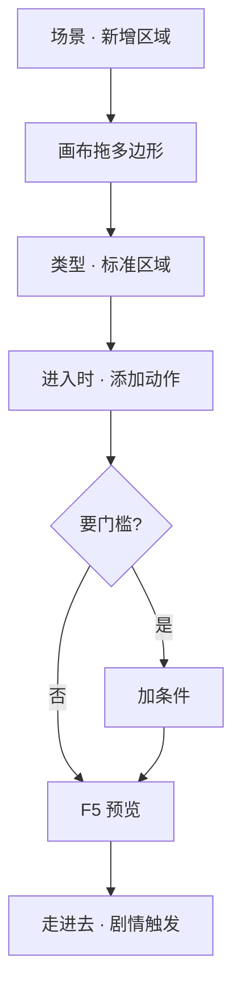

# 画一片区域触发剧情

有些戏不用按互动键——玩家**走进一片地**就自动发生：旁白响起、旗标变化、切过场。这种 invisible 的「感应区」叫**区域**（zone）。这一页教你在场景里画多边形区域，绑**进入 / 停留 / 离开**时该干什么。

---

## 这是什么（30 秒看懂）

想象城隍庙影壁前有一道看不见的门槛——玩家没按任何键，脚一踏过去，心里就自动冒出一句独白。这道「看不见的门槛」就是**区域**：地图上一块任意形状的多边形范围，编辑器不会画出边框给玩家看，纯靠「玩家的脚是否踩在这片地里」来判断该不该发生点什么。

区域最重要的是三个时机：**踏进来的一瞬间**、**站在里面的时候**、**走出去的一瞬间**——各自可以挂一串动作。想清楚你要的是哪个时机，比一股脑全塞进「进入」更不容易出错。

## 读完你能做到什么

- 在场景画布上画一片多边形区域
- 设「进入时」「停留时」「离开时」各自跑什么动作
- 可选：加条件，只有满足时才触发
- 预览里走进去验证剧情被触发

---

## 怎么开工具

主编辑器 → **物理世界 → 场景** → 区域列表与画布

动作编排见 [怎么编排动作](../editors/concepts/actions)。

---

## 区域 vs 热区（先分清）

| | **区域** | **热区** |
|---|---|---|
| **玩家怎么触发** | 脚踩进多边形就触发（可配条件） | 通常要走近按 E（部分可自动） |
| **形状** | 任意多边形，画布点选描边 | 点位置 + 碰撞多边形 |
| **典型用途** | 进庙自动旁白、离开义庄改旗标 | 调查物件、捡东西、转场 |

本页讲**区域**；调查点式互动见 [场景面板 · 热区](../editors/panels/scene)。

---

## 手把手逐步操作

### 第 1 步：打开场景

场景列表选「城隍庙」「义庄」等你需要加感应区的场景。

### 第 2 步：新增区域

1. 区域列表点 **新增**
2. 画布上出现默认多边形（往往是矩形），**拖顶点**改成你要的形状——比如城隍庙正殿前的台阶范围；工具通常也支持在边上**插入新点**、选中点后**删除**，慢慢把方形调成贴合地形的不规则多边形
3. 检查器里填 **标识**（系统用，别重名）

### 第 3 步：选区域类型

常见两种：

- **标准区域**：可配进入 / 停留 / 离开三类动作——本教程用这个
- **深度地面区域**：给场景深度遮挡用，会清掉上述三类动作；做遮挡见 [场景深度工具](../editors/render-domain/scene-depth-editor)

选 **标准区域**。

:::warning[类型切换会清空动作]
把一个已经配好进入/停留/离开动作的标准区域，改成深度地面区域，这三类动作会被**直接清空**。先想清楚这片区域到底是用来触发剧情还是用来做地面遮挡，别中途反悔切换类型。
:::

### 第 4 步：绑动作

检查器里三块：

| 时机 | 干什么 |
|---|---|
| **进入时** | 刚踩进边界的瞬间——播对白、设旗标、开过场 |
| **停留时** | 站在里面每帧或定时——少用，注意别刷太频 |
| **离开时** | 走出边界——可关旁白、复位状态 |

点「添加动作」，从列表选类型，例如：

- **播脚本对白** / **启动对白图** —— 自动说话
- **设旗标** —— 记「来过城隍庙」
- **开过场** —— 接 [排一场过场](./cutscene)

### 第 5 步：加条件（可选）

「只有接过某任务才触发」→ 检查器 **条件** 区添加，如任务进行中、某旗标为真。见 [怎么设条件](../editors/concepts/conditions)。

### 第 6 步：保存与验证

1. **Ctrl+S**
2. **F5** 预览，控制角色**走进**多边形
3. 进入时应立刻看到对白或过场；若没反应，查条件是否不满足、或区域是否画在可走层上

---

## 流程示意

---

## 雾津完整实例

**任务**：关二狗踏进城隍庙影壁后，自动响起一句心里独白，并标记「已进庙」；如果玩家再次离开这片区域，独白的气氛音效要停掉。

1. 场景选城隍庙，在影壁与正殿之间画一片区域，标识 `zone_yingbi_shadow`
2. **进入时** → 添加「播脚本对白」，说话人选玩家，台词：「庙里的烟比外头还呛。」
3. **进入时** → 再添加「设旗标」，记 `visited_temple_shadow`（名字按项目规范）
4. **离开时** → 添加动作停掉刚才可能触发的氛围音效或提示
5. **条件** 留空（谁进都触发）
6. **F5** 从雾津街头转场进庙，踩进区域——对白应自动弹出；退出区域时氛围音效应随之停止

---

## 常见卡点

**走进多边形范围，什么都没发生？**
先确认区域**类型**真的是「标准区域」——如果不小心选成了深度地面区域，进入/停留/离开这三类动作根本就不存在，自然没反应。其次检查**条件**是不是没满足；条件不满足时区域会安静地什么都不做，不会报错提示你。

**多边形画得歪七扭八，玩家实际踩的范围和画的对不上？**
画布上的顶点是可以逐个拖动、插入、删除的，耐心多描几刀，别急着交差；也可以对照场景底图的地面轮廓，把多边形边缘尽量贴着可见的地面边界画。

**「停留时」的动作刷得飞快，每秒响好几次同一句台词？**
停留时的动作是「站在里面持续触发」的，如果绑了播对白这类一次性表现，会一遍遍重复播放，观感很吵。这个时机更适合绑「一次性生效后不再重复」的逻辑（比如只在第一次停留时触发，后续用旗标挡住），或者干脆改放到「进入时」。

**把区域从标准改成深度地面后，之前配的动作全没了？**
这是设计如此——切换成深度地面区域会清空原有的进入/停留/离开动作。如果只是想临时试试深度效果，建议先把动作内容记下来或者干脆新建一片区域来试，别直接改动已经写好剧情的那片。

**区域和热区都能触发对话，到底该用哪个？**
需要玩家**主动按键**才发生的，用热区；玩家**走过路过就该发生**、不希望玩家有选择余地的，用区域。像「进庙自动被烟呛一下」这种气氛描写，用区域比用热区更自然，不用玩家还得特意点一下。

---

## 进阶变体

- **进入/停留/离开三件套组合出「状态型」感应区**：比如做一片「危险瘴气区」——进入时开始扣血或计时提示，停留时持续给某种效果，离开时清掉效果和提示。三个时机配合用，比单靠进入时一次性触发能表达更复杂的场面。
- **条件做「只触发一次」**：给进入时动作外层挂一个「旗标为假才触发」的条件，动作本身再把这个旗标设为真——玩家第二次踩进同一片区域就不会再触发同一段独白，避免气氛台词被玩家反复踩出来听腻。
- **多片区域接力做走廊式演出**：城隍庙从影壁走到正殿这段路，可以画好几片首尾相连的小区域，每片进入时演一小段（脚步声变化、光线变化提示语），比一整片大区域进一次全放完更有推进感。
- **区域联动位面**：如果项目里有「位面」概念（比如阴阳两界共用一张地图），区域和场景内其它实体一样支持限定「位面归属」——同一块地面，在不同位面表现出不同的触发内容。
- **区域触发过场而不是直接对白**：简单的一句心理独白用「播脚本对白」够了；如果想要黑屏、字幕、运镜这类更重的演出，进入时动作改成「开过场」，接一场做好的 [过场](./cutscene)，观感完全不同。
- **用离开时动作收尾**：很多人只记得配「进入时」，却忘了「离开时」——凡是进入时开了某种持续效果（音效循环、镜头微推），一定记得在离开时配对应的收尾动作，不然玩家走出老远了，效果还挂在身上。

---

## 相关手册

- [场景面板](../editors/panels/scene) —— 区域完整字段
- [怎么编排动作](../editors/concepts/actions) —— 动作类型大全
- [怎么设条件](../editors/concepts/conditions)
- [场景深度工具](../editors/render-domain/scene-depth-editor) —— 深度地面区域的正确用法
- [排一场过场](./cutscene) —— 区域进入时常调用的重演出
- [术语表 · 区域 / 热区](../reference/glossary)
