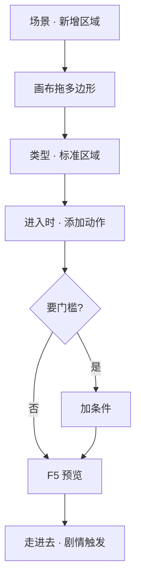

# 画一片区域触发剧情

有些戏不用按互动键——玩家**走进一片地**就自动发生：旁白响起、旗标变化、切过场。这种 invisible 的「感应区」叫**区域**（zone）。这一页教你在场景里画多边形区域，绑**进入 / 停留 / 离开**时该干什么。

---

## 读完你能做到什么

- 在场景画布上画一片多边形区域
- 设「进入时」「停留时」「离开时」各自跑什么动作
- 可选：加条件，只有满足时才触发
- 预览里走进去验证剧情被触发

---

## 怎么开工具

主编辑器 → **物理世界 → 场景** → 区域列表与画布

动作编排见 [怎么编排动作](../editors/concepts/actions)。

---

## 区域 vs 热区（先分清）

| | **区域** | **热区** |
|---|---|---|
| **玩家怎么触发** | 脚踩进多边形就触发（可配条件） | 通常要走近按 E（部分可自动） |
| **形状** | 任意多边形，画布点选描边 | 点位置 + 碰撞多边形 |
| **典型用途** | 进庙自动旁白、离开义庄改旗标 | 调查物件、捡东西、转场 |

本页讲**区域**；调查点式互动见 [场景面板 · 热区](../editors/panels/scene)。

---

## 逐步操作

### 第 1 步：打开场景

场景列表选「城隍庙」「义庄」等你需要加感应区的场景。

### 第 2 步：新增区域

1. 区域列表点 **新增**
2. 画布上出现默认多边形（往往是矩形），**拖顶点**改成你要的形状——比如城隍庙正殿前的台阶范围
3. 检查器里填 **标识**（系统用，别重名）

### 第 3 步：选区域类型

常见两种：

- **标准区域**：可配进入 / 停留 / 离开三类动作——本教程用这个
- **深度地面区域**：给场景深度遮挡用，会清掉上述三类动作；做遮挡见 [场景深度工具](../editors/render-domain/scene-depth-editor)

选 **标准区域**。

### 第 4 步：绑动作

检查器里三块：

| 时机 | 干什么 |
|---|---|
| **进入时** | 刚踩进边界的瞬间——播对白、设旗标、开过场 |
| **停留时** | 站在里面每帧或定时——少用，注意别刷太频 |
| **离开时** | 走出边界——可关旁白、复位状态 |

点「添加动作」，从列表选类型，例如：

- **播脚本对白** / **启动对白图** —— 自动说话
- **设旗标** —— 记「来过城隍庙」
- **开过场** —— 接 [排一场过场](./cutscene)

### 第 5 步：加条件（可选）

「只有接过某任务才触发」→ 检查器 **条件** 区添加，如任务进行中、某旗标为真。见 [怎么设条件](../editors/concepts/conditions)。

### 第 6 步：保存与验证

1. **Ctrl+S**
2. **F5** 预览，控制角色**走进**多边形
3. 进入时应立刻看到对白或过场；若没反应，查条件是否不满足、或区域是否画在可走层上

---

## 流程示意

---

## 雾津小例子

**任务**：关二狗踏进城隍庙影壁后，自动响起一句心里独白，并标记「已进庙」。

1. 场景选城隍庙，在影壁与正殿之间画一片区域
2. **进入时** → 添加「播脚本对白」，说话人选玩家，台词：「庙里的烟比外头还呛。」
3. **进入时** → 再添加「设旗标」，记 `visited_temple_shadow`（名字按项目规范）
4. **条件** 留空（谁进都触发）
5. **F5** 从雾津街头转场进庙，踩进区域——对白应自动弹出

---

## 相关手册

- [场景面板](../editors/panels/scene) —— 区域完整字段
- [怎么编排动作](../editors/concepts/actions) —— 动作类型大全
- [怎么设条件](../editors/concepts/conditions)
- [术语表 · 区域 / 热区](../reference/glossary)
