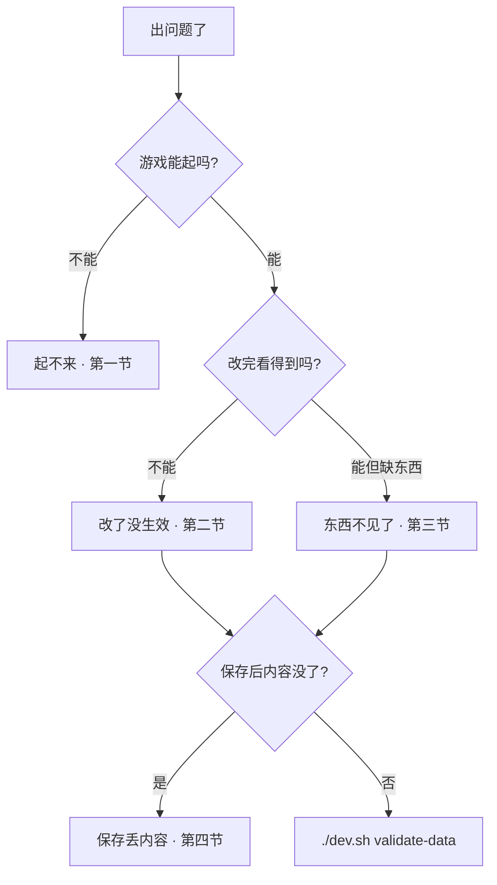

# 出问题怎么办

油灯还亮着，书案却乱了——游戏起不来、改完没反应、做好的东西凭空消失、一保存字就没了。这一页按**用户嘴里常说的四类事**列自查步骤；仍解决不了，再带着现象找懂工程的人。

---

## 读完你能做到什么

- **起不来**：环境、命令、端口怎么排
- **改了没生效**：保存、预览、触发条件怎么查
- **东西不见了**：引用、条件、位面、登记漏了啥
- **保存丢内容**：危险区与重建区，怎么避免再丢

---

## 总流程：先别慌，按顺序查

---

## 一、起不来

### 现象

- 敲 `./dev.sh` 报错
- 编辑器窗口闪退或打不开
- 游戏浏览器一片白、连不上

### 自查清单

| 步骤 | 做什么 |
|---|---|
| 1 | 命令是否在**游戏仓库根目录**跑的？文档站目录里跑一律不对 |
| 2 | 是否跑过 `./bootstrap.sh`？报「运行环境缺失」就先 bootstrap |
| 3 | 资源是否拉过？`./dev.sh pull` |
| 4 | 起游戏用 `./dev.sh game start`，不是别的拼写 |
| 5 | 浏览器地址跟终端提示的端口一致吗？5173 被占时会换端口 |
| 6 | 编辑器打不开：关掉旧窗口再 `./dev.sh editor` 重开 |

### 操作示意

<svg viewBox="0 0 640 300" xmlns="http://www.w3.org/2000/svg" role="img" aria-label="起不来排查示意" style={{width:'100%', height:'auto'}}>
  <rect width="640" height="300" fill="#1a1510" rx="8"/>
  <rect x="40" y="40" width="140" height="48" fill="#2a2218" stroke="#3a2f20" rx="6"/>
  <text x="110" y="70" textAnchor="middle" fill="#c9bda1" fontSize="11">bootstrap.sh</text>
  <path d="M180 64 L220 64" stroke="#8a7a5c" stroke-width="2"/>
  <rect x="220" y="40" width="140" height="48" fill="#2a2218" stroke="#3a2f20" rx="6"/>
  <text x="290" y="70" textAnchor="middle" fill="#c9bda1" fontSize="11">dev.sh pull</text>
  <path d="M360 64 L400 64" stroke="#8a7a5c" stroke-width="2"/>
  <rect x="400" y="40" width="200" height="48" fill="#2a2218" stroke="#e0a44e" rx="6"/>
  <text x="500" y="70" textAnchor="middle" fill="#e0a44e" fontSize="11">dev.sh game start</text>
  <text x="320" y="160" textAnchor="middle" fill="#8a7a5c" fontSize="12">仍失败 → 看终端完整报错 · 端口 · 是否在正确目录</text>
  <rect x="120" y="200" width="400" height="70" fill="#231c14" stroke="#5a8a86" rx="6"/>
  <text x="320" y="240" textAnchor="middle" fill="#5a8a86" fontSize="11">Web 控制台 ./dev.sh console 也可一键起游戏</text>
</svg>

### 雾津例子

新机器第一次编雾津，直接 `./dev.sh editor` 报错——先 `cd` 到游戏仓库，`./bootstrap.sh`，再 `./dev.sh pull`，然后一切就顺了。

---

## 二、改了没生效

### 现象

台词改了、图换了、物品加了，进游戏还是旧的。

### 自查清单

| 步骤 | 做什么 |
|---|---|
| 1 | **保存了吗？** Ctrl+S / Ctrl+Shift+S，标题栏无未保存标记 |
| 2 | **预览对了吗？** 内嵌预览用 **F5**；只开浏览器时确认已刷新，或 Shift+F5 再 F5 |
| 3 | **改的是玩家会走到的那条吗？** 对白改错图、任务指错 id，都会像「没改」 |
| 4 | **触发条件满足吗？** [旗标](../reference/glossary)、任务进度、[位面](../reference/glossary)不对，内容不会出现 |
| 5 | **跑校验** `./dev.sh validate-data`，有错误先修 |
| 6 | **缓存错觉** 独立窗口预览关干净再开 |

详见 [用运行预览验证改动](./preview-verify)。

### 雾津例子

城隍庙对白改了但游戏里还是旧词——发现改的是备用分支图，玩家走的是主线节点；换对节点保存 F5 就好。

---

## 三、东西不见了

### 现象

NPC 不露头、热区点不到、物品买不到、小游戏进不去、声音没响。

### 常见原因

| 原因 | 你怎么查 |
|---|---|
| **条件未满足** | 图对话、热区、NPC 上的条件——任务未到、旗标未立 |
| **位面不对** | 东西挂在非常规位面，玩家还在默认现实世界 |
| **没登记全** | 物品没进商店价目、小游戏没建实例、音频没挂场景 |
| **引用断了** | 动作里指的任务、关卡、物品编号和面板里不一致 |
| **场景入口没了** | 转换热区删了、坐标偏到墙外 |
| **资源没入库** | 图、音频没走分类导入，列表里选不到 |

不是「丢了」，多半是**链断了一环**——从玩家进场景到触发的整条链，用预览走一遍，缺哪步补哪步。

### 雾津例子

香烛铺买不到新香——价目表有货，但场景里进铺热区被误删；回场景面板补热区，F5 再买就有。

---

## 四、保存丢内容（危险区）

### 现象

手改过的字、塞进去的额外说明，开面板再保存就没了；音频音量写了也白写。

这叫进了 **[危险区](../editors/concepts/danger-zone)**：编辑器保存时会把整块**重建**，只留它认识的字段。

### 高频重建区（别乱塞东西）

| 区域 | 后果 |
|---|---|
| 热区内部详情 | 编辑器不认识的项被抹掉 |
| NPC 巡逻路线 | 只保留面板里那几项 |
| 出生点 | 多余字段会没 |
| 打开并保存过的对白节点 | 未知内容全清 |
| 音频每条 | 只留源文件引用，别手写音量循环 |
| 部分过场步骤 | 面板外的字段会丢 |

### 怎么避免

1. **做内容前**读 [危险区](../editors/concepts/danger-zone) 或 [可编辑面参考](../reference/authoring-surface)
2. **只填检查器里有的项**，别当纯文本编辑器硬改底层数据
3. **编辑器够不着的**（场景背景层、完整深度图等）用专项工具导出，别手搓
4. 重要文案用版本管理；大改前先备份或提交一版

### 雾津例子

给调查热区手写了一大段说明在编辑器没显示的格里，一保存变空——应写在检查器「调查文本」里，或走档案见闻录链接。

---

## 快速对照表

| 用户说法 | 先看 |
|---|---|
| 起不来 | bootstrap → pull → 正确目录与命令 |
| 改了没生效 | 保存 → F5 → 对错节点 → 条件 |
| 东西不见了 | 条件 · 位面 · 登记 · 引用链 |
| 保存丢内容 | 危险区 · 只填面板字段 |

---

## 仍解决不了时

带上这些信息找人效率最高：

1. 你做了什么（改哪个面板、什么内容）
2. 期望什么、实际什么
3. 终端报错原文（若有）
4. `./dev.sh validate-data` 是否报错
5. 是否动过编辑器面板外的手写数据

---

## 接下来读什么

| 页面 | 内容 |
|---|---|
| [危险区](../editors/concepts/danger-zone) | 哪里会丢、哪里够不着 |
| [用运行预览验证改动](./preview-verify) | 标准验货流程 |
| [5 分钟跑起来](./intro) | 环境与命令 |
| [术语表](../reference/glossary) | 旗标、位面、热区 |
